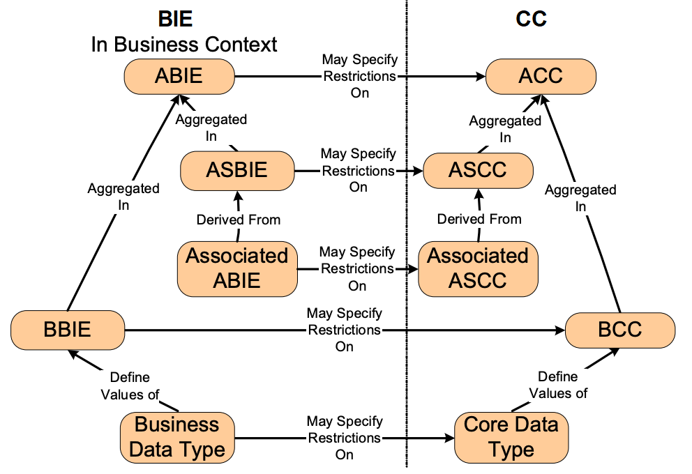
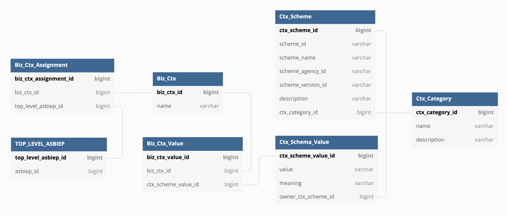

# Introduction

The purpose of this document is to provide a concise overview of Score database structure to assist in the contribution to Score development. As Score has adopted a canonical data model design based on [CCTS (Core Component Technical Specification) v3.0](https://unece.org/DAM/cefact/codesfortrade/CCTS/CCTS-Version3.pdf), core structural characteristics in tables and columns such as names and data types follow CCTS definitions.

# Core Components (CCs) and Business Information Entities (BIEs)

In general, CCTS defines two abstract meta models: Core Components (CCs) and Business Information Entities (BIEs). There are various types of CCs and also various types of BIEs.

The definition of each data element in a data exchange specification is represented as a CC, while a specialized definition of a CC in a particular business context is reflected through a BIE. The relationships between CCs and BIEs are illustrated in the figure below. For a little deeper overview of CCTS, please visit [Core Component in Brief section in Score User Guide](./user_guide/index.rst#core-component-management).

And the relationship is represented in DB as follows (in fact, there are `manifest` tables between CCs and BIEs for tracking revisions in releases. This will be explained later):

There are two differences between CCTS definition and actual table definitions.

1. `ACC` table has `based_acc_id` to support hierarchical type reference. The reason we introduced this is that most data exchange libraries have use the notion of inheritance to maximize reusability and ease of conceptualization. For example, both `Customer Party` and `Supplier Party` can share a common based ACC `Party`.
2. Core Data Type (CDT) and Business Data Type (BDT) are both represented in `DT` table. In practice, standard developers have defined their BDT as standard definitions based on the UN/CEFACT standard CDTs, and end-users use them without further manipulations in BIEs. Therefore, Score provides the functionality to define BDTs only for the standard developer user and BDTs can be used directly with the CCs as no further customization is enabled when defining a BIE.

## Core Components (CCs) Naming Rules

Each CC table has names related columns, such as `object_class_term`, `property_term`, `representation_term`, and `data_type_term`. All these columns are a part of the CC DEN (dictionary entry name), which is a unique official name of the CC in the dictionary. It is expressed in DB, as follows:

Each CC table has the column `DEN`, and it is unmodifiable. The following illustrates how `DENs` are defined:

* `ACC.DEN`: consists of `object_class_term` followed by a dot, a space character, and the term ‘Details’ (e.g., `object_class_term`: 'Contract' → `DEN`: 'Contract. Details'.)
* `ASCC.DEN`: consists of `object_class_term` of the associating ACC followed by a dot, a space character, and the DEN of the associated `ASCCP`​ (e.g., `from_acc->object_class_term`: ‘Contract’ and `to_asccp->DEN`: ‘Effective. Period’ → `DEN`: ‘Contract. Effective. Period’.)
* `ASCCP.DEN`: consists of `property_term` followed by a dot, a space character, and the `object_class_term` of the associated `ACC` (e.g., `property_term`: ‘Effective’ and `role_of_acc->object_class_term`: ‘Period’ → `DEN`: ‘Effective. Period’.) It should be noted that words that are consecutively repeated are truncated.
* `BCC.DEN`: consists of `object_class_term` of the associating ACC followed by a dot, a space character, and the DEN of the associated `BCCP`​ (e.g., `from_acc->object_class_term`: ‘Contract’ and `to_bccp->DEN`: ‘Price. Amount’ → `DEN`: ‘Contract. Price. Amount’.) It should be noted that words that are consecutively repeated are truncated.
* `BCCP.DEN`: consists of `property_term` followed by a dot, a space character, and the `representation_term` of the BDT used (e.g., `property_term`: ‘Price’ and BDT’s `representation_term`: ‘Amount’ → `DEN`: ‘Price. Amount.)
* `DT.DEN`:
    * For CDT, it consists of `data_type_term` followed by a dot, a space character, and the term ‘Type’ (e.g., `data_type_term`: ‘Date Time’ → `DEN`: ‘Date Time. Type’.) It should be noted that CDT data are as defined in the [CDT catalog 3.1 standard](https://unece.org/fileadmin/DAM/cefact/codesfortrade/CCTS/CCTS-DTCatalogueVersion3p1.pdf "https://unece.org/fileadmin/DAM/cefact/codesfortrade/CCTS/CCTS-DTCatalogueVersion3p1.pdf"). Each CDT has `data_type_term` and `representation_term`defined.
    * For BDT, it consists of `data_type_term` and `qualifier`, if any, followed by a dot, a space character, and the term ‘Type' (e.g., `data_type_term`: ‘Date Time’ and `qualifier`: ‘Open’ -> `DEN`: ‘Open\_ Date Time. Type’.) Both `data_type_term` and `representation_term` of the BDT is the same as those of CDT on which it is based.

For more information, please read [CCTS (Core Component Technical Specification) v3.0](https://unece.org/DAM/cefact/codesfortrade/CCTS/CCTS-Version3.pdf "https://unece.org/DAM/cefact/codesfortrade/CCTS/CCTS-Version3.pdf") that defines naming rules for each entity.

# Data Types (DTs) and Supplementary Components (SCs)

CCTS Data Type Catalog v3.1 defines standard Core Data Types and rules for developing Business Data Types to give the value domain to BCCs and BCCPs including allowed primitive types and supplementary components. The following diagram shows the relationship between DTs, SCs, primitive types, and BIEs.

* First of all, 11 allowed primitive types defined in CCTS Data Type Catalog are populated into the `cdt_pri` table, as follows:

| **cdt\_pri\_id** | **name** |
| ---------- | ---- |
| 1 | Binary |
| 2 | Boolean |
| 3 | Decimal |
| 4 | Double |
| 5 | Float |
| 6 | Integer |
| 7 | NormalizedString |
| 8 | String |
| 9 | TimeDuration |
| 10 | TimePoint |
| 11 | Token |

* `cdt_awd_pri` and `cdt_sc_awd_pri` tables contain mapping information of allowed primitives for each CDT as defined in the catalog definitions. The following tables are example rows of `Amount. Type` CDT and `Amount. Currency. Code` SC.

    | **cdt\_awd\_pri\_id** | **dt\_id** | **cdt\_pri\_id** | **is\_default** |
    | -------------- | ----- | ---------- | ---------- |
    | 1 | 1 (Amount. Type) | 3 (Decimal) | 1 (True) |
    | 2 | 4 (Double) | 0 (False) |
    | 3 | 5 (Float) | 0 (False) |
    | 4 | 6 (Integer) | 0 (False) |

    | **cdt\_sc\_awd\_pri\_id** | **dt\_sc\_id** | **cdt\_pri\_id** | **is\_default** |
    | ----------------- | -------- | ---------- | ---------- |
    | 1 | 1 (Amount. Currency. Code) | 7 (NormalizedString) | 0 (False) |
    | 2 | 8 (String) | 0 (False) |
    | 3 | 11 (Token) | 1 (True) |

* `xbt` table keeps the mapping between primitives in various syntaxes, such as XML, JSON, and OpenAPI. The following table is a part of `xbt` rows.

| **xbt\_id** | **subtype\_of\_xbt\_id** | **builtin\_type** | **jbt\_draft05\_map** | **openapi30\_map** |
| ------ | ----------------- | ------------ | --------------- | ------------- |
| 1 |   | xsd:anyType | {“type”: “string”} | {“type”: “object”} |
| 2 | 1 | xsd:anysimpleType | {“type”: “string”} | {“type”: “string”} |
| 12 | 2 | xsd:string | {“type”: “string”} | {“type”: “string”} |
| 13 | 12 | xsd:normalizedString | {“type”: “string”} | {“type”: “string”, “format”: “normalizedString”} |
| 14 | 13 | xsd:token | {“type”: “string”} | {“type”: “string”, “format”: “token”} |
| 19 | 2 | xsd:float | {“type”: “number”} | {“type”: “number”, “format”: “float”} |
| 20 | 2 | xsd:decimal | {“type”: “number”} | {“type”: “number”} |
| 21 | 20 | xsd:integer | {“type”: “number”, “multipleOf”: 1} | {“type”: “integer”} |
| 22 | 21 | xsd:nonNegativeInteger | {“type”: “number”, “multipleOf”: 1, “minimum”: 0, “exclusiveMinimum”: false} | {“type”: “integer”, “minimum”: 0, “exclusiveMinimum”: false} |
| 23 | 22 | xsd:positiveInteger | {“type”: “number”, “multipleOf”: 1, “minimum”: 0, “exclusiveMinimum”: true} | {“type”: “integer”, “minimum”: 0, “exclusiveMinimum”: true} |
| 24 | 2 | xsd:double | {“type”: “number”} | {“type”: “number”, “format”: “double”} |

The relationships between `xbt`columns uses [XML Schema Data Types](https://www.w3.org/TR/xmlschema-2/#built-in-datatypes "https://www.w3.org/TR/xmlschema-2/#built-in-datatypes") as the main type system as shown in the following figure.

* `cdt_awd_pri_xps_type_map` and `cdt_sc_awd_pri_xps_type_map` tables contain mapping data indicating `xbt` for each CDT and SC to express CCTS primitive types using specific data formats. `Amount. Type` CDT and `Amount. Currency. Code` SC used in previous examples could be mapped, as follows:

| **cdt\_awd\_pri\_xps\_type\_map\_id** | **cdt\_awd\_pri\_id** | **xbt\_id** | **is\_default** |
| --------------------------- | -------------- | ------ | ---------- |
| 1 | 1 (Amount. Type, Decimal) | 20 (xsd:decimal) | 1 (True) |
| 2 | 2 (Amount. Type, Double) | 24 (xsd:double) | 0 (False) |
| 3 | 2 (Amount. Type, Double) | 19 (xsd:float) | 0 (False) |
| 4 | 3 (Amount. Type, Float) | 19 (xsd:float) | 0 (False) |
| 5 | 4 (Amount. Type, Integer) | 21 (xsd:integer) | 0 (False) |
| 6 | 4 (Amount. Type, Integer) | 23 (xsd:positiveInteger) | 0 (False) |
| 7 | 4 (Amount. Type, Integer) | 22 (xsd:nonNegativeInteger) | 0 (False) |

| **cdt\_sc\_awd\_pri\_xps\_type\_map\_id** | **cdt\_sc\_awd\_pri\_id** | **xbt\_id** |
| ------------------------------ | ----------------- | ------ |
| 1 | 1 (Amount. Currency. Code, NormalizedString) | 13 (xsd:normalizedString) |
| 2 | 2 (Amount. Currency. Code, String) | 12 (xsd:string) |
| 3 | 3 (Amount. Currency. Code, Token) | 14 (xsd:token) |

* Finally, `bdt_pri_restri` and `bdt_sc_pri_restri` tables have the domain restrictions of BDTs to define value domains of `BBIE` and `BBIE_SC`.

## Top-Level ASBIEP and other Business Information Entities (BIEs)

A top-level ASBIEP is a concept BIE to indicate the root of the BIE hierarachy tree. The following diagram describes the relationship between `top_level_asbiep` and BIE tables. When the Create BIE menu is invoked on the UI, a is created and also its descendant BIEs including the ABIEP, ABIE, BBIE, etc.

`top_level_asbiep.asbiep_id` indicates a root ASBIEP node of the BIE tree, and each BIE table has `owner_top_level_asbiep_id` column to indicate where this BIE belongs to. In fact, Score has used `owner_top_level_asbiep_id` column in queries when it needs the entire BIE data.

`` SELECT * FROM `asbiep` WHERE `owner_top_level_asbiep_id` = ?; ``
`` SELECT * FROM `abie` WHERE `owner_top_level_asbiep_id` = ?; ``
`` SELECT * FROM `asbie` WHERE `owner_top_level_asbiep_id` = ?; ``
`` SELECT * FROM `bbie` WHERE `owner_top_level_asbiep_id` = ?; ``
`` SELECT * FROM `bbiep` WHERE `owner_top_level_asbiep_id` = ?; ``
`` SELECT * FROM `bbie_sc` WHERE `owner_top_level_asbiep_id` = ?; ``

Retrieved data from SQLs above are used within the Score application logics for various purposes, such as the BIE expression.

In another example, such query is utilized in the ‘Reused BIE’ function. The purpose of the function is to embed pre-profiled BIEs into another BIE. In this function, it is necessary to check if the value of `asbie.owner_top_level_asbiep_id` is different with `asbie->to_asbiep.owner_top_level_asbiep_id`. The following is a query to retrieve all ASBIEs reusing other BIEs in the current BIE.

`` SELECT `asbie`.* FROM `asbie`  ``
`` JOIN `asbiep` ON `asbie`.`to_asbiep_id` = `asbiep`.`asbiep_id`  ``
`` WHERE `asbie`.`owner_top_level_asbiep_id` != `asbiep`.`owner_top_level_asbiep_id` AND ``
`` `asbie`.`owner_top_level_asbiep_id` = ?; ``

## Release and Core Component Manifests

In Score, each release of a data exchange library consists of a group of components. In order to enable this grouping mechanism, ‘manifest’ tables are introduced between `release` and CC tables. The following diagram illustrates `release`-CCs table relationships.

Each CC table (ACC, ASCC, BCC, ASCCP, BCCP, DT, and code list) has an associated manifest table (ACC\_MANIFEST, ASCC\_MANIFEST, BCC\_MANIFEST, ASCCP\_MANIFEST, BCCP\_MANIFEST, and DT\_MANIFEST.) And every manifest table has a reference to a `release` table.
Suppose that we had `Location` ACC in Release ‘10.0’ as below.

| **acc\_id** | **object\_class\_term** | **based\_acc\_id** |
| ------ | ----------------- | ------------ |
| 1 | Location | NULL |

| **release\_id** | **release\_num** |
| ---------- | ----------- |
| 1 | 10.0 |

| **acc\_manifest\_id** | **acc\_id** | **release\_id** | **based\_acc\_manifest\_id** |
| --------------- | ------ | ---------- | --------------------- |
| 1 | 1 | 1 | NULL |

If it there were to be a change to ‘Location’ ACC to have a ‘Location Base’ ACC as a base type in the next release ‘10.1’, it would look like below.

| **acc\_id** | **object\_class\_term** | **based\_acc\_id** |
| ------ | ----------------- | ------------ |
| 1 | Location | NULL |
| 2 | Location Base | NULL |
| 3 | Location | 2 |

| **release\_id** | **release\_num** |
| ---------- | ----------- |
| 1 | 10.0 |
| 2 | 10.1 |

| **acc\_manifest\_id** | **acc\_id** | **release\_id** | **based\_acc\_manifest\_id** |
| --------------- | ------ | ---------- | --------------------- |
| 1 | 1 | 1 | NULL |
| 2 | 2 | 2 | NULL |
| 3 | 3 | 2 | 2 |

From these datasets, we could get a set of ACCs in each release through the following query:

`` SELECT `acc`.* FROM `acc` ``
`` JOIN `acc_manifest` ON `acc`.`acc_id` = `acc_manifest`.`acc_id` ``
`` JOIN `release` ON `acc_manifest`.`release_id` = `release`.`release_id` ``
`` WHERE `release`.`release_num` = ?; ``

The query result would be

| **acc\_id** | **object\_class\_term** | **based\_acc\_id** |
| ------ | ----------------- | ------------ |
| 1 | Location | NULL |

when `release_num` is ‘10.0’ in the query parameter; and

| **acc\_id** | **object\_class\_term** | **based\_acc\_id** |
| ------ | ----------------- | ------------ |
| 2 | Location Base | NULL |
| 3 | Location | 2 |

when `release_num` is ‘10.1’.
Moreover, each BIE table is associated with these manifest tables, not directly with CC tables, because BIEs are related to a specific release. Thus, the relationship between CCs and BIEs can be specified, as follows:

## Module

Module is an entity representing a directory and file structure that Score uses to express schemas into a file system. From this definition, each module has two types: ‘File’ and ‘Directory’, and only ‘File’ type modules can contain components, and ‘Directory’ type modules can contain ‘File’ modules. A set of modules can be used in one or more releases, so each module set is associated with release manifests. The following diagram shows these relationships.

Every module-manifest relational table on the right (such as `module_ASCCP_manifest)`has the same pattern, that it has `module_id` and `module_set_release_id` to indicate which module entities and sets are associated with specific manifest components for releases.
Note that there are no module-manifest relational tables for `ASCC` and `BCC`. Because, all associations in ACCs should be in the same module where the ACC is assigned. Also, dependencies between modules are not managed in the database structure, because it can be logically calculated by components' relations. Suppose that ‘Party’ ACC has ‘Name’ BCCP.

| **acc\_(manifest)\_id** | **object\_class\_term** |
| ----------------- | ----------------- |
| 1 | Party |

| **bcc\_(manifest)\_id** | **from\_acc\_(manifest)\_id** | **to\_bccp\_(manifest)\_id** |
| ----------------- | ---------------------- | --------------------- |
| 1 | 1 | 1 |

| **bccp\_(manifest)\_id** | **property\_term** |
| ------------------ | ------------- |
| 1 | Name |

If we want to assign ‘Party’ ACC into ‘Component’ module and ‘Name’ BCCP into ‘Field’ module,

| **module\_id** | **parent\_module\_id** | **type** | **name** |
| --------- | ---------------- | ---- | ---- |
| 1 | NULL | DIRECTORY | / |
| 2 | 1 | FILE | Component |
| 3 | 1 | FILE | Field |

`module_acc_manifest` and `module_bccp_manifest` would look like below.

| **module\_acc\_manifest\_id** | **module\_id** | **acc\_manifest\_id** |
| ---------------------- | --------- | --------------- |
| 1 | 2 (Component Module) | 1 (Party ACC) |

| **module\_bccp\_manifest\_id** | **module\_id** | **bccp\_manifest\_id** |
| ----------------------- | --------- | ---------------- |
| 1 | 3 (Field Module) | 1 (Name BCCP) |

In this case, ‘Component’ module should have a reference to ‘Field’ module to reference the ‘Name’ BCCP for the ‘Party’ ACC. In XML schema, for example, ‘Component’ schema has to use ‘include’ or ‘import’ element (by equivalent of the target namespaces between the two schemas) to refer to the ‘Field’ schema. The algorithm detects cyclical dependency when the CCs are exported and report such issue at that stage.

## Sequencing Keys

ASCC and BCC associations should be assigned a unique sequencing key within the ACC. The straight-forward approach is to assign a unique numeric number to each association in order. The drawback of this approach is that it may need many operations to add, change, or delete an association from the sequence, especially if the ACC has a large number of associations. Assuming that the ACC has 100 associations, so each association has assigned numbers from 1 to 100. If it attempts to add a new association at the beginning of the sequence, it should increase assigned numbers by 1 for all associations, which needs 100 operations. In order to reduce computational need for sequencing key updates, Score has `seq_key` table that does not rely on the numerical order of the sequence key but instead it captures the order of the key as a linked list.

`seq_key` table maintains the sequence of associations using doubly linked list structure with `prev_seq_key_id` and `next_seq_key_id` columns. We can rewrite the previous example using the `seq_key` table. Suppose that ‘Party’ ACC had the following ASCCs with unique numeric numbers for sequencing keys.

| **ascc\_manifest\_id** | **DEN** | **seq\_key** |
| ---------------- | --- | ------- |
| 1 | Party. Physical Location. Location | 1 |
| … |
| 100 | Party. Employee Contract. Contract | 100 |

It can be rewritten with `seq_key`, as follows:

| **seq\_key\_id** | **ascc\_manifest\_id** | **prev\_seq\_key\_id** | **next\_seq\_key\_id** |
| ---------- | ---------------- | --------------- | --------------- |
| 1 | 1 | NULL | 2 |
| … |
| 100 | 100 | 99 | NULL |

Now, all (traverse/insert/remove) operations in `seq_key` follow [the same logic in doubly linked list](https://en.wikipedia.org/wiki/Doubly_linked_list#Basic_algorithms "https://en.wikipedia.org/wiki/Doubly_linked_list#Basic_algorithms"). For example, if a new ASCC is inserted before the `Party. Employee Contract. Contract`, it can have 101 `seq_key` column but the actual order is kept in the `seq_key` table..

# Business Contexts

Business context is a discriminator for categorizing BIEs according to their use in business circumstances. In CCTS, business contexts could be described for the BIE by assigning context categories and its scheme values. The following diagram illustrates the relationship between BIEs and business contexts.

 
 
 
 
 
