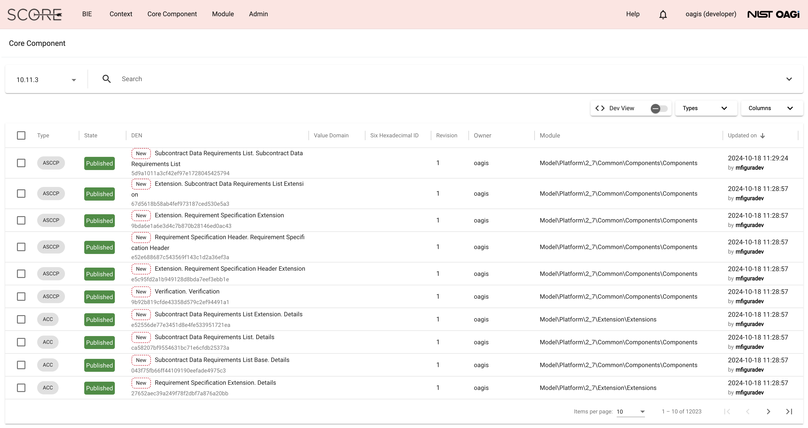

Score User Guide
================

About this Guide
----------------

How to use this guide
---------------------

Use the menu on the left to browse through sections.

The content of the user guide is on one HTML page. Use the browser’s
text search to find content on this page.

Due to limited development resources, the user guide is designed to
minimize its maintenance due to UI changes. Therefore, it contains
minimal UI graphics. It is recommended that the user guide is read along
with the tool. Follow the instruction along with the tool interactions.

Nomenclature
-------------

+-------------------------+--------------------------------------------+
| Structural Format       | Meaning                                    |
+=========================+============================================+
| "Text in Double Quotes" | Double quoted text is used for button      |
|                         | labels, labels, table column names on a    |
|                         | page, names of web pages, label of a tree  |
|                         | node, and example text for a form field.   |
+-------------------------+--------------------------------------------+
| Italicized Text         | Italicized text is used to form field      |
|                         | labels or emphasizing some keywords        |
+-------------------------+--------------------------------------------+

Administration
==============

Types of Users and Their Rights
-------------------------------

Score has two user roles, namely, End User and OAGIS Developer (or
Developer for short). There is also the Admin right that can be assigned
to either an End User or a Developer. The Admin right provides access to
the "Admin" menu that allows to Create a User, Update User’s Information
(including password reset), and Enable or Disable User Account. The
Developer role has access to all functions except for `Extend a
BIE <#extend-a-bie>`__. The End User role has access to all functions.
When a user logins into Score, a message is displayed to inform the user
whether the account has the End User or the Developer role. Moreover,
the role is shown next to the user account name at the top-right of the
page.

It is important that developer roles be used only for developing
standards particularly the Core Components (CCs). Standard Development
Organizations (SDOs) may wish to also standardize BIEs, in which case
the developer role should be used to manage those BIEs as well. For
detailed differences between developer and end user CCs or BIEs, it is
important to read `Developer Vs. end user core
components <#developer-vs-end-user-core-components>`__,
`Standard/Developer Core Component
Management <#standard-developer-core-component-management>`__, and `End
user core component management <#end-user-core-component-management>`__,
and `BIE Management <#bie-management>`__.

Generally, BIE content cannot be used or reused across developer and end
user role. And developer CCs cannot use end user CCs, but end user CCs
can use developer CCs. This is naturally the case as developer CCs are
standard and should not contain non-standard content created by the end
user. However, the end user CCs should be able to use standard CCs,
create by the developer.

The table below summarizes in details user rights to different kinds of
entities. Availability of certain actions also depends on the entity
state. The detail in the Other Dev and Other End Users columns should be
read in the context of the Dev. Owner and End User Owner columns,
respectively, i.e., it is the rights to the entity they do not currently
own.

‘Transfer’ means transfer of ownership. It is important to note that
transfers can occur only between the same user role.

In the table, CRUD = Create/Read/Update/Delete; CRUDE = CRUD and Extend;
CURD = Create/Update/Read/Discard, CURDE = CURD and Extend. Delete is
different from Discard in that Delete is only marked as deleted and can
be restored. Discard is permanently purged from the database and cannot
be restored.

Changing the role of a user (i.e., from end user to developer and vice
versa) is not allowed since it will impact how the Score behaves on the
existing content that the user might have already created.

Table summarizing user rights for different entities – CRUD =
Create/Read/Update/Delete; CRUDE = CRUD, Extend; CURD =
Create/Update/Read/Discard, CURDE = CURD, Extend. "Everything but
Update, Delete, and Transfer" means "Everything that the Dev. Owner can
do (according to the cell to left) but Update, Delete, and Transfer)"

+------------+--------------+-------------+--------------+--------------+
|            | Dev. Owner   | Other Dev   | End User     | Other End    |
|            |              |             | Owner        | users        |
+============+==============+=============+==============+==============+
| Developer  | CRUD,        | Everything  | Cannot own   | Read, Extend |
| CC         | Revise,      | but Update, | one.         | (via BIE     |
|            | Restore,     | Delete and  |              | extension),  |
|            | Comment,     | Transfer    |              | Use in End   |
|            | Transfer,    |             |              | User CC      |
|            | Reuse        |             |              |              |
+------------+--------------+-------------+--------------+--------------+
| Developer  | CURD, Copy,  | Everything  | Cannot own   | Read, Copy,  |
| BIE        | Uplift,      | but Update  | one.         | Express,     |
|            | Transfer,    | and         |              | Uplift when  |
|            | Express,     | Transfer    |              | not in WIP   |
|            | Reuse        |             |              | state        |
+------------+--------------+-------------+--------------+--------------+
| Developer  | CRUD,        | Everything  | Cannot own   | Read, Use in |
| Code       | Revise,      | but Update  | one.         | EU CC, Use   |
| List       | Reuse,       | and         |              | in BIE,      |
|            | Transfer     | Transfer    |              | Derive an EU |
|            |              |             |              | Code List    |
+------------+--------------+-------------+--------------+--------------+
| Developer  | Read,        | Read, Reuse | Cannot own   | Read, Use in |
| Agency     | Update,      |             | one.         | EU CC, Use   |
| ID List    | Revise,      |             |              | in BIE,      |
|            | Reuse,       |             |              | Derive an EU |
|            | Transfer     |             |              | Agency ID    |
|            |              |             |              | List         |
+------------+--------------+-------------+--------------+--------------+
| End User   | Read,        | Same        | CRUD, Amend, | Everything   |
| CC         | Comment,     |             | Restore,     | but Update,  |
|            | Cannot use   |             | Comment,     | Delete, and  |
|            | in Developer |             | Reuse in EU  | Transfer     |
|            | CC           |             | CC, Transfer |              |
+------------+--------------+-------------+--------------+--------------+
| End User   | Read, Copy,  | Same        | CURDE, Copy, | Everything   |
| BIE        | Express      |             | Express,     | but Update,  |
|            |              |             | Reuse,       | Discard,     |
|            |              |             | Uplift,      | Extend, and  |
|            |              |             | Transfer     | Transfer     |
+------------+--------------+-------------+--------------+--------------+
| End User   | Read         | Same        | CRUD, Amend, | Everything   |
| Code       |              |             | Restore,     | but Update,  |
| List       |              |             | Uplift,      | Delete, and  |
|            |              |             | Reuse in     | Transfer     |
|            |              |             | BIE,         |              |
|            |              |             | Comment,     |              |
|            |              |             | Transfer     |              |
+------------+--------------+-------------+--------------+--------------+
| End User   | Read         | Same        | CRUD, Amend, | Everything   |
| Agency     |              |             | Restore,     | but Update,  |
| ID List    |              |             | Uplift,      | Delete, and  |
|            |              |             | Reuse in     | Transfer     |
|            |              |             | BIE,         |              |
|            |              |             | Comment,     |              |
|            |              |             | Transfer     |              |
+------------+--------------+-------------+--------------+--------------+
| Standard   | CURD         | Same        | N/A, i.e.,   | Read         |
| Namespace  |              |             | End users    |              |
|            |              |             | cannot       |              |
|            |              |             | create it.   |              |
+------------+--------------+-------------+--------------+--------------+
| End User   | Read         | Same        | CURD         | Same         |
| Namespace  |              |             |              |              |
+------------+--------------+-------------+--------------+--------------+
| Release    | CURD,        | Same        | Cannot own a | Read         |
| Management | Publish      |             | release.     |              |
+------------+--------------+-------------+--------------+--------------+
| Module     | CURD         | Same        | Cannot own   | Read         |
| Management |              |             | any module   |              |
|            |              |             | related      |              |
|            |              |             | entity       |              |
+------------+--------------+-------------+--------------+--------------+

Create a User
-------------

Only OAGIS developer can create a user account:

1. First, log in as an OAGIS developer. There is a default account with
   username and password = ‘oagis’ and ‘oagis’.

2. On the top menu, click the "Admin" menu.

3. Click "Accounts" from the drop-down list.

4. Click "New Account" button.

5. On the "Create Account" page, fill out the following fields:

   1. *Login ID*, which is the username of the account (it cannot be
      changed after the account is created) (Mandatory).

   2. *Name* (Optional).

   3. *Organization* (Optional).

   4. Leave the "OAGIS Developer" checkbox unchecked to create an End
      User. Check the box for OAGIS Developer type of user.

   5. Use the check box named "Admin" to assign the Admin right to the
      user account being created. The admin right allows the user to
      manage other user accounts.

   6. *Password* (Mandatory).

   7. *Confirm Password* (Mandatory).

..

   Note that the password should be at least five characters.

6. Click the "Create" button.

Note that once a user account is created, it can be disabled but not
discarded. For more information about disabling and enabling a user
account, see `Enable or Disable User
Account <#enable-or-disable-user-account>`__.

Update User’s Information (including password reset)
----------------------------------------------------

A user with the admin right can change the Name, Organization, and
password of another user. To do so,

1. Click "Admin" menu.

2. Choose "Accounts" from the drop-down list.

3. On the "Accounts" page, use the search filters on the top to find the
   desired user account to update. Click the "Login ID" of the desired
   user.

   1. Change the fields: Name, Organization, Password, and Admin
      checkbox as desired.

4. Click the "Update" button.

Enable or Disable User Account
------------------------------

A user account can be Enabled or Disabled. Disabling a user account
prevents the user from logging into Score using that account.

Only users with the admin right can disable and re-enable a user
account.

To disable a user account:

1. Click the "Admin" menu.

2. Choose "Accounts" from the drop-down list.

3. On the "Accounts" page, click the "Login ID" of the user account that
   you want to disable or re-enable.

4. Click "Disable this account" to disable the log in via this account
   or "Enable this account" to -enable it.

The status of a user account (i.e., Enabled or Disabled) is displayed
next to each account on the "Accounts" page.

Password Management
-------------------

Change password
~~~~~~~~~~~~~~~

A user can change his password through the user’s account settings.

To change it:

1. On the right side of the top menu of the page, click the account’s
   name.

2. Choose "Settings" from the drop-down list.

3. On the "Change password" page, fill out the fields:

   1. *Old password*, which is the current password.

   2. *New password.*

   3. *Confirm new password*.

4. Click the "Update" button\ *.*

Forgotten password
~~~~~~~~~~~~~~~~~~

In the event a user has forgotten his/her password, he/she should ask
someone that has the admin right to change/reset his/her password.

Assuming you are a user with the admin right. To change/reset someone
else’s password:

1. Click the "Admin" menu.

2. Choose "Accounts" from the drop-down list.

3. On the "Accounts" page, click the "Login ID" of the user that has
   forgotten his/her password.

4. Enter the new password of the user into the field *Password*.

5. Verify the new password of the user by entering it again into the
   *Confirm new password* field.

6. Click the "Update" button.

Note that you can change the Name and the Organization of a user while
changing his/her password (see `Update User’s
Information <#update-users-information-including-password-reset>`__).

Customize UI
------------

A user can select either CCTS (Core Component Technical Specification)
or OAGIS terminology (or other that may be available in the future).
This will add terms from the selected terminology to menu items and
other UI labels as balloons or in parentheses. To select a terminology:

1. On the right side of the top menu of the page, click the account’s
   name.

2. Select a terminology, e.g., "CCTS Terminology" or "OAGIS Terminology"
   from the drop-down list. Note that CCTS Terminology is a
   default/baseline one, i.e., no balloon nor additional term would
   appear.

3. A check mark appears next to the selected terminology; and when mouse
   over a menu item a balloon appears for terminology other than CCTS
   Terminology.

Using Single Sign-On (SSO)
--------------------------

Overview
~~~~~~~~

Score supports the integration of external accounts managed by the
third-party identity providers (IdPs) compliant with the OpenID Connect
Specification. If your system administrator has enabled SSO when
installing Score, this feature allows the OpenID connect account to link
to a Score account.

Connect external accounts to Score
~~~~~~~~~~~~~~~~~~~~~~~~~~~~~~~~~~

To connect external IdP accounts to Score, the user must first try to
sign in to Score using the IdP account. When Score does not have a
record of the IdP account, it places the account in the pending state.
Score developers will see these pending accounts under the Admin and can
manage the approvals. The approval process includes making a connection
between Score and IdP accounts.

There are two cases to make a connection between Score and IdP accounts.
The first case is when there is no corresponding Score account. The
other case is when there is already a corresponding account in Score.
The followings describe the approval or disapproval process performed by
a score developer account.

1. Click the "Pending SSO" submenu under the "Admin" menu.

2. To approve an IdP account, choose a target account name from the
   pending list.

   1. Click "Create new account" button if there is no corresponding
      Score account for this IdP account.

      1. Enter the *Login ID*, *Name*, and *Organization* fields.

      2. Click "Create" button. Note that the username in the Score
         account is used for displaying contents in Score.

   2. Click "Link to existing account" button if there is an existing
      Score account corresponding to this IdP account.

      1. Select a target account from the existing user list. The list
         shows only users who are not linked to an IdP account yet.

3. Click "Reject" button to disallow this IdP user from accessing Score.

Home Page
=========

The home page is the landing page after logged in. It is also available
by clicking on the SCORE logo located at the top left of the screen.

The purpose of the home page is a dashboard showing, for example, the
number of BIEs per state, recently modified extensions, and it consists
of two main tabs: (i) the "BIEs" tab and the (ii) "User Extensions" tab.

BIEs Tab
--------

This tab provides analytics about the BIEs and comprises the following
panels:

-  "Total BIEs by states" that displays the number of all BIEs existing
   in Score per state (WIP, QA and Production). The number includes all
   BIEs regardless of the release they belong to.

-  "My BIEs by states" that displays the number of BIEs owned by the
   current user per state.

-  "BIEs by users and states". This panel displays the number of BIEs
   per user and state including the number of BIEs per user. The panel
   offers the "User" filter to narrow down its results to a specific
   user. To do so, click on the "User" filter field, and select the
   desired user.

-  "My recent BIEs" that displays the five (5) most recently modified or
   created BIEs.

The "Branch" drop-down field allows for filtering the above panels based
on the release. If the "All" option is selected, the above panel
provides analytics for all BIEs regardless of their release.

User Extensions Tab
-------------------

This tab provides analytics about the Extensions and comprises the
following panels:

-  "Total User Extensions by states" that displays the number of all
   extensions existing in Score per state (WIP, QA and Production). The
   number includes all extensions regardless of the release they belong
   to.

-  "My User Extensions by states" that displays the number of extensions
   owned by the current user per state regardless of their release. This
   panel is displayed only to end users, since developers cannot `Extend
   a BIE <#extend-a-bie>`__.

-  "User Extensions by users and states". This panel displays the number
   of extensions per user and state. This represents the number of core
   components that have been extended, not the BIEs. One core component
   extension can appear in many BIEs. The panel offers the "User" filter
   to narrow down its results to a specific user. To do so, click on the
   "User" filter field and select the desired user.

-  "My unused extensions in BIEs" (displayed only to end users). This
   panel displays additions to extensions that have been initialized in
   top-level BIEs but never enabled in any top-level BIEs. Those
   additions to the extension are indicated in the last "Association
   Property Term" column. The query looks across all BIEs in the
   repository. For example, a user invokes an extension to the
   Application Area component in a Process BOM top-level BIE. He adds
   BCCP1 and BCCP2 to the Application Area Extension. If there are two
   top-level BIEs in the database that has Application Area in the BIE
   tree, e.g., the Process BOM one and a Process Purchase Order one, and
   only BCCP1 is enabled in the Process BOM while the Process Purchase
   Order has initialized the Application Area Extension node but does
   not have anything underneath enabled; there will be two entries in
   this table. One entry is for the BCCP2 in the Process BOM and another
   for the BCCP2 in the Process Purchase Order, since BCCP2 is never
   enabled in either of the two top-level BIEs. If there is the third
   top-level BIE containing the Application Area, however, the user has
   never initialized the Application Area extension node; the table will
   still have only two entries. This is because BBIEP2 is never
   initialized in the database via that third top-level BIE. Specific
   BIE nodes are initialized only if the user has expanded the parent
   tree node of those BIEs.

The "Branch" drop-down field allows for filtering the above panels based
on the release. If the "All" option is selected, the above panel
provides analytics for all BIEs regardless of their release.

Core Component Management
=========================

Core Component in Brief
-----------------------

Core Components or CCs for short are canonical, context-independent data
(exchange) models. The meta-model of CCs in Score follows the `UN/CEFACT
Core Component Specification (CCS)
standard <https://www.unece.org/fileadmin/DAM/cefact/codesfortrade/CCTS/CCTS-Version3.pdf>`__,
also known as ISO 15000-5.

Score treats CCs as the canonical model of a data exchange standard such
as the Open Application Group Integration Specification (OAGIS) or
MIMOSA CCOM. In CCS, Business Information Entities (or BIEs) can be
derived from CCs. Score treats BIEs like an implementation/usage guide
of corresponding CCs for a particular business context. See the `BIE
Management <#end-user-core-component-management>`__ section for further
explanation about BIEs.

In a nutshell, there are 7 types of CCs you should know about for using
Score. They are as follows:

1. Aggregate Core Component (ACC)

2. Association Core Component Property (ASCCP)

3. Association Core Component (ASCC)

4. Basic Core Component Property (BCCP)

5. Basic Core Component (BCC)

6. Business Data Type (BDT)

7. Code List (CL)

8. Agency Identifier List

Explanations about these types of CCs including Score specific
implementation details are given next and the figure below shows the
example used throughout the explanation.

Aggregate Core Component (ACC)
~~~~~~~~~~~~~~~~~~~~~~~~~~~~~~

ACC represents reusable complex data structure, i.e., one that has one
or more properties, some of which are also complex data structures. Some
ACCs are semantic data structure, some are architectural archetype. An
example of an ACC is "Purchase Order", which may have "Identifier",
"Order Date Time", "Customer Party", and "Purchase Order Line"
properties. While "Identifier" and "Order Date Time" are simple
properties, "Customer Party" and "Purchase Order Line" are complex
properties and are represented by another ACC. Hence, ACCs can be
building blocks for other complex data structures.

There are two ways to use ACC as a building block, 1) as a based type
inheritance for another ACC and 2) as a representation of a property.

In the first case, an "Order" ACC, which has "Identifier" and "Order
Date Time" properties, may be a based type of the "Purchase Order" ACC.
That means, the "Purchase Order" ACC inherits these two properties from
the based "Order" ACC. While the ACCs’ based type relationship is not
supported in CCS, Score extends the CCS model to support that.

As stated earlier some ACCs are semantic data structures and some are
architecture archetypes. Taking OAGIS as an example, it has an
architectural archetype called "Base" to support its extension
architecture. For instance, OAGIS standard defines "Address Base" and
"Address" ACCs for the "Address" semantic entity; all semantic
properties are placed in the "Address Base" ACC while the "Address" ACC
is based on the "Address Base" ACC and only adds to it an extension
point. Score Core Component Management has specific features to address
OAGIS architectural requirements and also XML schema features. These
will be described in specific sections about the management of these
different types of CCs.

In the second case of ACC as building block, "Party" and "Purchase Order
Line" ACCs may be used as the representations for the "Customer" and the
"Purchase Order Line" properties. To use an ACC as a representation of a
property, an ASCCP that is described next has to be first created and
then association, ASCC, from the "Purchase Order" to the ASCCP then can
be made. These are described next.

Association Core Component Property (ASCCP)
~~~~~~~~~~~~~~~~~~~~~~~~~~~~~~~~~~~~~~~~~~~

Practically, ASCCP allows ACC to be reused as a property of another ACC.
All CCS entities have an important detail called Dictionary Entry Name
(DEN). While ACC DEN is made up of an Object Class Term and the fixed
string "Details" such as "Purchase Order. Details" – "Purchase Order" is
the Object Class Term; an ASCCP DEN is made up of its unique Property
Term and the ACC’s Object Class Term representing its data structure
(notice that each term in DEN is separated by a dot and a space and each
word is separated by a space). Oftentimes, the Property Term is the same
as Object Class Term such that an ASCCP DEN looks like "Party. Party"
because a Party ASCCP is also represented by the Party ACC; however,
this is not always the case. For example, a Property Term may be
"Customer Party" which may also be represented by the "Party. Details"
ACC. In this case, according to the CCS truncation rule, DEN of the
ASCCP would be "Customer. Party". However, Score has NOT implemented the
truncation rule; therefore, DEN is "Customer Party. Party" in Score.

Property Term is the most important detail of the ASCCP. If you would
like to understand the detail to why Score has not implemented the
truncation rule in DEN, read on; otherwise, you can skip to the next
section that describes ASCC. ASCC is the way in which an ACC uses an
ASCCP.

There are three reasons to why Score has not implemented the truncation
rule in DEN. First, Score was initially tested on an existing standard.
While the standard also adopted CCS, its normative form was in XML
schema. Therefore, Score has to reverse engineered the standard from XML
schema into the CCS meta-model. Due to limited development resources,
the reverse engineering has to be done by code. Names in the XML schema
may be resulting from the truncation rule; and in such case, it is not
computationally deterministic to recognize what the full Property Term
is. Taking the component named "Bank Draft Check" that should be
imported into Score as an ASCCP. It uses the component named "Check"
that should be imported into Score as an ACC. It is not clear whether
the Property Term should be just "Bank Draft" or "Bank Draft Check".

The second reason follows the first reason that Score cannot rely on DEN
to express the CCs into XML schemas such that the generated schemas are
the same as the imported source. It is more reliable to use the whole
component name as the Property Term and then use the Property Term to
generate schemas as well.

The third reason, as it turned out, when reading the untruncated DEN, it
is clearer what the Property Term is and searching is simpler as well.
For example, if the user thinks about searching for the "Bank Draft
Check" notion. He does not have to worry about putting "Bank Draft.
Check" or "Bank Draft Check" in the search field; he can just type in
the DEN search field, "Bank Draft Check".

DEN is a generated field in Score. At some point in the future, the
algorithm for DEN can change to use the truncation rule, if the user
community wants so.

Association Core Component (ASCC)
~~~~~~~~~~~~~~~~~~~~~~~~~~~~~~~~~

When an ACC has an ASCCP as a property, there is an association from the
ACC to the ASCCP. An ASCC represents that association. An ASCC has a DEN
which is composed of the Object Class Term of the ACC and the DEN of the
ASCCP.

For example, the "Purchase Order. Details" ACC has the property
"Customer Party. Party" ASCCP means that there is a "Purchase Order.
Customer Party. Party" ASCC representing the association between the ACC
and the ASCCP. The ASCC carries details such as the cardinality of the
property, the definition of the property when used under the ACC.

In Score, ASCC is local to the ACC. It is not reused.

Basic Core Component Property (BCCP)
~~~~~~~~~~~~~~~~~~~~~~~~~~~~~~~~~~~~

Just like ASCCP, BCCP is a reusable property that can be used by an ACC.
The difference is BCCP has a simpler structure or no structure. BCCP
itself can carry a value (in an instance data) and can have at most one
level of children. An example of a BCCP is "Tax Amount"; and it has a
child "Currency Code". An instance data of the "Tax Amount" BCCP
includes the 3000 value of the tax amount itself and the "US Dollar"
value of the "Currency Code".

Just like ASCCP, BCCP also has a Property Term representing its
semantics. DEN of the BCCP is made up of the Property Term and the Data
Type Term of the BDT it uses. BDT will be described below, but BDT
indicates the values and the children the BCCP can have. For example,
the "Tax Amount" BCCP uses the "Amount. Type" BDT. Since Property Term
of the BCCP is "Tax Amount" and Data Type Term of the BDT is "Amount",
the BCCP DEN is "Tax Amount. Amount" if the truncation rule is not used
(See the ASCCP section about why Score does not use the CCS DEN
truncation rule). Basic Core Component (BCC)

Unfortunately, the name, BCC, is not very suggestive of what it is. But
it might be easier to remember BCC as a counterpart of the ASCC. That
is, think of it as an association from the ACC to the BCCP (just like
ASCC as an association from ACC to the ASCCP). Similar to the ASCC, BCC
has DEN which is made up of the ACC’s Object Class Term and the BCCP
DEN. For example, the "Order. Details" ACC has the property Identifier
means that it uses the "Identifier. Identifier" BCCP. Consequently, DEN
of the respective BCC is "Order. Identifier. Identifier".

Business Data Type (BDT)
~~~~~~~~~~~~~~~~~~~~~~~~

BDT is a standard data type defined based on `Core Data Type
Catalog <https://www.unece.org/fileadmin/DAM/cefact/codesfortrade/CCTS/CCTS-DTCatalogueVersion3p1.pdf>`__,
a companion specification to the CCS. Practically, BDT is used to
indicate values (or formally, a value domain) a simple property can
take, and the child attributes it can have and their value domains. For
example, the "Amount. Type" BDT is defined to have the decimal value
domain, one attribute whose DEN is "Amount. Currency. Code", and the
value domain of the currency code is an ISO standard code list.
Attribute of a BDT is called Supplementary Component (SC) in CCS and the
part of the BDT that holds the BDT’s value is called Content Component.
Both Content Component and Supplementary Component may have multiple
value domains, one of which is a default.

The first part of the BDT DEN such as "Amount. Type" is called Data Type
Term. Data Type Term is used to make up the second part of the BCCP DEN
as in "Tax Amount. Amount". BDT DEN may include a qualifier in front of
the Data Type Term separated by the under bar such as "Open\_ Amount.
Type". The qualifier communicates additional semantics and may also
results in a restriction to the value domain.

**Optional Reading about how CDT, BDT, and BIE work in Score**:
According to CCS, BDT is derived from its Core Data Type (CDT)
counterpart and CCs are supposed to use only CDT and BIEs use only BDT.
Since BDT can be exactly the same as CDT, Score simplifies the user
experience and expose only BDTs even though the underlying repository
has the BDT and CDT relationships. Additionally, standards which are
treated as CCs in Score already supply and use BDT; and hence, Score
allows CCs to use BDTs. On the BIE side, Score does not expose BDT
separately for simpler user experience; consequently, value domains and
SCs also appear as they are applied directly to BBIEs.

Types of BDTs in Score
^^^^^^^^^^^^^^^^^^^^^^

BDTs in Score are classified into default BDT, unqualified BDT, and
qualified BDT.

1. Default BDTs are variation of OAGIS implementations of CDTs. These
   BDTs use various primitives for the content and supplementary
   components. They don’t have semantic qualifiers. OAGIS suffixes the
   data type term of the based CDT with random string.

2. An unqualified BDTs can be viewed as an OAGIS selection of default
   BDTs for a particular CDT. Therefore, unqualified BDTs do not have a
   semantic qualifier. For example, for the "Amount CDT", OAGIS selects
   "AmountType_0723C8" default BDT, which uses double as primitive for
   the content component and token for its "Currency Code" SC.
   Consequently, OAGIS define an "AmountType" BDT based on the
   "AmountType_0723C8". These are good BDTs to use with BCCPs because
   they use the least restrictive primitives that can be further
   restricted in the BIE. It follows that all OAGIS BCCPs use
   unqualified BDTs and qualified BDTs but not any other default BDTs

3. Qualified BDTs are BDTs with a semantic qualifier. A lot of qualified
   BDTs are created so that code list can be used with BCCPs.

Score also employs another flag called Commonly Used. This flag is
generally for convenient. In the OAGIS data shipped with Score, BDTs
used by BCCPs in OAGIS 10.6 are flagged with Commonly Used equal true.

Code List (CL) and Agency Identifier List
~~~~~~~~~~~~~~~~~~~~~~~~~~~~~~~~~~~~~~~~~

Code list is a way of providing a value domain to the BDT and its SCs –
other ways of providing value domains are via primitives (e.g., decimal,
boolean).

Code List is a list of allowable values (however, sometimes standards
intentionally leave the list open to any additional values for
extensibility reason).

While CCS meta-model does not regard CL as a kind of CCs, Score treats
CLs defined as part of the canonical standard as CC to facilitate the
standard publication and usage purpose.

The Core Data Type Catalog specification specifies "Identifier Scheme"
as another way of providing a value domain to the BDT and its SC. Score
has not implemented "Identifier Scheme" management in full blown. It
allows management of one kind of "Identifier Scheme" which is the
"Agency Identifier" and the implementation is specifically a list of
values

Key Concepts of Score CC Management
-----------------------------------

In addition to employing the CCS meta-model, Score aims to improve the
state of art in **collaborative** development of a standard data model
with enhanced **traceability**.

In addition to being a web-based application that allows multiple users
to simultaneously access a single source of truth, life cycle states
each CC have also contributed to enhancing the collaborative experience
in Score. CCs can take various states. These states allow for the CC
developers to let their collaborators know the readiness of the CCs to
be reviewed or put into a release. CCs can be viewed and used by others
even while it is still being developed. A mechanism was designed so that
references between CCs cannot become invalid. That is deleted CCs can be
restored by another user. More details about CC life-cycle states are
described in the `Developer Vs. end user core
components <#developer-vs-end-user-core-components>`__ section and
other specific CC management sections.

Score also supports the release concept, just like the traditional way
of publishing a standard or software. At present, a single Score
database intends to support only backwardly compatible releases. It
should be noted that backward compatibility depends on syntactical
expression of the CCs. Therefore, Score backward compatibility may be
more liberal than that of a specific syntax expected by a particular
standard user. Release also has states that support typical standard
publication and review process. This is further described in the
`Release Management <#release-management>`__ section.

Once CCs are published/released, they can be revised. Score keeps
revisions of CCs for each of its release (as part of the whole
standard). For traceability enhancement, every change to CCs is also
kept in Score database. These are called history.

Releases of a standard are kept in the Score database (as delta). The
user can work with multiple backwardly compatible releases in the tool.
For example, some ongoing integration projects may still use CC
definitions from an older release, while new integration projects can
embark on CC definitions from the latest release

CC ownership
~~~~~~~~~~~~

The user who creates the CC is the first owner of the CC. Ownership of
the CC can be transferred only between the same types of users –
developer user or end user.

There are three situations when the ownership of a CC is automatically
transferred. First is when a user *restores* a deleted CC. Second is
when the developer user *revises* the CC, and lastly when the end user
*amends* the CC. In those cases, the ownership is automatically
transferred to the user who performed the respective actions. See also
the `cc <#cc-states>`__ section.

CC details are always visible to other users (in any state). It is just
that only the owner can make changes to the CC. The only exception is
when CCs are put into a release. Any developer can put any CC in the
`Candidate state <#cc-states>`__ into a release and then manage their
release states.

Developer Vs. end user core components 
~~~~~~~~~~~~~~~~~~~~~~~~~~~~~~~~~~~~~~~

Core components (CCs) can be created and managed by either Score
developer user or end user. The intention for CCs created by the
developer is for them to become a standard. The intention for CCs
created by the end user are for used in the BIE extension. BIE extension
is typically used when there is an urgent need to add to the standard or
when there is unique requirement to add to the standard to meet the
integration need, see the `Extend a BIE <#extend-a-bie>`__ section.

CCs created by the Score developer role are called *Developer CCs*
(DCCs) or *Standard CCs*. CCs created by Score end user role are called
*End User CCs* (EUCCs).

The most important difference between DCCs and EUCCs is their life
cycles. The way EUCCs interact with BIEs is also different, but this
will be explained in the `Extend a BIE <#extend-a-bie>`__ section. The
next section below describes CC states.

CC states
~~~~~~~~~

Developer CC states
^^^^^^^^^^^^^^^^^^^

The figure below shows life cycle states of DCCs. When a CC is created
for the first time, it has a WIP state with revision number 1. The
creator is the owner. If a developer revises a Published CC, it also has
a WIP state with an incremental revision number and has a new owner.

All users (not just developers) have read access to CCs in all states.
Only the current owner has the write access when a CC is in the WIP
state. The ownership of a CC is relinquished when the CC is in the
Deleted or Published state. In other words, another developer can take
over the ownership by restoring a deleted CC or revising a published CC.
Transitions from Candidate to Release Draft and from Release Draft to
Published of a CC is occurred by the state transitions of the Release,
to which the CC is assigned. See more about this in the `Release
Management <#release-management>`__ section. The table below summarizes
the action and authorization in each state.

+---------------+---------------------------------------------+--------------------------------------------+-------------------------+
| Role State    | Developer Owner                             | Other Developers                           | End Users               |
+===============+=============================================+============================================+=========================+
| WIP           | Edit.                                       | View details.                              | View details            |
|               | Change state to Draft.                      | Use in other DCCs.                         |                         |
|               | Delete and the state is changed to Deleted. |                                            |                         |
|               | Use in other DCCs.                          |                                            |                         |
+---------------+---------------------------------------------+--------------------------------------------+-------------------------+
| Draft         | Change state to WIP or Candidate.           | View details.                              | View details            |
|               | Use in other DCCs.                          | Use in other DCCs.                         |                         |
+---------------+---------------------------------------------+--------------------------------------------+-------------------------+
| Candidate     | Change state to WIP.                        | View details.                              | View details            |
|               | Use in other DCCs.                          | Use in other DCCs.                         |                         |
|               | Assign to a new release and                 | Assign to a new release and                |                         |
|               | change state to Release Draft via           | change state to Release Draft via          |                         |
|               | Release Management                          | Release Management                         |                         |
+---------------+---------------------------------------------+--------------------------------------------+-------------------------+
| Release Draft | View Details.                               | View Details.                              | View details            |
|               | Use in other DCCs.                          | Use it other DCCs.                         |                         |
|               | Change state to Published or                | Change state to Published or               |                         |
|               | back to Candidate via                       | back to Candidate via                      |                         |
|               | Release Management.                         | Release Management.                        |                         |
+---------------+---------------------------------------------+--------------------------------------------+-------------------------+
| Published     | Revise – a new revision is created in WIP.  | Revise – a new revision is created in WIP. | View details.           |
|               | Use it in other DCCs.                       | Use it in other DCCs.                      | Create BIE from the CC. |
|               |                                             |                                            | Use in EUCCs.           |
+---------------+---------------------------------------------+--------------------------------------------+-------------------------+
| Deleted       | Restore back to WIP state.                  | Restore back to WIP state.                 | View details            |
|               | Use in other DCCs.                          | Use in other DCCs.                         |                         |
+---------------+---------------------------------------------+--------------------------------------------+-------------------------+

The intention of the Draft, Candidate, and Deleted states is to help
with the development collaborations where multiple developers may work
on different parts of the release changes and uses each other’s CCs.

The Deleted state in particular ensures that references across CCs do
not become invalid if the owner does not want that CC anymore. If a CC
is deleted (accept BCC and ASCC), it can be restored by any other
developer.

The Draft and Candidate states along with the Release Draft and
Published state are for development collaboration. Exactly how these
states are used may subject to a practice designed by a specific
standard governing body. The following is an example, a CC developer
transitions a set of related CCs to the Draft state to indicate that
they are ready to be reviewed. That set of CCs and others advanced to
the Draft state are reviewed and received comments by a group of CC
developers. Some that need changes are put back to WIP state, changed,
and put back to Draft again for the next review cycle; some that need no
further changes are moved to Candidate. CCs may be cycled through WIP
and Draft a few times. In addition, CCs in the Candidate state may need
to be moved back to WIP for some changes due to dependencies to other
CCs. Next the group of developers (e.g., the standard architecture
committee) decides that a set of Candidate CCs is sufficient to make a
release, a developer (e.g., the chief architect) create a release draft
from those Candidate CCs. The release draft may be opened to public
reviews and comments. At this state, CCs in the release draft cannot be
changed by anyone. If changes are needed, the whole release draft is
cancelled and all CCs in it are transitioned back to the Candidate
state, at which point further changes can be made. If no changes are
needed, a developer can move the Release into the Published state and
all CCs in the release draft are also moved correspondingly. Using these
states with issue management system, such as GitHub Issue or Jira, an
SDO can establish an agile standard development process.

End user CC states
^^^^^^^^^^^^^^^^^^

Next, the state diagram below shows the life cycle of EUCCs. EUCCs can
have four states. When an EUCC is first created, it has the WIP state.
An EUCC is always created and living in a specific release. When an EUCC
uses DCCs, those DCCs have to be in the same release and DCCs’
specifications are with respect to the release.

WIP state means that the CC is still being changed or in fluid
condition. QA generally means that the CC is ready to be reviewed or
tested. Finally, Production means that the CC is already in used in a
deployment.

All users (not just end users) have read access to EUCCs. Only the
current owner has write access when an EUCC is in the WIP state. The
ownership of an EUCC is relinquished when the CC is in the Deleted or
Production state. In other words, another end user can take over the
ownership by restoring a deleted CC or amending a production EUCC. The
table below summarizes the action and authorization in each state.

+------------+---------------------------------------------+----------------------+-------------------+
| Role State | End User Owners                             | Other End Users      | Developers        |
+============+=============================================+======================+===================+
| WIP        | Edit.                                       | View details.        | View details      |
|            | Change state to QA.                         | Use in other EUCCS.  |                   |
|            | Delete and the state is changed to Deleted. |                      |                   |
|            | Use in other EUCCs.                         |                      |                   |
+------------+---------------------------------------------+----------------------+-------------------+
| QA         | Change state to WIP or Production.          | View details.        | View details      |
|            | Use in other EUCCs.                         | Use in other EUCCs.  |                   |
+------------+---------------------------------------------+----------------------+-------------------+
| Production | Use in other EUCCs.                         | View details.        | View details      |
|            | Amend and the state is back to WIP.         | Use in other EUCCs.  |                   |
|            | Profile in respective BIE extension.        |                      |                   |
+------------+---------------------------------------------+----------------------+-------------------+
| Deleted    | Use in other EUCCs.                         | Use in other EUCCs.  | View details      |
|            | Restore back to WIP.                        | Restore back to WIP. |                   |
+------------+---------------------------------------------+----------------------+-------------------+

The intention of the QA, Production, and Deleted states is to help with
the development collaborations where multiple end users may work on
different parts of the release changes.

The Deleted state allows the CCs to be managed independently while still
encouraging collaboration and reuses. Even though a user may no longer
want a CC, another user may still use the CC. The user who owned and
deleted the CC can document the reason he/she deleted and what CC may
have replaced it. Other users who have CCs depending on that CC can
determine whether to continue using that CC or switch to a replacement
CC. If a user decides to continue using it, he/she can restore the CC
back to the WIP state again.

The QA and Production states allow the end user community to manage EUCC
development collaboratively and along with integration project
development life cycle. Exactly how these two states are used may
subject to a practice designed by a specific end user community.

Since Score 2.0, the flexibility between the EUCC life cycle and the BIE
life cycle was provided, while also minimizing the performance impact.
That is EUCCs can be modified even when there is active (non-Production)
BIEs relying on them, albeit with some limitations. That is, when the
EUCC is not in the Production state, it cannot be profiled in BIE. In
other words, the EUCC is also locked in BIE during its amendment until
it is in the Production state again. In addition, only backwardly
compatible changes can be made during the amendment. Further details
about EUCC and BIE interactions are described in the `Extend a
BIE <#extend-a-bie>`__ section.

CC unit of control
~~~~~~~~~~~~~~~~~~

Score treats ACC, ASCCP, BCCP, BDT, Code List, and Agency Identifier
List as separate unit of controls. In other words, their states are
independently managed; and the following entities and their states are
managed as part of one of those unit of controls. 1) BCCs and ASCCs are
part of an ACC unit of control. 2) SCs is part of a BDT unit of control.
3) Code Values are part of a Code List unit of control. And 4) Agency
Identifiers are part of an Agency Identifier List unit of control.

Component types
~~~~~~~~~~~~~~~

Component types are Score feature that supports OAGIS standard
architecture. It only applies to ACC.

While there are eight component types, Score users usually use only 2
that are *Base* and *Semantics*. They may seldomly use another one,
which is *Semantic Group*. They will also frequently see *Extension* and
*User Extension Group*, but these two are largely handled by the system.
The table below summarizes these and other component types. Standards
other than OAGIS may use only *Semantics* and *Semantic Group* component
types.

+----------------+-----------------------------------------------------+
| Component Type | Usage Description                                   |
+================+=====================================================+
| Semantics      | Use this component type unless the component is     |
|                | supposed to be serialized as an XML schema group,   |
|                | which is signified with the Semantic Group          |
|                | component type.                                     |
|                |                                                     |
|                | For OAGIS, use this component type when the ACC     |
|                | should have an extension point.                     |
+----------------+-----------------------------------------------------+
| Base           | For OAGIS, use this component type for an ACC that  |
|                | should have an ACC counterpart that contains the    |
|                | extension point. For example, OAGIS design pattern  |
|                | is as follows. "Party Base. Details" ACC with the   |
|                | Base component type contains all the property the   |
|                | Party should have. A "Party. Details" ACC with the  |
|                | Semantics component type should be based on         |
|                | (derived from) the "Party Base. Details" ACC with   |
|                | only one additional property, which is Extension.   |
|                | Score has a macro that automatically creates the    |
|                | Extension for a given Semantic ACC.                 |
|                |                                                     |
|                | OAGIS design pattern also necessitates that an ACC  |
|                | with Base component should have the object class    |
|                | term ending with the word "Base".                   |
+----------------+-----------------------------------------------------+
| Sematic Group  | Use this component type for an ACC intended to      |
|                | reflect an XML Schema group definition.             |
|                |                                                     |
|                | OAGIS design pattern also necessitates that an ACC  |
|                | with Semantic Group component type should have the  |
|                | object class term ending with the word "Group".     |
+----------------+-----------------------------------------------------+
| Extension      | This component type designates an ACC that is an    |
|                | OAGIS extension point of another ACC. For examples, |
|                | "Party Extension. Details" is an Extension ACC for  |
|                | the "Party. Details".                               |
|                |                                                     |
|                | Score developers can create this type of ACC        |
|                | manually, but they usually do not need to do that.  |
|                | It is better that they invoke the "Create OAGIS     |
|                | Extension" macro on a Semantics ACC to ensure       |
|                | consistent naming convention and design pattern.    |
+----------------+-----------------------------------------------------+
| User Extension | Score users never create this type of ACC manually. |
| Group          | It is automatically created (or revised if one      |
|                | already exists) when the end user invokes an        |
|                | extension in the BIE. The end user then edits this  |
|                | ACC to add properties to the Extension component of |
|                | an associated ACC.                                  |
+----------------+-----------------------------------------------------+
| Embedded       | This component type represents the notion of XML    |
|                | Schema any (xsd:any), which may also be             |
|                | representable in other syntaxes. There is only one  |
|                | ACC, "Any Structured Content. Details", that has    |
|                | this component type. At this time, Score does not   |
|                | allow users to create an ACC with this component    |
|                | type.                                               |
|                |                                                     |
|                | An ASCCP for this ACC is "Any Property. Any         |
|                | Structured Content". Score users may use this       |
|                | property in an ACC to reflect the notion of         |
|                | xsd:any.                                            |
+----------------+-----------------------------------------------------+
| OAGIS10 Nouns  | This component type signifies an ACC that contains  |
|                | all OAGIS Noun definitions when serialized. Score   |
|                | users most likely would never use this component    |
|                | type; and Score does not allow users to create an   |
|                | ACC with this component type.                       |
+----------------+-----------------------------------------------------+
| OAGIS10 BODs   | This component type signifies an ACC that contains  |
|                | all OAGIS BOD definitions when serialized. Score    |
|                | users most likely would never use this component    |
|                | type; Score does not allow users to create an ACC   |
|                | with this component type.                           |
+----------------+-----------------------------------------------------+

Branch
~~~~~~

Branch is a snapshot of a set of revisions of CCs. Branch is used to
represent a release. There is also a *Working* branch that represents
the revisions of CCs being worked on for a future release.

Score developers work on the Working branch to create a future release.
End users only create and maintain EUCCs in a specific release branch.
In other words, EUCCs are specific to a release. Inherently, BIEs are
also specific to a release. Therefore, only EUCCs in the same release as
a BIE can be used for extending the BIE.

When there is an active draft release, there is a draft release branch
as well. Score users can only view details of CCs in the draft release
branch.

The user selects a branch after opening a "Core Component" page by
clicking "View/Edit Core Component" under the Core Component menu.

Search and Browse CC Library
----------------------------

This section describes how to search and view core components. Core
Components can be partitioned or grouped in many ways using filters
described in this section, in addition to the different CC types
according to CCS described in the `Core Component in
Brief <#core-component-in-brief>`__ section.

The very first version of Score was populated with OAGIS 10.4 standard.
For details about how OAGIS 10.4 was imported into Score, consult
`Overview of the OAGIS Repository
<https://drive.google.com/open?id=0B--IONsLNMMRTmhzdklOOFRmN1U&tabid=134&portalid=0&mid=494>`__, a Component of the Score.

Drop-down List
~~~~~~~~~~~~~~

Most drop-down list has a built-in filter. This is particularly useful
when a list is big. The filter is displayed after a drop-down list is
clicked. The user can narrow down the values in the list by typing in a
few characters. For example, in the owner drop-down, typing in "oa" will
narrow down the list to usernames containing "oa".

How to Search and Filter for a Core Component
~~~~~~~~~~~~~~~~~~~~~~~~~~~~~~~~~~~~~~~~~~~~~

Searching for a Core Component is performed in the "Core Component"
page. To visit this page:

1. On the top menu of the page, click "Core Component".

2. Choose "View/Edit Core Component" from the drop-down list.

The "Core Component" page is returned where ACC, ASCC, ASCCP, BCC, BCCP,
CDT (Core Data Type), and BDT (Business Data Type) are displayed
according to filters in the bottom table. You can use the filters
described and depicted on the screenshot below to filter the list of CCs
that is displayed:

-  *Branch* allows for filtering the Core Components based on their
   release. To do this:

   -  | Choose the release you would like to view from the "Branch"
        drop-down list near the top-left of the page. Specifically,
        "Working" means the release being worked on, based on the latest
        release. In other words, if the current latest release is
        "10.6", "Working" means 10.6 plus changes; and if "10.6" or
        "10.5" is selected then only core components **and their
        details** as they were at the release will be displayed. All
        releases are generally incremental. See also
        `Branch <#branch>`__.
      | **Note:** Any change in the *Branch* filter of a CC-related page
        (i.e., the "Code List" and "Core Component" page) is stored and
        used across all CC-related pages. The "Code List" page is
        considered CC-related when it is visited via "View/Edit Code
        List" under the "Core Component" menu. However, it is considered
        BIE-related when it is visited via "View/Edit Code List" under
        the "BIE" menu.

-  *Type* allows for filtering the results based on the `CC
   type <#core-component-in-brief>`__. To use this filter:

   -  Click on it and check or uncheck the "ACC", "ASCC", "ASCCP",
      "BCC", "BCCP", "CDT", or "BDT" checkboxes to filter out various
      CC types. If no CC type is selected, the filter is not used.

-  *State* allows for filtering the results based on Core Components’
   state. To use this filter:

   -  Click on it and check the checkboxes to list core components in
      those states. If no State is selected, the filter is not used. For
      definitions of states, see the `CC States <#cc-states>`__ section.
      See also the `CC unit of control <#cc-unit-of-control>`__ section.

-  *Deprecated* allows for filtering in or out deprecated CCs. Select
   "True" to show only deprecated CCs or "False" to show only CCs that
   are not deprecated. Both are included when neither option is
   selected.

-  *Component Type* enables filtering ACC based on the `Component
   Type <#component-types>`__ that supports OAGIS architecture. To use
   this filter:

   -  Check the desired checkboxes next to the `Component
      Type <#component-types>`__. If no selection is performed, the
      filter is not used. Note that Component Type only applies to ACC.
      If no (CC) Type filtering is selected, all types of CCs are still
      listed. In other words, if the Component Type filter is used, it
      might be better to set the Type filter to only ACC.

-  Free form text filtering based on CCs’ *DEN* (dictionary entry name),
   *Definition*, *Module* or a combination of them. The matching is case
   insensitive. To use these filters:

   -  Enter a search string in the *DEN* (the name of the core
      component), *Definition* or *Module* field and click "Search"
      button. Note that search strings entered in three fields are
      treated as having an AND logical relationship.

   -  It is important to note that the DEN is stored in space-separated
      format (while the XML schema or other expressions of the standard
      may have the name formatted in camel case). For example, type in
      "Employee Count" instead of "EmployeeCount". In addition, "ID" is
      stored as "Identifier" in DEN.

   -  The *Definition* field allows you to find a core component whose
      definition matches the input string. The content in the Definition
      is generally written in normal language grammar. Keep in mind
      though that if you try to match a data element name in the
      Definition, it may still be in the camel case format. The tool
      does not parse the Definition when it is imported. Unfortunately,
      when standard developers refer to data elements in the definition
      there is no consistent convention. For example, one definition may
      be "Address of the Customer Party" while another may be "Business
      Unit of the CustomerParty". Notice that the format of the
      "Customer Party" data element is inconsistent in the two
      definitions.

   -  A good technique is to search with longer input string first, if
      nothing found try changing to different synonyms, and also try
      shortening the input string where more results, yet less accurate,
      will be returned.

   -  Use double quotes around the search terms in *DEN* and
      *Definition*, to match the exact substring as in the double
      quotes. For example, if search input in the *DEN* field is ""Name
      Identification"", part of the DEN has to match the whole search
      input. In other words, a component with DEN "Named Identification.
      Details" won’t be returned. However, if the search input in the
      *DEN* field is "Name Identification" without double quotes, DENs
      that partially match both tokens will be returned. In other words,
      the CC with DEN "Named Identification. Details" will be returned.

   -  The *Module* field allows for filtering based on the physical file
      path the core component resides based on the Module Assignment in
      Score. The path is stored with a backslash and without the file
      extension, such as ".xsd". In the case of OAGIS 10.4 standard, for
      example, all shared components reside in subfolders of the
      "Model\\Platform\\2_4\\Common" folder, nouns are serialized to the
      respective noun module (e.g. "Model\\Nouns\\PurchaseOrder"). To
      search only shared components, the user may enter "common" in the
      *Module* field. Or, to search only about nouns, the user may enter
      "nouns" in the *Module* field.

After searching for a CC, clicking anywhere in the row will display its
definition. Click on its DEN to open its detail page.

|Graphical user interface, text, application, email Description
automatically generated|

How to Read a Core Component
~~~~~~~~~~~~~~~~~~~~~~~~~~~~

After searching for a Core Component (see `How to Search and Filter for
a Core Component <#how-to-search-and-filter-for-a-core-component>`__),
you can view its details by clicking its DEN (DEN column). Clicking
anywhere else in the row and the row will be expanded to show the
definition of the CC.

Doing so, a page is returned having the name of the CC you have chosen.
This page is divided into the two panes; the left one depicting the
structure of the CC in the form of a tree and the right one showing the
fields of a selected CC in the tree.

The CC tree is a data structure in which different types of components
are organized through the tree hierarchy. The table and figure below
provide a quick reference to what these types of CCs are. The following
five (5) formats are used to distinguish different types of components
in the tree:

1. **Bold Red font** is for an ACC. Another way to recognize an ACC in
   the tree is it is displayed with its DEN, which ends with ".
   Details". When there is an ACC node directly under another ACC node,
   the node on the top is based on (i.e., extends) the bottom ACC and
   inherits all properties from the bottom (based) ACC.

2. **Bold Blue font** is for ASCCs along with ASCCPs they use. This node
   displays the property term of the ASCCP.

3. *Italic Grey font* is for BCCs along with BCCPs and BDTs they use.
   These BCCs have been designated as attributes (as in XML Schema, it
   should be noted that this attribute designation is needed so that
   Score can maintain backward compatibility with some standards that
   have their normative form in XML Schema). The node displays the
   property term of the BCCP.

4. Regular green font is for BBCs along with BCCPs and BDTs they use.
   This node displays the property term of the BCCP.

5. Regular red font is for Supplementary Components (SC).

Search within a Core Component Tree
~~~~~~~~~~~~~~~~~~~~~~~~~~~~~~~~~~~

On an opened "Core Component" detail page, the user can search for any
descendant nodes, which can be various types of CC entities. To do this:

1. Click in the tree, on the node to be used as search scope. Only nodes
   under the selected node will be used as the search space.

2. Enter the search term above the tree pane.

3. Click the search (magnifying glass) button. Some CCs are very big
   containing tens of thousands of nodes and search can take a few
   seconds.

4. Use the "Exclude SCs" checkbox in order to skip (i.e., exclude) the
   SC nodes from the searching function. When it is checked (i.e.,
   enabled) the searching function does not consider the SC nodes.

**Tip**: There is a search option next to the search button. For faster
search, supplementary components of the CCs, which repeat a lot, are
excluded by default. The user can switch off this exclusion, but the
search will be slower.

Find the usages (a.k.a. Where Used) of a Core Component
~~~~~~~~~~~~~~~~~~~~~~~~~~~~~~~~~~~~~~~~~~~~~~~~~~~~~~~

This function allows the user to research about how a CC has been used
or referenced in other CCs. The function can be invoked on an ACC,
ASCCP, or a BCCP. Invoked on an ACC, the application will display ACCs
that are based on (extensions/subtype of) the ACC, and ASCCPs created
from the ACC. Invoked on the ASCCP or BCCP, the application will show
ACCs that have associations to it. To use this function:

1. Open a detail page of a core component.

2. Expand the tree.

3. Click the ellipsis icon located next to any ACC (red), ASCCP (blue),
   or BCCP (green or grey) node.

4. In the returned context menu, click the option "Where Used"

5. The returned dialog lists the CCs wherein the specific node is used
   as described above.

6. Click on a listed CC to open its detail page in a new tab.

Quick reference to different types of CCs
~~~~~~~~~~~~~~~~~~~~~~~~~~~~~~~~~~~~~~~~~

+-------------+--------------------+-------------------------------+-------------------------------------+
| **CC Type** | **Full Name**      | **Mapping to XML Schema**     | **Examples**                        |
+-------------+--------------------+-------------------------------+-------------------------------------+
| ACC         | Aggregate Core     | Type definition with          | Invoice Type,                       |
|             | Component          | complex content               | Address Type                        |
+-------------+--------------------+-------------------------------+-------------------------------------+
| BDT         | Business Data Type | A simple content definition   | Amount Type,                        |
|             |                    | with or without attributes    | Quantity Type                       |
+-------------+--------------------+-------------------------------+-------------------------------------+
| SC          | Supplementary      | Attribute of a BDT            | Currency Code of the Amount Type,   |
|             | Component          |                               | Unit Code of the Quantity Type      |
+-------------+--------------------+-------------------------------+-------------------------------------+
| BCCP        | Basic Core         | Element definition            | Tax Amount or Total Amount          |
|             | Component          | with simple content           | using the Amount Type BDT           |
|             | Property           | (using a BDT)                 |                                     |
+-------------+--------------------+-------------------------------+-------------------------------------+
| BCC         | Basic Core         | Element reference             | The relationship from Invoice Type  |
|             | Component          | (using a BCCP)                | to Tax Amount BCCP,                 |
|             |                    |                               | the relationship from Invoice Type  |
|             |                    |                               | to Total Amount BCCP                |
+-------------+--------------------+-------------------------------+-------------------------------------+
| ASCCP       | Association Core   | Element definition            | Billing Address or Shipping Address |
|             | Component          | with complex content          | using Address Type                  |
|             | Property           | reusing an ACC                |                                     |
+-------------+--------------------+-------------------------------+-------------------------------------+
| ASCC        | Association Core   | Element reference             | The relationship from Invoice Type  |
|             | Component          | using an ASCCP                | to Billing Address ASCCP,           |
|             |                    |                               | the relationship from Invoice Type  |
|             |                    |                               | to Shipping Address                 |
+-------------+--------------------+-------------------------------+-------------------------------------+

In the example figure below, **Work Order. Details** is an ACC. The
*Type Code* directly underneath it is a BCC as well as BCCP bundled into
one node. **Work Order Header** is an ASCC and ASCCP bundled into one
node. Under the **Work Order Header** of the **Work Order. Details**,
the tree shows that its ASCCP was created from the **Work Order Header.
Details** ACC. The hierarchy of ACCs directly under the **Work Order
Header. Details** ACC shows the series of extension/inheritance that
**Work Order Header. Details** extends **Work Order Header Base.
Details**, which in turn extends another hierarchy of extensions from
**Request Header Base. Details,** **Status Header Base. Details,** to
**Header Base. Details**. Notice however that all the extensions did not
add any ASCC or BCC to a property except for the **Status Header Base.
Details** ACC, which has the **Status** ASCCP added. The tree goes on to
show how the **Status. Details** ACC was modelled. Finally, it shows
that the Status. Details ACC has Code and Description BCCs (inherited
from **Status ABIE. Details**). And Code BCCP has four SCs including
Type Code, List Identifier, List Agency Identifier, and List Version
Identifier.

Whenever a node in the tree is selected, its details are depicted on the
right pane. These fields are different for each component type and they
are described below.

**An ACC has the following fields**:

+------------------+---------------------------------------------------+
| GUID             | A globally unique number of the component.        |
+------------------+---------------------------------------------------+
| Object Class     | The name of the ACC (this is typically used in    |
| Term             | expression generation).                           |
+------------------+---------------------------------------------------+
| DEN              | The full official name of the ACC.                |
+------------------+---------------------------------------------------+
| Component Type   | -  See `Component types <#component-types>`__     |
+------------------+---------------------------------------------------+
| Abstract         | An indicator the ACC is not instantiable.         |
+------------------+---------------------------------------------------+
| Deprecated       | A status to indicate that the ACC should no       |
|                  | longer be reused and that it may be replaced by   |
|                  | something else. There are some business rules     |
|                  | applied to deprecated ACC. For example, when the  |
|                  | user wants to create a new ASCCP, the application |
|                  | will give a warning when a deprecated ACC is      |
|                  | selected.                                         |
+------------------+---------------------------------------------------+
| Definition       | The unique semantic meaning of the ACC.           |
+------------------+---------------------------------------------------+

**An ASCC has the following fields**:

+------------------+---------------------------------------------------+
| GUID             | A globally unique number of the component.        |
+------------------+---------------------------------------------------+
| DEN              | The unique official name of the ASCC (DEN of an   |
|                  | ASCC is constructed from Object Class Term of the |
|                  | ACC and DEN of the ASCCP it uses).                |
+------------------+---------------------------------------------------+
| Min              | Minimum cardinality/occurrences of the            |
|                  | association in an instance.                       |
+------------------+---------------------------------------------------+
| Max              | Maximum cardinality/occurrences of the            |
|                  | association in an instance.                       |
+------------------+---------------------------------------------------+
| Deprecated       | A status applied to indicate that the ASCC should |
|                  | no longer be used in an instance document (and    |
|                  | there may be a replacement).                      |
+------------------+---------------------------------------------------+
| Definition       | The unique semantic meaning of the ASCC. It       |
|                  | usually indicates context specific semantics of   |
|                  | the ASCCP used by the ASCC. The context is the    |
|                  | ACC owning the ASCC.                              |
+------------------+---------------------------------------------------+

**An ASCCP has the following fields**:

+------------------+---------------------------------------------------+
| GUID             | A globally unique identifier of the component.    |
+------------------+---------------------------------------------------+
| Property Term    | Name of the ASCCP expressing a qualification of   |
|                  | the Associated ACC (this is typically used in     |
|                  | expression generation). When there is no          |
|                  | qualification, the Property Term should be the    |
|                  | same as the Object Class Term of the ACC.         |
+------------------+---------------------------------------------------+
| DEN              | The full official name of the ASCCP (DEN of an    |
|                  | ASCCP is constructed from its Property Term and   |
|                  | Object Class Term of the ACC it uses).            |
+------------------+---------------------------------------------------+
| Nillable         | Indicating if a NULL value can be assigned in an  |
|                  | instance.                                         |
+------------------+---------------------------------------------------+
| Reusable         | Indicating whether the ASCCP can be reused (this  |
|                  | is primarily to support the notion of the local   |
|                  | element in XML Schema expression).                |
+------------------+---------------------------------------------------+
| Deprecated       | A status indicating that the ASCCP should no      |
|                  | longer be reused and that it may have been        |
|                  | replaced by something else. There are business    |
|                  | rules associated with deprecated ASCCPs. For      |
|                  | example, when the user wants to create a new      |
|                  | ASCC, the application will give a warning when a  |
|                  | deprecated ASCCP is selected.                     |
+------------------+---------------------------------------------------+
| Definition       | The unique semantic meaning of the ASCCP.         |
+------------------+---------------------------------------------------+

**A BCCP has the following fields**:

+------------------+---------------------------------------------------+
| GUID             | A globally unique identifier of the component.    |
+------------------+---------------------------------------------------+
| Property Term    | Name of the BCCP (this is typically used in       |
|                  | expression generation).                           |
+------------------+---------------------------------------------------+
| DEN              | The full official name of the BCCP (DEN of a BCCP |
|                  | is derived from its property term and data type   |
|                  | term of the BDT it uses).                         |
+------------------+---------------------------------------------------+
| Nillable         | Indicating if a NULL value can be assigned in an  |
|                  | instance. If a BCCP is nillable, a BCC using it   |
|                  | is automatically nillable regardless of the       |
|                  | setting in the BCC.                               |
+------------------+---------------------------------------------------+
| Deprecated       | A status to indicate that the BCCP should no      |
|                  | longer be reused and that existing uses have been |
|                  | replaced by something else. For example, when the |
|                  | user wants to create a new BCC, the application   |
|                  | will not allow it to associate to a deprecated    |
|                  | BCCP.                                             |
+------------------+---------------------------------------------------+
| Value            | Value that a data processing system should assume |
| Co               | if no value is assigned in an instance.           |
| nstraint/Default |                                                   |
| Value            |                                                   |
+------------------+---------------------------------------------------+
| Value            | Value that all instance data must have.           |
| Constraint/Fixed |                                                   |
| Value            |                                                   |
+------------------+---------------------------------------------------+
| Definition       | The unique semantic meaning of the BCCP.          |
+------------------+---------------------------------------------------+

**A BCC has the following fields**:

+------------------+---------------------------------------------------+
| GUID             | A globally unique identifier of the component.    |
+------------------+---------------------------------------------------+
| DEN              | The full official name of the BCC (DEN of a BCC   |
|                  | is constructed from Object Class Term of the ACC  |
|                  | and DEN of the BCCP it uses).                     |
+------------------+---------------------------------------------------+
| Entity Type      | Possible values are Element or Attribute. The     |
|                  | primary purpose of this is to support legacy XML  |
|                  | Schema. Attribute indicates that this BCC should  |
|                  | be serialized as an xsd:attribute.                |
+------------------+---------------------------------------------------+
| Min              | Minimum cardinality/occurrences of the            |
|                  | association in an instance.                       |
+------------------+---------------------------------------------------+
| Max              | Maximum cardinality/occurrences of the            |
|                  | association in an instance.                       |
+------------------+---------------------------------------------------+
| Deprecated       | A status indicating that the BCC should no longer |
|                  | be used in an instance document (and there may be |
|                  | a replacement).                                   |
+------------------+---------------------------------------------------+
| Default Value    | Value that a data processing system should assume |
|                  | if no value is assigned in an instance.           |
+------------------+---------------------------------------------------+
| Definition       | The unique semantic meaning of the BCC. It        |
|                  | usually indicates context specific semantics of   |
|                  | the BCCP used by the BCC. The context is the ACC  |
|                  | owning the BCC.                                   |
+------------------+---------------------------------------------------+

**A (Business) Data Type has the following fields:**

+------------------+---------------------------------------------------+
| GUID             | A globally unique identifier of the Data Type.    |
+------------------+---------------------------------------------------+
| Data Type Term   | The basic semantics of the Data Type. It also     |
|                  | tells the general value domain of the data type.  |
|                  | There is a finite set of allowed Representation   |
|                  | Terms defined in the CC specification that can be |
|                  | used as a Data Type Term, e.g., Amount, Code,     |
|                  | Date, Date Time.                                  |
+------------------+---------------------------------------------------+
| Qualifier        | A term that indicates a refined semantics and     |
|                  | possibly value domain of the Data Type.           |
+------------------+---------------------------------------------------+
| DEN              | The full official name of the Data Type (DEN of   |
|                  | the data type is derived from the Qualifier and   |
|                  | the Data Type Term).                              |
+------------------+---------------------------------------------------+
| Definition       | The unique semantic meaning of the Data Type.     |
+------------------+---------------------------------------------------+

**A Supplementary Component has the following fields:**

+------------------+---------------------------------------------------+
| GUID             | A globally unique number identifier of the        |
|                  | component.                                        |
+------------------+---------------------------------------------------+
| DEN              | The full official name of the Supplementary       |
|                  | Component.                                        |
+------------------+---------------------------------------------------+
| Min              | Minimum cardinality/occurrences of the            |
|                  | Supplementary Component in an instance.           |
+------------------+---------------------------------------------------+
| Max              | Maximum cardinality/occurrences of the            |
|                  | Supplementary Component in an instance.           |
+------------------+---------------------------------------------------+
| Definition       | The unique semantic meaning of the Supplementary  |
|                  | Component for the Data Type.                      |
+------------------+---------------------------------------------------+

Standard/Developer Core Component Management
--------------------------------------------

This part of the user guide covers developer CC management. `End user
core component management <#end-user-core-component-management>`__
will be covered in the `BIE extension <#extend-a-bie>`__ section. **To
manage developer core components, make sure that the Working branch is
selected**.

Core Component Management Tips and Tricks
~~~~~~~~~~~~~~~~~~~~~~~~~~~~~~~~~~~~~~~~~

If you have already started using Score for CC management, this section
may help increasing your productivity.

1. To navigate to a particular node of the CC tree quickly, use the
   search box on the top of CC tree. It should be noted that 1) Current
   selected node is context node the search from and 2) Search term
   should be space-separated words as appearing in the tree.

2. Use multiple browser tabs to view, create or edit CCs. You can even
   use another tab to create a new CC to be used in CC being edited in
   another tab.

3. Click on the Ellipsis (the three dots) next to the node to open the
   context menu. You can find more shortcuts and macros such as:

   1. Open the CC associated with node in a new browser tab. This allows
      you to make changes or investigate some more details about that CC
      without leaving the top-level CC you are interested in.

   2. A macro to create an ASCCP from an opened ACC.

   3. A macro to create OAGIS Extension.

   4. Faster tree expansion with "Expansion 2" and "Expansion 3", which
      means expanding the tree 2 or 3 levels in one click.

   5. The "Where Used" menu allows you to analyze where a particular CC
      is referenced, including when an ACC is used as a based ACC.

Namespace Management
~~~~~~~~~~~~~~~~~~~~

All CCs require a namespace. Namespaces are designated as either
Standard (i.e., developer namespace) or Non-standard (i.e., end user
namespace).

Namespace is used for two purposes in Score - 1) It designates the
universe to which the CC belongs and 2) It can be used in XML schema or
other syntactical expression; however, some overriding can occur during
the expression.

Find a namespace
^^^^^^^^^^^^^^^^

1. Click on the "View/Edit Namespace" under the "Core Component" menu at
   the top of the page.

2. Use any of the filter fields on the top or use pagination buttons at
   the bottom of the page to find the desired namespace.

3. Click on any column header to sort the namespaces. This can also help
   find the desired namespace.

View detail of a namespace
^^^^^^^^^^^^^^^^^^^^^^^^^^

1. `Find the desired namespace <#find-a-namespace>`__.

2. The whole detail of the namespace is displayed in the list of the
   namespaces table; or click on the URI of the desired namespace to
   open the "Namespace Detail" page. **Tips**: On some browsers, hold
   down Ctrl on the keyboard and click to open the detail page in a new
   tab.

Edit detail of a namespace
^^^^^^^^^^^^^^^^^^^^^^^^^^

1. The user has to be the owner of the namespace to make changes, but
   the ownership can be transferred. See also `Transfer ownership of a
   namespace <#transfer-ownership-of-a-namespace>`__.

2. `Find the desired namespace <#find-a-namespace>`__.

3. Click on the URI of the desired namespace to open the "Namespace
   Detail" page.

4. Change the properties of the namespace. The URI is required and must
   follow the URI syntax.

5. Click "Update" to save changes or click "Back" to cancel changes.

Create a namespace
^^^^^^^^^^^^^^^^^^

1. Click on the "View/Edit Namespace" under the "Core Component" menu at
   the top of the page.

2. Click the "New Namespace" button at the top right of the page.

3. Specify at least the URI according to the URI specification syntax.

4. **Notice** that a namespace created by a developer user is by default
   a Standard namespace (the *Standard* check box is checked and
   locked). When the end user creates a namespace, the *Standard* check
   box is unchecked and locked, i.e., the namespace is an end-user
   namespace.

5. Click "Create" to save the new namespace or click "Back" to cancel.

**Notice** that a namespace created by a developer user is by default a
Standard namespace (the "Standard" check box is checked and locked).
When the end user creates a namespace, the "Standard" check box is
unchecked and locked, i.e., the namespace is an end-user namespace.

Discard a namespace
^^^^^^^^^^^^^^^^^^^

Discard permanently delete the namespace. Only the owner can discard,
but the ownership can be transferred. See also `Transfer ownership of a
namespace <#transfer-ownership-of-a-namespace>`__.

1. `Find the desired namespace <#find-a-namespace>`__.

2. There are two ways to invoke the discard function.

   1. Click on the three-dot ellipsis on the right of namespace to
      discard and click on "Discard", or

   2. `Open the detail page of the
      namespace <#view-detail-of-a-namespace>`__ and click the "Discard"
      button.

3. Click "Discard" again on the pop-up dialog to confirm; or click
   "Cancel" to go back. If the namespace is not used by any other
   entity, it will be discarded. Otherwise, a message is returned
   indicating that the namespace cannot be deleted.

Transfer ownership of a namespace
^^^^^^^^^^^^^^^^^^^^^^^^^^^^^^^^^

If another user needs to update or manage the namespace, its ownership
must be transferred to that user. Only the current owner of the
namespace can transfer to another user. The transfer can occur only
between the same user types – developer or end user.

1. `Find the desired namespace <#find-a-namespace>`__.

2. There are two ways to invoke the ownership transfer function.

   1. Click on the two opposite arrows icon next to the username in the
      *Owner* column, or

   2. Click on the three-dot ellipsis on the right of the namespace
      entry, then click "Transfer Ownership".

3. The dialog listing transferable users pops up. Use the search fields
   or pagination to find the desired user.

4. Check the checkbox in front of the user entry and click "Transfer".
   Alternatively, click "Cancel" to go back.

BCCP Management
~~~~~~~~~~~~~~~

Find a BCCP
^^^^^^^^^^^

See `Search and Browse CC Library <#search-and-browse-cc-library>`__ to
find the BCCP needed.

**Tip**: How to find where a BCCP is used. BCC DEN pattern can help
locate the ACCs that use a particular BCCP. Make sure that the BCC is
checked or better yet the only one checked on the *Type* filter. In the
*DEN* field, input a search string like this ". [BCCP DEN]". For
example, we can see where the "Street Name" BCCP whose DEN is "Street
Name. Name" is used by input ". Street Name. Name" in the *DEN* field.
Note that the double quotes should be included in the *Search* field for
a more precise match. Note also that BCC has no detail page, so clicking
on the BCC search result does not do anything. To see the detail of the
particular ACC, copy the first token of the ASCC DEN, which is the
object class term of an ACC and use it as a search input (make sure that
ACC is selected in the Type filter).

View detail of a BCCP
^^^^^^^^^^^^^^^^^^^^^

`Find a BCCP <#find-a-bccp>`__. Click on the BCCP DEN after the desired
BCCP is found to open the BCCP detail page. To understand the detail of
the BCCP, see `Quick reference to different types of
CCs <#quick-reference-to-different-types-of-ccs>`__.

**Tip**: You can open a BCCP detail page from within another Core
Component tree. On any BCCP node (regular-green font node), click on the
ellipsis next to the node and select "Open in new tab".

Create a new BCCP
^^^^^^^^^^^^^^^^^

1. If you are not already on, open the "Core Component" page by clicking
   the "View/Edit Core Component" menu item under the "Core Component"
   menu at the top of the page. (note: depending on your circumstance,
   make sure the right branch is selected on top-left branch dropdown
   list).

2. Click on the plus sign near the top-right corner of the page.

3. Select "BCCP".

4. A BDT selection page is open. Check the check box in front of the
   desired BDT. You can use the Commonly Used BDTs are listed by
   default. The user can use other search filters to find the desired
   BDT. For explanation about different types of BDTs in Score see
   `Types of BDTs in Score <#types-of-bdts-in-score>`__.

5. A new BCCP is created with revision #1. Its detail page is open with
   default values populated. The new BCCP is in the WIP state. See also
   `Edit detail of a BCCP <#edit-detail-of-a-bccp>`__.

Edit detail of a BCCP
^^^^^^^^^^^^^^^^^^^^^

This section describes BCCP editing when its revision number is 1.

1. Open the BCCP detail page according to `View detail of a
   BCCP <#view-detail-of-a-bccp>`__. The BCCP has to be in the WIP state
   to be editable. The following fields can be updated.

   1. *Property Term*. Property Term should be space-separated words,
      each with initial letter capitalized Acronyms and plural should be
      avoided. For OAGIS, it should be what one would expect to see in
      the expression, except **the word "Identifier" which should always
      be spelled out**. For example, the name of a street should have a
      property term "Street Name", which would yield "Street Name. Name"
      as DEN. In other words, the data type term "Name" is not used in
      the expression generation. Naming pattern in OAGIS has data type
      term in the property term except when the data type term is Text
      (e.g., DEN of a description is "Description. Text" not
      "Description Text. Text". *Property Term* is required.

   2. *Nillable*. Nillable specifies whether a null value can be
      assigned in the instance data. *Nillable* is required but it is
      defaulted to false.

   3. *Deprecated*. Since this is a brand new BCCP, *Deprecated* is
      locked.

   4. *Value Constraint*. Select "Default" or "Fixed" value constraint
      in the drop down and specify the value in the adjacent text field.
      Note that "Fixed" value constraint and "Nillable" are mutually
      exclusive, i.e., "Nillable" cannot be true if there is a "Fixed"
      value constraint and vice versa. *Value Constraint* is optional.

   5. *Namespace*. Select a standard namespace from the dropdown list.
      See the `Namespace
      Management <#namespace-management>`__ section
      to create a standard namespace if needed or how namespaces may be
      used in Score. *Namespace* is required.

   6. *Definition Source*. Specify the source of the definition. This is
      typically a URI, but the field accepts free form text. *Definition
      Source* is optional.

   7. *Definition*. Specify the description of the BCCP. *Definition* is
      optional but a warning is given if none is specified.

2. Click the "Update" button at the top right to save changes.

Delete a newly created BCCP
^^^^^^^^^^^^^^^^^^^^^^^^^^^

See `Delete a newly created CC <#delete-a-newly-created-cc>`__.

Restore a deleted BCCP
^^^^^^^^^^^^^^^^^^^^^^

See `Restore a deleted CC <#restore-a-deleted-cc>`__.

Revise a BCCP
^^^^^^^^^^^^^

A BCCP in the Published state can be revised where certain changes can
be made. Any developer user can revise a published BCCP. He/she does not
have to be its owner. To do that:

1. `Find a BCCP <#find-a-bccp>`__ in the Working branch.

2. `Open detail page of the BCCP <#view-detail-of-a-bccp>`__.

3. Click the "Revise" button at the top-right corner of the page. The
   BCCP goes into the WIP state and its revision number increases by 1.

4. The following fields can be updated.

   1. *Nillable*. It can only be updated from false (unchecked) to true
      (checked).

   2. *Deprecated*. It can only be updated from false (unchecked) to
      true (checked).

   3. *Value Constraint*. Select "Default" or "Fixed" value constraint
      in the dropdown list and specify the value in the adjacent field.
      Note that "Fixed" value constraint and "Nillable" are mutually
      exclusive, i.e., "Nillable" cannot be true if there is a fixed
      value constraint and vice versa. *Value constraint* is optional.

   4. *Definition Source*. Specify the source of the definition. This is
      typically a URI, but the field accepts free form text. *Definition
      Source* is optional.

   5. *Definition*. Specify the description of the BCCP. *Definition* is
      optional but a warning is given if none is specified.

5. Click the "Update" button at the top right to save changes.

Cancel a BCCP revision
^^^^^^^^^^^^^^^^^^^^^^

See `Cancel a CC revision <#cancel-a-cc-revision>`__.

Change BCCP states
^^^^^^^^^^^^^^^^^^

See `Change CC states <#change-a-cc-state>`__.

Transfer ownership of a BCCP
^^^^^^^^^^^^^^^^^^^^^^^^^^^^

See `Transfer ownership of a CC <#transfer-ownership-of-a-cc>`__.

View history of changes to a BCCP
^^^^^^^^^^^^^^^^^^^^^^^^^^^^^^^^^

See `View Change History of a CC <#view-change-history-of-a-cc>`__.

ASCCP Management
~~~~~~~~~~~~~~~~

Find an ASCCP
^^^^^^^^^^^^^

See `Search and Browse CC Library <#search-and-browse-cc-library>`__ to
find the ASCCP needed.

**Tip**: How to find where an ASCCP is used. ASCC DEN pattern can help
locate the ACCs that use a particular ASCCP. Make sure that the ASCC is
checked or better yet the only one checked on the *Type* filter on the
Core Component page. In the *DEN* field input a search string like this
". [ASCCP DEN]". For example, we can see where "Party" ASCCP whose DEN
is "Party. Party" is used by input ". Party. Party" in the *DEN* field.
Note that the double quotes should be included in the search field for
more precise match. Note also that ASCC has no detail page, so clicking
on the BCC search result does not do anything. To see the detail of the
particular ACC, copy the first token of the ASCC DEN, which is the
object class term of an ACC and use it as a search input (make sure that
ACC is selected in the Type filter).

View detail of an ASCCP
^^^^^^^^^^^^^^^^^^^^^^^

`Find an ASCCP <#find-an-asccp>`__. Click on the ASCCP DEN after the
desired ASCCP is found to open the ASCCP detail page. To understand the
detail of the ASCCP, see `Quick reference to different types of
CCs <#find-the-usages-a.k.a.-where-used-of-a-core-component>`__.

**Tip**: You can open an "ASCCP detail" page from within another Core
Component tree. On any ASCCP node (bolded blue font node), click on the
ellipsis next to the node and select "Open in new tab".

Create a new ASCCP
^^^^^^^^^^^^^^^^^^

There are two ways to create a new ASCCP.

1. Create an ASCCP from scratch.

   1. If you are not already on, open the "Core Component" page by
      clicking the "View/Edit Core Component" menu item under the "Core
      Component" menu at the top of the page.

   2. Click on the plus sign near the top-right corner of the page.

   3. Select "ASCCP".

   4. The ACC selection page is open. Check the check box in front of
      the desired ACC. The user can use other search filters to find the
      desired ACC. Certain types of ACCs are excluded from the list
      including "Extension", "User Extension Group", "Embedded",
      "OAGIS10 Nouns", and "OAGIS10 BODs". For explanation about these
      different types in Score see `Component
      Types <#component-types>`__.

   5. A new ASCCP is created with revision #1. Its detail page is open
      with default values populated. The new ASCCP is in the WIP state.
      The developer may `edit the detail of the
      ASCCP <#edit-detail-of-an-asccp>`__.

2. Create an ASCCP from an ACC:

   1. `Open ACC detail page <#view-detail-of-an-acc>`__ where the
      current user is the owner of the ACC and the ACC is in the WIP
      state.

   2. Click the ellipsis next to the root node of the ACC tree in the
      left pane.

   3. Select "Create ASCCP from this" menu item.

   4. An ASCCP is created with default values. In this case, the
      property term is defaulted to the same as the ACC’s object class
      term. The ASCCP is in WIP state. See also `Edit detail of an
      ASCCP <#edit-detail-of-an-asccp>`__.

Edit detail of an ASCCP
^^^^^^^^^^^^^^^^^^^^^^^

This section describes ASCCP editing when its revision number is 1.

1. Open the ASCCP detail page according to `View detail of an
   ASCCP <#view-detail-of-an-asccp>`__. The ASCCP has to be in the WIP
   state to be editable. The following fields can be updated.

   1. *Property Term*. Property Term should be space-separated words,
      each with initial letter capitalized. Acronyms and plural words
      should be avoided. For OAGIS, it should be what one would expect
      to see in the expression. For example, a "Customer Party" ASCCP
      which uses the "Party" ACC should have a property term "Customer
      Party" (not just "Customer" as *CustomerParty* is expected in the
      expression), which would yield "Customer Party. Party" as DEN. In
      other words, the object class term "Party" is not used in the
      expression generation.

   2. *Nillable*. Nillable specifies whether a null value can be
      assigned in the instance data. *Nillable* is required, but it is
      defaulted to false.

   3. *Deprecated*. Since this is a brand new ASCCP. The deprecated
      field is locked.

   4. *Reusable*. This flag supports the notion of local element
      expression in XML Schema. It is required but it is defaulted to
      true, which makes the ASCCP analogous to the global element in XML
      Schema. There are two consequences when an ASCCP is set to not
      reusable – 1) the application will allow only one ASCC to use the
      ASCCP; and 2) there can be multiple ASCCPs with the same property
      term in a single release. In OAGIS, the Data Area component in a
      BOD is expressed as a local element. In such situation, the ASCCP
      corresponding to a Data Area would have this flag set to false.

   5. *Namespace*. Select a standard namespace from the dropdown list.
      See the `Namespace
      Management <#core-component-management-tips-and-tricks>`__ section
      to create a standard namespace if needed or how namespace may be
      used in Score. *Namespace* is required.

   6. *Definition Source*. Specify the source of the definition. This is
      typically a URI, but the field is free form text. Definition
      Source is optional.

   7. *Definition*. Specify the description of the ASCCP. *Definition*
      is optional, but a warning is given if none is specified.

2. Click the "Update" button at the top right to save changes.

Delete a newly created ASCCP
^^^^^^^^^^^^^^^^^^^^^^^^^^^^

See `Delete a newly created CC <#delete-a-newly-created-cc>`__.

Restore a deleted ASCCP
^^^^^^^^^^^^^^^^^^^^^^^

See `Restore a deleted CC <#restore-a-deleted-cc>`__.

Revise an ASCCP
^^^^^^^^^^^^^^^

An ASCCP in the Published state can be revised where certain changes can
be made. Any developer user can revise a published ASCCP. He/she does
not have to be its owner. To do that:

1. `Find an ASCCP <#find-an-asccp>`__ in the Working branch.

2. `Open detail page of the ASCCP <#view-detail-of-an-asccp>`__.

3. Click the "Revise" button at the top-right corner of the page. The
   ASCCP goes into the WIP state and its revision number increases by 1.

4. The following fields can be updated.

   1. *Nillable*. It can only be updated from false (unchecked) to true
      (checked).

   2. *Deprecated*. It can only be updated from false (unchecked) to
      true (checked).

   3. *Reusable*. It can only be updated from false (unchecked) to true
      (checked). If the reusable is changed to true, it means that there
      can be multiple ASCCs using the ASCCP. However, it may cause
      release invalidation if this results in multiple reusable ASCCP
      with the same property term.

   4. *Definition Source*. Specify the source of the definition. This is
      typically a URI, but the field is free form text. Definition
      Source is optional.

   5. *Definition*. Specify the description of the ASCCP. *Definition*
      is optional but a warning is given if none is specified.

5. Click the "Update" button at the top right to save changes.

Cancel an ASCCP revision
^^^^^^^^^^^^^^^^^^^^^^^^

See `Cancel a CC revision <#cancel-a-cc-revision>`__.

Change ASCCP states
^^^^^^^^^^^^^^^^^^^

See `Change CC states <#change-a-cc-state>`__.

Transfer ownership of an ASCCP
^^^^^^^^^^^^^^^^^^^^^^^^^^^^^^

See `Transfer ownership of a CC <#transfer-ownership-of-a-cc>`__

View history of changes to an ASCCP
^^^^^^^^^^^^^^^^^^^^^^^^^^^^^^^^^^^

See `View Change History of a CC <#view-change-history-of-a-cc>`__.

ACC Management
~~~~~~~~~~~~~~

Find an ACC
^^^^^^^^^^^

See `Search and Browse CC Library <#search-and-browse-cc-library>`__ to
find the ACC needed.

**Tip**: How to find what ASCCPs already exist that are created from a
particular ACC. Using the ASCCP DEN pattern along with the double quotes
and the *Type* filter, ASCCPs created from a particular ACC can be
better located. For example, type ". Party" in the *DEN* field and make
sure only ASCCP is selected in the Type dropdown will help narrow down
the search to ASCCPs that use the Party ACC (the result will also
include those that use an ACC whose object class term starts with
"Party").

View detail of an ACC
^^^^^^^^^^^^^^^^^^^^^

`Find an ACC <#find-an-acc>`__. Click on the ACC DEN after the desired
ACC is found to open the "ACC detail" page. To understand the detail of
the ACC, see `Quick reference to different types of
CCs <#find-the-usages-a.k.a.-where-used-of-a-core-component>`__.

**Tip**: You can open an "ACC detail" page from within another Core
Component tree. On any ACC node (bolded red font node or also noticeable
with its full DEN ending with ". Details"), click on the ellipsis next
to the node and select "Open in new tab".

Create a new ACC
^^^^^^^^^^^^^^^^

1. If you are not already on, open the "Core Component" page by clicking
   the "View/Edit Core Component" menu item under the "Core Component"
   menu at the top of the page.

2. Click on the plus sign near the top-right corner of the page.

3. Select "ACC".

4. A new ACC is created with revision #1. Its detail page is open with
   default values populated. See also `Edit detail of an
   ACC <#edit-detail-of-an-acc>`__.

Edit detail of an ACC
^^^^^^^^^^^^^^^^^^^^^

This section describes ACC editing when its revision number is 1.

1. Open the "ACC detail" page according to `View detail of an
   ACC <#view-detail-of-an-acc>`__. The ACC has to be in the WIP state,
   and the current user has to be the owner to be editable. The fields
   in the details pane may be updated as follows.

   1. *Object Class Term*. Name of the ACC. The value should be
      space-separated words, each with initial letter capitalized. This
      field is required.

   2. *Component Type*. Possible values of *Component Type* are *Base*,
      *Semantics*, or *Semantic Group*. For explanations about these
      Component Types, see `Component Types <#component-types>`__. This
      field is required.

   3. *Abstract*: When the *Component Type* is set to *Base*, *Abstract*
      is set to true and locked. *Semantics* Component Type can also be
      abstract or concrete. Abstract does not apply to the *Semantic
      Group* Component Type. This field is required.

   4. *Deprecated*. Since this is a brand new ACC. The deprecated field
      is locked.

   5. *Namespace*. Select a standard namespace from the dropdown list.
      See the `Namespace
      Management <#core-component-management-tips-and-tricks>`__ section
      to create a standard namespace if needed or how namespace may be
      used in Score. *Namespace* is required.

   6. *Definition Source*. Specify the source of the definition. This is
      typically a URI but the field accepts a free form text.
      *Definition Source* is optional.

   7. *Definition*. Specify the description of the BCCP. *Definition* is
      optional but a warning is given if none is specified.

2. Click the "Update" button at the top right to save changes.

3. The developer may want to perform these other actions on the ACC:

   1.  `Set another ACC as a base of this ACC <#set-a-based-acc>`__.

   2.  `Remove the based ACC <#remove-the-based-acc>`__.

   3.  `Add a property to the ACC <#add-a-property-to-an-acc>`__ and
       edit the detail of the resulting `BCC <#_Edit_details_of>`__ or
       `ASCC <#edit-details-of-a-new-ascc>`__.

   4.  `Remove a property from an
       ACC <#remove-a-property-from-an-acc>`__.

   5.  `Order the
       properties/associations <#order-the-propertiesassociations>`__.

   6.  `Ungroup an ASCCP <#ungroup-properties>`__.

   7.  `Change the state of the ACC <#change-acc-states>`__.

   8.  `Create OAGIS Extension point for an
       ACC <#create-oagis-extension-point-for-an-acc>`__.

   9.  `Create an ASCCP from this ACC <#create-a-new-asccp>`__.

   10. `Refactor a property to a based
       ACC <#refactor-a-property-in-an-acc>`__.

View history of changes to an ACC
^^^^^^^^^^^^^^^^^^^^^^^^^^^^^^^^^

See `View Change History of a CC <#view-change-history-of-a-cc>`__

Set a based ACC
^^^^^^^^^^^^^^^

1. On the `ACC detail page <#view-detail-of-an-acc>`__ where the current
   user owns the ACC and the ACC is in WIP state, click on the ellipsis
   next to the root node of the ACC tree (on the left pane). Select "Set
   based ACC".

2. A dialog opens up for selecting an ACC. Only *Semantics* and *Base*
   ACC Component Types can be selected, all other types are excluded
   from the list. Use various filters on the top to find the desired
   ACC.

3. Check the checkbox in front of the desired ACC.

4. Click the "Apply" button.

**Tip**: OAGIS design pattern typically establishes the base/inheritance
relationship between ACC whose Component Type is Base until an extension
point is needed. For example, "Personnel Base. Details" is based on
"Employee Base. Details", which in turn is based on "Person Base.
Details". See also `Create OAGIS Extension point for an
ACC <#create-oagis-extension-point-for-an-acc>`__.

Remove the based ACC
^^^^^^^^^^^^^^^^^^^^

1. On the `ACC detail page <#view-detail-of-an-acc>`__ where the current
   user owns the ACC and the ACC is in WIP state, expand the root node
   on the ACC tree.

2. If the ACC has a based ACC, the child node of the root node is the
   based ACC. Click on the ellipsis next to that node and select
   "Delete".

3. Confirm (or cancel) the based ACC removal.

Add a property to an ACC
^^^^^^^^^^^^^^^^^^^^^^^^

1. On the `ACC detail page <#view-detail-of-an-acc>`__ where the current
   user owns the ACC and the ACC is in WIP state, expand the root node
   on the ACC tree.

2. Click on the ellipsis next to the root node and select one of the
   following menu items – "Insert Property at First", "Append Property
   at Last". Alternatively, click on the ellipsis next to any child
   property node of the ACC and select "Insert Property Before" or
   "Insert Property After" menu item. A property node has to be a direct
   child of the root ACC node. A child property node may be an ASCCP in
   bolded blue font or may be a BCCP in regular green font.

3. A dialog is open where the user can select a BCCP or ASCCP. Use
   filters on the top to find the desired BCCP or ASCCP.

4. Check the checkbox in front of the desired BCCP or ASCCP.

5. Click the "Apply" button.

6. If a BCCP was selected in step 4, a new BCC is created that
   associates the ACC with the BCCP. The user may `edit detail of the
   new BCC <#_Edit_details_of>`__. If an ASCCP was selected, an ASCC is
   created that associates the ACC with the ASCCP. The user may `edit
   detail of the new ASCC <#edit-details-of-a-new-ascc>`__.

Remove a property from an ACC
^^^^^^^^^^^^^^^^^^^^^^^^^^^^^

Only a property whose ASCC or BCC is in revision 1 can be removed.

1. On the `ACC detail page <#view-detail-of-an-acc>`__ where the current
   user owns the ACC and the ACC is in WIP state, expand the root node
   on the ACC tree.

2. Click on the ellipsis next to any child property node of the ACC and
   select the "Remove" menu item. A property node has to be a direct
   child of the root ACC node. A child property node may be an ASCCP or
   a BCCP node. An ASCCP node is noticeable by bolded-blue font, while a
   BCCP node is in regular-green font.

3. A dialog is open to confirm or cancel the removal.

Edit details of a new ASCC
^^^^^^^^^^^^^^^^^^^^^^^^^^

The section describes the case where the revision number of the ASCC is
1.

1. On the `ACC detail page <#view-detail-of-an-acc>`__ where the current
   user owns the ACC, and the ACC is in WIP state, expand the root node
   on the ACC tree.

2. Click on a child node of the ACC with the bolded-blue font. The node
   encapsulates both ASCC and ASCCP information. Detail of the ASCC is
   displayed in the detail pane on the right side. When the ASCC
   revision number is 1, its detail can be updated as follows.

   1. *Cardinality Min*. The value shall be a non-negative number that
      is less than or equal to *Cardinality Max*. *Cardinality Min* is
      required.

   2. *Cardinality Max*. The value shall be a non-negative number that
      is equal or more than *Cardinality Min*. The value can also be
      "unbounded". Entering -1 to this field is also recognized as
      "unbounded". It should be noted that if 0 value is entered, the
      system will ask for the Definition field to be filled with
      explanation why it is 0. *Cardinality Max* is required.

   3. *Deprecated*. This field is locked to false. It cannot be changed
      because it is a brand new ASCC that shouldn’t be deprecated right
      away.

   4. *Definition Source*. Specify the source of the definition. This is
      typically a URI, but the field is free form text. *Definition
      Source* is optional.

   5. *Definition*. Specify the description of the ASCC. This is the
      definition of ASCCP in the context of the ACC. *Definition* is
      optional but a warning is given if none is specified.

3. Click the "Update" button at the top right to accept changes.

Ungroup Properties
^^^^^^^^^^^^^^^^^^

This function is about changing a content model of some properties of an
ACC. This function is available on an association to a group ASCCP
(i.e., an ASCCP which uses a Semantic Group type ACC). Ungrouping the
association to the ASCCP means refactoring to create associations from
the owner ACC directly to properties within the group. To do so,

1. On the `ACC detail page <#view-detail-of-an-acc>`__ where the current
   user owns the ACC, and the ACC is in WIP state, expand the root node
   on the ACC tree.

2. Locate the association to the group ASCCP in the ACC tree.

3. Click on the ellipsis next to the ASCC node and select the "Refactor"
   and then the "Ungroup" menu item.

4. In the returned dialog, confirm the intention to ungroup the
   properties.

It should be noted that ungrouping should be done with careful
consideration as in certain circumstances it could lead to backward
incompatibility change in certain syntaxes.

Edit details of a new BCC 
^^^^^^^^^^^^^^^^^^^^^^^^^^

The section describes the case where the revision number of the BCC is
1.

1. On the `ACC detail page <#view-detail-of-an-acc>`__ where the current
   user owns the ACC, and the ACC is in WIP state, expand the root node
   on the ACC tree.

2. Click on a child node of the ACC with the regular-green font or
   italicized-grey font. The node encapsulates both BCC and BCCP
   information. Detail of the BCC is displayed in the detail pane on the
   right side. When the BCC revision number is 1, its detail can be
   updated as follows.

   1. *Entity Type*. Possible values are *Element* or *Attribute* but
      the field is active only if the BCCP has no `Supplementary
      Component (SC) <#business-data-type-bdt>`__. Otherwise, it is
      locked to the value *Element*. The *Attribute* option is to
      support the notion of attribute in XML Schema. This field is
      required.

   2. *Cardinality Min*. The value shall be a non-negative number that
      is less than or equal to the *Cardinality Max*. However, the value
      can only be 0 or 1, if *Attribute* is selected in the *Entity
      Type*. This field is required.

   3. *Cardinality Max*. The value shall be a non-negative number that
      is equal or more than the *Cardinality Min*. The value can also be
      "unbounded". Entering -1 to this field is also recognized as
      "unbounded". However, the value can only be 0 or 1 if *Attribute*
      is selected in *Entity Type*. It should be noted that if 0 value
      is entered, the system will ask for the *Definition* field to be
      filled with explanation why it is 0. This field is required.

   4. *Deprecated*. This field is required, but it is defaulted and
      locked to false. It cannot be changed because it is a brand-new
      BCC that shouldn’t be deprecated right away.

   5. *Value Constraint*. This field is activated only when *Attribute*
      is selected in the *Entity Type*. It allows for the *Value
      Constraint* in the BCCP to be overridden by the value specified
      here. Select the *Fixed Value* or *Default Value* option and
      specify the desired value in the adjacent field. This field is
      optional.

   6. *Definition Source*. Specify the source of the definition. This is
      typically a URI, but the field accepts a free form text.
      *Definition Source* is optional.

   7. *Definition*. Specify the description of the BCCP. *Definition* is
      optional but a warning is given if none is specified.

3. Click the "Update" button at the top right to accept changes. It
   should be noted that if *Entity Type* is *Attribute*, the node will
   be moved to the top. On the contrary, if *Entity Type* is changed to
   *Element*, the node will be moved to the bottom.

Order the properties/associations
^^^^^^^^^^^^^^^^^^^^^^^^^^^^^^^^^

1. On the `ACC detail page <#view-detail-of-an-acc>`__ where the current
   user owns the ACC, and the ACC is in WIP state, expand the root node
   on the ACC tree.

2. To move a child node of the ACC up or down the tree, click and hold
   the handle icon (=) of the node and drag it up or down the tree. You
   may notice that some child nodes at the top of the tree have no
   handle and cannot be moved. It is because they are BCC whose *Entity
   Type* is *Attribute*.

Delete a newly created ACC
^^^^^^^^^^^^^^^^^^^^^^^^^^

An ACC whose revision number is 1 can be (marked) deleted. The ACC has
to be in the WIP state and owned by the current user. See `Delete a
newly created CC <#delete-a-newly-created-cc>`__.

Restore a deleted ACC
^^^^^^^^^^^^^^^^^^^^^

See `Restore a deleted CC <#restore-a-deleted-cc>`__.

Revise an ACC
^^^^^^^^^^^^^

An ACC in the Published state can be revised where certain changes can
be made. Any developer user can revise a published ACC. He/she does not
have to be its owner. To do that:

1. `Find an ACC <#find-an-acc>`__ in the Working branch.

2. `Open detail page of an ACC <#view-detail-of-an-acc>`__ in the
   Published state.

3. Click the "Revise" button at the top-right corner of the page. The ACC
   goes into the WIP state and its revision number increases by 1.

4. Only the following fields in the ACC detail pane on the right may be
   updated.

   1. *Deprecated*. This can only be updated from false (unchecked) to
      true (checked). In other words, if the ACC was deprecated in the
      previous revision, it cannot be un-deprecated.

   2. *Definition Source*. Specify the source of the definition. This is
      typically a URI, but the field accepts a free form text.
      *Definition Source* is optional.

   3. *Definition*. Specify the description of the BCCP. *Definition* is
      optional but a warning is given if none is specified.

5. Click the "Update" button at the top right to save changes.

6. The developer may want to perform these other actions on the ACC:

   1.  `Set another ACC as a base of this ACC <#set-a-based-acc>`__.

   2.  `Remove the based ACC <#remove-the-based-acc>`__.

   3.  `Add a property to the ACC <#add-a-property-to-an-acc>`__ and
       edit the detail of the resulting `BCC <#_Edit_details_of>`__ or
       `ASCC <#edit-details-of-a-new-ascc>`__.

   4.  `Remove a property from an
       ACC <#remove-a-property-from-an-acc>`__. Only the ASCC and BCC
       that are in revision 1 can be removed (added during the current
       revision can be removed).

   5.  `Order the
       properties/associations <#order-the-propertiesassociations>`__.

   6.  `Refactor a property to a based
       ACC <#refactor-a-property-in-an-acc>`__.

   7.  `Ungroup an ASCCP <#ungroup-properties>`__.

   8.  `Change the state of the ACC <#change-acc-states>`__.

   9.  `Create OAGIS Extension point for an
       ACC <#create-oagis-extension-point-for-an-acc>`__.

   10. `Create an ASCCP from this ACC <#create-a-new-asccp>`__.

Refactor a property in an ACC
^^^^^^^^^^^^^^^^^^^^^^^^^^^^^

A property (i.e., ASCCP or BCCP) of a revised ACC in WIP state can be
moved (up) to a based ACC or (down) to a derived ACC. To do so,

1. On the `ACC detail page <#view-detail-of-an-acc>`__ where the current
   user owns the revised ACC and the ACC is in WIP state, expand the
   root node on the ACC tree.

2. Note down the based or derived ACC, to which you want to move the
   desired property.

3. Click on the ellipsis next to the property node of the ACC you want
   to refactor, select the "Refactor" and then the "Refactor to Base"
   menu item. A page for refactoring the selected property is returned.

   1. At the top table of the page select the ACC in which you want to
      move the selected property.

   2. Click the "Analyze" button.

   3. At the "Analysis result and required action" section of the page,
      all the ACC that will be affected by this refactoring are listed.
      Depending on the case, the following user actions might be needed
      in order to refactor the property.

      1. An affected ACC is not in WIP state but it is owned by the
         current user. In this case, click on the DEN of the affected
         ACC to open it in a new tab and move it to the WIP state.

      2. An affected ACC is in Published state. In this case, click on
         the DEN of the affected ACC to open it in a new tab and revise
         it by clicking the "Revise" button at the top-right of the
         page.

      3. An affected ACC is owned by another user and is not in WIP
         state. In this case, the user either asks the other user to
         move it to WIP state or to transfer the ACC ownership.

4. Once all the required actions are performed, click "Analyze" button
   again. The message "Ready to refactor" should appear next to all the
   affected ACCs.

5. Click "Refactor" button.

The figure below shows an example where the user has refactored Property1 from
ACC4 up to ACC1. Both ACC4 and ACC2 are affected as Property1 has to also be
removed from ACC2.

+------------------------------+--------+-----------------------------+
| |image1|                     |        | |image2|                    |
+------------------------------+--------+-----------------------------+

The refactored property is inserted at the bottom of the property
sequence in the target ACC. In the above example, Property1 is inserted
as the last property of ACC1.

Cancel an ACC revision
^^^^^^^^^^^^^^^^^^^^^^

See `Cancel a CC revision <#cancel-a-cc-revision>`__.

Change ACC states
^^^^^^^^^^^^^^^^^

See `Change CC states <#change-a-cc-state>`__.

Transfer ownership of an ACC
^^^^^^^^^^^^^^^^^^^^^^^^^^^^

See `Transfer ownership of a CC <#transfer-ownership-of-a-cc>`__.

.. _view-history-of-changes-to-an-acc-1:

View history of changes to an ACC
^^^^^^^^^^^^^^^^^^^^^^^^^^^^^^^^^

See `View Change History of a CC <#view-change-history-of-a-cc>`__.

Create OAGIS Extension point for an ACC
^^^^^^^^^^^^^^^^^^^^^^^^^^^^^^^^^^^^^^^

This is a feature specific to OAGIS design pattern. Each OAGIS component
typically has an extension point. The OAGIS extension design pattern is
as follows. First, create an ACC whose *Component Type* is set to
*Base*; its object class term should end with "Base", e.g., "Party
Base". This is the ACC where all properties reside. Then, create another
ACC whose *Component Type* is set to *Semantics* and it is based on the
first ACC. The object class term of this ACC should be the same as that
of the first ACC but without the word "Base", e.g., "Party". For OAGIS,
the Semantics ACC is where the extension point should be created. Score
provides a macro to do that. Necessary entities are created with correct
names and properties. To do that.

1. Make sure the `ACC detail page is open <#view-detail-of-an-acc>`__,
   it is in the WIP state, and is owned by the current user. ACC must
   not already have a property named "Extension".

2. Click on the ellipsis next to the root node of the ACC and select
   "Create OAGi Extension Component". This menu item is not visible if
   the ACC already has a property named "Extension".

3. A dialog appears asking for confirmation or cancellation.

4. If confirmed, the ACC will be inserted with the "Extension" property
   at the bottom. It should be noted that if the user removes the
   property and invoke this macro again, it will result in duplication
   extension components created. The user can simply add the existing
   property extension ASCCP instead of invoking the macro. For OAGIS,
   the proper extension ASCCP for an ACC is the one with this DEN
   pattern "Extension. [Object Class Term] Extension". For example, for
   "Party. Details" ACC, a proper extension ASCCP is "Extension. Party
   Extension". If duplicated extension CCs were created, the user should
   `delete <#delete-a-newly-created-cc>`__ them. The extraneous
   components would include the extension ASCCP and ACC with DENs such
   as "Extension. Party Extension" and "Party Extension. Details". They
   would have older update timestamps.

DT Management
~~~~~~~~~~~~~

DT Management allows users to create and manage Business Data Types
(BDTs).

Find a DT
^^^^^^^^^

See `Search and Browse CC Library <#search-and-browse-cc-library>`__ to
find the DT needed.

**Tip**: Using the DT DEN pattern that is "Data Type. Type" along with
the double quotes can help filter the research result down to mostly
data types without having to use the Type filter. For example, type
"Amount. Type" (double quotes should be included) in the *DEN* field.

View detail of a DT
^^^^^^^^^^^^^^^^^^^

To view DT detail:

1. `Find a DT <#find-a-dt>`__.

2. Click on the DEN of the DT to open the "DT detail" page.

Create a new DT
^^^^^^^^^^^^^^^

Only BDT creation is supported. The user cannot create a Core Data Type
(CDT). A BDT has to be based on either a CDT or another BDT.

1. If you are not already on, open the "Core Component" page by clicking
   the "View/Edit Core Component" menu item under the "Core Component"
   menu at the top of the page.

2. Click on the plus sign near the top-right corner of the page.

3. Select "DT".

   1. The "Select based DT" page is open. Click the check box in front
      of the desired DT to use as the base of the new DT. You can also
      use the search filters on the "Select bases DT" page to find the
      desired base DT. For more information about the search filters,
      see `How to use Search Filters <#how-to-use-search-filters>`__.

   2. A new DT is created with revision #1. Its detail page is open with
      default values populated. The new DT is in the WIP state. The
      developer may `edit the detail of the
      DT <#edit-detail-of-a-brand-new-dt>`__.

Score supports both Core Data Type specification v3.1 and ISO 15000-5
Core Component Types as a base of the new BDT. This will result in
different sets of supplementary components (SCs) when a CDT is selected
as a based DT. At the bottom of the page where a base DT is to be
selected, the user has three choices. If the CDT v3.1 is selected
(default), the BDT will have SCs per the CDT v3.1. If the ISO 15000-5 is
selected, the BDT will have SCs per the ISO 15000-5 Core Component Type
definition. If the third choice "None" is selected, the BDT will have
SCs from both specifications. Note that the selection of these choices
matters only when the base DT is a CDT. If the selected based DT is a
BDT, the SCs follow those in the BDT.

Edit detail of a brand new DT
^^^^^^^^^^^^^^^^^^^^^^^^^^^^^

This section describes DT editing when its revision number is 1.

1. Open the "DT detail" page according to `View detail of a
   DT <#view-detail-of-a-dt>`__. The DT has to be in the WIP state, and
   the current user has to be the owner to be editable. The fields in
   the details pane may be updated as follows.

   1. *Qualifier*: Qualifier field uses tokenize qualifiers. Each
      qualifier can be added as a string value after the qualifiers
      inherited from the base DT. A Qualifier can be removed by clicking
      the x icon. This field is required if the based DT already has a
      qualifier (however, it does not have to be the same or ends with
      the existing qualifier). Note: To add a qualifier in front of an
      existing qualifier, remove the existing qualifier first and type
      in each desired qualifier token and press Enter in the desired
      order. Alternatively, remove existing qualifier(s) and type in
      multiple qualifiers with the under bar and a space separator
      according to the CCTS specification and press Enter. For example,
      type in "Total\_ Tax" would result in two qualifiers.

   2. *Six Hexadecimal Identifier*. Click the renew icon to generate an
      identifier for this DT. This field is optional. If specified, this
      random number will be suffixed to the DT when it is serialized.

   3. *Namespace*. Select a standard namespace from the dropdown list.
      See the `Namespace Management <#namespace-management>`__ section
      to create a standard namespace if needed or how namespace may be
      used in Score. *Namespace* is required.

   4. *Definition Source*. Specify the source of the definition. This is
      typically a URI but the field accepts a free form text.
      *Definition Source* is optional.

   5. *Definition*. Specify the description of the BCCP. *Definition* is
      optional but a warning is given if none is specified.

   6. *Content Component Definition*. Specify the definition of the DT’s
      Content Component value. This is typically a free form text.
      *Content Component Definition* is optional.

2. Click the "Update" button at the top right to save changes.

3. The developer may want to perform these other actions on the DT:

   1. `Edit Value Domain <#edit-value-domain>`__.

   2. `Add an SC to the DT <#add-an-sc-to-a-dt>`__.

   3. `Edit a newly added
      SC <#edit-details-of-a-brand-new-sc-in-the-dt-where-it-was-added>`__.

   4. `Remove a newly added SC from the DT <#_Remove_a_newly_1>`__.

   5. `Edit an inherited SC <#_Edit_details_of_4>`__.

Edit Value Domain
^^^^^^^^^^^^^^^^^

This section applies to value domain editing of both the DT content
component and SCs. Value domains inherited from the based DT or existing
in the previous revision of the DT cannot be edited nor discarded.

1. On the `DT detail page <#view-detail-of-a-dt>`__ where the current
   user owns the DT, and the DT is in WIP state. Click on the root node
   of the DT or expand the root node on the DT tree and click on an SC
   node.

2. Click "Value Domain" in the detail pane on the right side to expand
   the "Value Domain" area. The following actions may be performed:

   1. Click the "Add" button to add a value domain.
      Since Score has all possible Primitive value domains for DT content
      component and SC, only Code List or Agency ID List value domain types
      can be added. This is allowed only when there is a Token in the
      primitive value domain type. After clicking the "Add" button,
      select either Code List or Agency ID List value domain type and
      then select a specific Code List or agency ID List to use as
      the value domain. Finally, click the "Update" button on the top.

   2. *Set the default value domain*.
      Select the default value domain in the dropdown list.

   3. *Discard a newly added value domain*.
      To do so, click the checkbox in front of the desired value domain
      and click the "Discard" button. A value domain which is selected as
      the default value domain cannot be discarded. Change the default to
      another value domain first, then that default value domain can be
      discarded.

3. Click the "Update" button.

Add an SC to a DT
^^^^^^^^^^^^^^^^^

1. On the `DT detail page <#view-detail-of-a-dt>`__ where the current
   user owns the DT and the DT is in WIP state, expand the root node on
   the DT tree.

2. Click on the ellipsis next to the root node and select the menu item
   – "Add Supplementary Component". A new SC is added at the end of the
   DT tree. The default DEN of the SC node is in the format "[Data Type
   Term of the DT]. Property Term [a number]. [Representation Term]".

3. Click the SC on the tree to Edit details of a new SC.

Edit details of a brand new SC in the DT where it was added
^^^^^^^^^^^^^^^^^^^^^^^^^^^^^^^^^^^^^^^^^^^^^^^^^^^^^^^^^^^

The section describes the case of editing an SC added to the DT. The SC
should have already been added in the latest revision of the DT.

1. On the `DT detail page <#view-detail-of-a-dt>`__ where the current
   user owns the DT, and the DT is in WIP state, expand the root node on
   the DT tree.

2. Click on an SC node of the DT. The detail of the SC is displayed in
   the detail pane on the right side of the page.

   1. *Property Term.* Property term should be unique across all SCs
      derived from this DT as well as within the DT itself. This field
      is required. It must be space-separated words, each with initial
      letter capitalized.

   2. *Representation Term*. Click on this field and select the
      representation term of the SC in the dropdown list. This field is
      required.

   3. *Cardinality.* The Cardinality field can be *Optional or
      Required.* To select the Cardinality of the SC, click the
      Cardinality field and select either *Optional* or *Required*.

   4. *Value Constraint*. Select *default* or *fixed value* constraint
      in the dropdown list and specify the value in the adjacent field.
      Value constraint is optional.

   5. *Value Domain*. See `Edit Value Domain <#edit-value-domain>`__.

   6. *Definition Source*. Specify the source of the definition. This is
      typically a URI, but the field is free form text. *Definition
      Source* is optional.

   7. *Definition*. Specify the description of the SC. This is the
      definition of SC in the context of the DT. *Definition* is
      optional, but a warning is given if none is specified.

3. Click the "Update" button at the top right to accept changes.

**Note** that any changes to the SC are propagated to the corresponding
SC in all DTs derived from this DT. **Therefore, any restrictions put
upon this SC will overwrite the restrictions in the derived DT. However,
editing an SC in the derived DT will not effect the same SC in the based
DT.**

Remove a newly added SC from a DT
^^^^^^^^^^^^^^^^^^^^^^^^^^^^^^^^^

Only a newly added SC can be removed. SCs that are inherited from the
based DT cannot be removed. Removing an SC in a DT will also result in
the removal of the same SC in derived DTs.

1. On the `DT detail page <#view-detail-of-a-dt>`__ where the current
   user owns the DT and the DT is in WIP state, expand the root node on
   the DT tree.

2. Click on the ellipsis next to any SC of the DT, if logically allowed,
   the "Remove" menu item is visible and active, select the menu item.

3. Click "Ok" in the confirmation dialog box, or "Cancel", if so
   desired.

Edit details of an existing SC
^^^^^^^^^^^^^^^^^^^^^^^^^^^^^^

The section describes the case of editing an SC inherited from a based
DT or when revising a DT. The DT can be either a brand-new (revision #1)
or revised DT (revision greater than #1).

1. On the `DT detail page <\l>`__ where the current user owns the DT,
   and the DT is in WIP state, expand the root node on the DT tree.

2. Click on an SC node of the DT. The detail of the SC is displayed in
   the detail pane on the right side of the page.

   1. *Property Term.* Property term cannot be changed.

   2. *Representation Term*. The Representation Term cannot be changed.

   3. *Cardinality.* Cardinality can be changed only if the current
      value is optional.

   4. *Value Constraint*. Select *default* or *fixed value* constraint
      in the dropdown list and specify the value in the adjacent field.
      Value constraint is optional.

   5. *Value Domain*. See `Edit Value Domain <#edit-value-domain>`__.

   6. *Definition Source*. Specify the source of the definition. This is
      typically a URI, but the field is free form text. *Definition
      Source* is optional.

   7. *Definition*. Specify the description of the SC. This is the
      definition of SC in the context of the DT. *Definition* is
      optional, but a warning is given if none is specified.

3. Click the "Update" button at the top right to accept changes.

**Note** that any changes to the SC are propagated to the corresponding
SC in all DTs derived from this DT. **Therefore, any restrictions put
upon this SC will overwrite the restrictions in the derived DT**.

Delete a newly created DT
^^^^^^^^^^^^^^^^^^^^^^^^^

A DT whose revision number is 1 can be (marked) deleted. The DT has to
be in the WIP state and owned by the current user. See `Delete a newly
created CC <#delete-a-newly-created-cc>`__.

Restore a deleted DT
^^^^^^^^^^^^^^^^^^^^

See `Restore a deleted CC <#restore-a-deleted-cc>`__.

Revise a DT
^^^^^^^^^^^

A DT in the Published state can be revised where certain changes can be
made. Any developer user can revise a published DT. He/she does not have
to be its owner. To do that:

1. `Find a DT <#find-a-dt>`__ in the Working branch.

2. `Open detail page of a DT <#view-detail-of-a-dt>`__ in the Published
   state.

3. Click the Revise button at the top-right corner of the page. The DT
   goes into the WIP state and its revision number increases by 1.

4. Only the following fields in the DT detail pane on the right may be
   updated.

   1. *Definition Source*. Specify the source of the definition. This is
      typically a URI but the field accepts a free form text.
      *Definition Source* is optional.

   2. *Definition*. Specify the description of the BCCP. *Definition* is
      optional, but a warning is given if none is specified.

   3. *Content Component Definition*. Specify the definition of the DT’s
      Content Component value. This is typically a free form text.
      *Content Component Definition* is optional.

5. Click the "Update" button at the top right to save changes.

6. The developer may want to perform these other actions on the DT:

   1. `Edit Value Domain <#edit-value-domain>`__.

   2. `Add an SC to the DT <#add-an-sc-to-a-dt>`__.

   3. `Edit details of a new
      SC <#edit-details-of-a-brand-new-sc-in-the-dt-where-it-was-added>`__.

   4. `Remove a newly added SC from the DT <#_Remove_a_newly_1>`__.

   5. `Editing details of an inherited
      SC <#edit-details-of-an-existing-sc>`__.

Cancel a DT revision
^^^^^^^^^^^^^^^^^^^^

See `Cancel a CC revision <#cancel-a-cc-revision>`__.

Change DT states
^^^^^^^^^^^^^^^^

See `Change CC states <#change-a-cc-state>`__.

Transfer ownership of a DT
^^^^^^^^^^^^^^^^^^^^^^^^^^

See `Transfer ownership of a CC <#transfer-ownership-of-a-cc>`__.

View history of changes to a DT
^^^^^^^^^^^^^^^^^^^^^^^^^^^^^^^

See `View Change History of a CC <#view-change-history-of-a-cc>`__.

Common Developer CC Management Functions
~~~~~~~~~~~~~~~~~~~~~~~~~~~~~~~~~~~~~~~~

The user guide in this section commonly applies to BCCP, ASCCP, and ACC.

Delete a newly created CC
^^^^^^^^^^^^^^^^^^^^^^^^^

A CC with revision #1 can be deleted. Doing so will put the CC into the
deleted state. This signifies that the owner of the deleted CC does not
want to use it anymore. It suggests that if the CC is used by another
developer, he/she should consider using another CC. It is recommended
that the owner documents the reason for deletion in the *Definition*
field before deleting. Other developers (or the owner himself) can
however restore the CC - See `Restore a deleted
CC <#restore-a-deleted-cc>`__. To delete a CC:

1. Go to the "Core Component" page by clicking the "View/Edit Core
   Component" menu item under the "Core Component" menu. Find one or
   more CCs to delete. See `Search and Browse CC
   Library <#search-and-browse-cc-library>`__ for help in locating a CC.

2. There are two ways to delete a CC:

   1. Delete one or more CCs simultaneously.

      1. Check the checkbox in front of one or more CCs that are in the
         WIP state, have revision 1, and owned by the current developer.

      2. A trash icon is displayed at the top-right corner of the page.

      3. Select the trash icon.

   2. Delete a CC individually:

      1. Click on the DEN of the CC to open its detail page. The CC must
         be in the WIP state, has revision 1, and is owned by the
         current developer.

      2. Click the "Delete" button at the top-right corner.

3. Confirm (or cancel) the deletion on the pop-up dialog.

Restore a deleted CC
^^^^^^^^^^^^^^^^^^^^

Once a CC has been deleted, the ownership is delinquent from the current
owner. Any other developers can restore the CC to the WIP state and take
the ownership. To restore a CC.

1. Go to the "Core Component" page by clicking the "View/Edit Core
   Component" menu item under the "Core Component" menu. Find one or
   more CCs to restore from deletion. See `Search and Browse CC
   Library <#search-and-browse-cc-library>`__ for help in locating a CC.
   There are two ways to restore a CC.

   1. Restore one or more CCs simultaneously:

      1. Check the checkbox in front of the CCs that are in the Deleted
         state.

      2. A trash can with an arrow icon inside is displayed at the
         top-right corner of the page.

      3. Select the icon.

   2. Restore CC individually:

      1. Click on the DEN of a deleted CC to open its detail page.

      2. Click the "Restore" button at the top-right corner of the page.

2. Confirm (or cancel) the restoration on the pop-up dialog.

Cancel a CC revision
^^^^^^^^^^^^^^^^^^^^

The developer who is the owner of a CC being revised can cancel the
revision. In this case, all changes to the CC are discarded. CC detail
and its owner are rollbacked to the pre-revised state. To cancel a CC
revision:

1. Go to the "Core Component" page by clicking the "View/Edit Core
   Component" menu item under the "Core Component" menu. Find the CC to
   cancel its revision. See `Search and Browse CC
   Library <#search-and-browse-cc-library>`__ for help in locating a CC.

2. Click on the DEN of the CC to open its detail page. The current user
   has to be the owner of the CC and the CC has to be the WIP state with
   revision number greater than 1.

3. Click the "Cancel" button at the top-right of the page.

4. Confirm (or cancel) the revision cancellation.

Change a CC state
^^^^^^^^^^^^^^^^^

The section covers the toggling between WIP, Draft, and Candidate CC
states. For detailed meaning of these and other states, see `CC
States <#cc-states>`__. The current user has to be the owner of the CC
to toggle between these three states. To change the CC state:

1. Go to the "Core Component" page by clicking the "View/Edit Core
   Component" menu item under the "Core Component" menu. Find one or
   more CCs to change the state. See `Search and Browse CC
   Library <#search-and-browse-cc-library>`__ for help in locating a CC.

2. There are two ways to change state of a CC:

   1. Change the state of one or more CCs in one shot.

      1. Check the checkbox in front of one or more CCs that are in the
         same state and owned by the current developer.

      2. Arrow icons are displayed at the top-right corner of the page.
         Depending on the current state of the selected CCs; left,
         right, or both arrow icons are displayed.

      3. Click the left arrow icon to retract the state or click the
         right arrow icon to advance the state.

   2. Change the state of CC individually:

      1. Open the CC detail page, clicking the DEN of the CC in WIP,
         Draft, or Candidate state that is owned by the current
         developer.

      2. Depending on the current state of the CC, click either the
         "Move to Draft", "Move to Candidate", or "Back to WIP" button
         at the top-right corner of the page.

   3. Confirm (or cancel) the state change.

Transfer ownership of a CC
^^^^^^^^^^^^^^^^^^^^^^^^^^

To let another developer makes changes to a CC, the current owner has to
transfer ownership of the CC to another developer. Developer CC can be
transferred only to another developer. To transfer ownership:

1. Go to the "Core Component" page by clicking the "View/Edit Core
   Component" menu item under the "Core Component" menu. Find one or
   more CCs to transfer ownership. See `Search and Browse CC
   Library <#search-and-browse-cc-library>`__ for help in locating a CC.

2. There are two ways to transfer ownership of a CC:

   1. Transfer ownership of one or more CCs simultaneously.

      1. Check the checkbox in front of one or more CCs that are owned
         by the current developer and are in the WIP state.

      2. The double-arrow icon is displayed at the top-right corner of
         the page.

      3. Click the double-arrow icon.

      4. A dialog is displayed to select a developer. Use the filter on
         the top to find the desired developer and check the checkbox in
         front of it.

      5. Click the "Transfer" button.

   2. Transfer ownership of a CC individually:

      1. On the "Core Component" page, when a CC is in the WIP state and
         is owned by the current developer, there is a double-arrow icon
         next to the username of the owner.

      2. Click the double-arrow icon.

      3. A dialog is displayed to select a developer. Use the filter on
         the top to find the desired developer and check the checkbox in
         front of it.

      4. Click the "Transfer" button.

View Change History of a CC
^^^^^^^^^^^^^^^^^^^^^^^^^^^

1. On any `CC detail page <#_How_to_Read>`__, click on the ellipsis of a
   node in the CC tree in the left pane. Select the "Show History" menu
   item.

2. A new browser tab is opened showing a list of changes that have
   occurred.

3. Check any two checkboxes in the list. The "Compare" button is
   activated.

4. Click the "Compare" button.

5. A diff dialog is open. Older copy is shown on the left and the newer
   one is shown on the right. Fields that were changed are highlighted
   in blue. Things that were newly added are highlighted green.

6. Click anywhere outside the dialog or hit the "Esc" key to close the
   diff dialog.

Purge a CC
^^^^^^^^^^

Purge allows for permanently discarding CCs, Code Lists and Agency ID
lists from Score. Such entities along with their logs and comments can
never be restored back.

Any developer can purge any CC providing that it is in the Deleted
state. See `Delete a newly created CC <#delete-a-newly-created-cc>`__.
However, if the CC is still used by another CC (as a property, base, or
role of an ASCCP) that is not in the Deleted state, it cannot be purged.
For instance, if you want to purge a deleted BCCP which is still used as
a property of an ACC. The ACC should be deleted first.

1. Go to the "Core Component" page by clicking the "View/Edit Core
   Component" menu item under the "Core Component" menu. Find one or
   more CCs to delete. See `Search and Browse CC
   Library <#search-and-browse-cc-library>`__ for help in locating a CC.

2. There are two ways to purge a CC:

   1. Delete one or more CCs simultaneously.

      1. Check the checkbox in front of one or more CCs that are
         deleted.

      2. A trash icon with a "Purge" toolbox is displayed at the
         top-right corner of the page.

      3. Click this trash icon.

   2. Delete a CC individually:

      1. Click on the DEN of the CC to open its detail page. The CC must
         be in the Deleted state.

      2. Click the "Purge" button at the top-right corner.

3. A confirmation dialog is displayed. Confirm or cancel the purge
   request.

Create an OAGIS BOD
~~~~~~~~~~~~~~~~~~~

Score includes a macro for creating an OAGIS BOD for a selected ASCCP.
To create an OAGIS BOD:

1. Click on the "View/Edit Core Component" menu item under the "Core
   Component" menu, if you are not already on the "Core Component" page.

2. Click on the plus sign at the top-right of the page.

3. Select "Create OAGi BOD" Component.

4. A dialog opens up where a Verb can be selected on the left side and
   an ASCCP can be selected on the right side. Use the filters on the
   top find and select a Verb and an ASCCP. Multiple Verbs and multiple
   ASCCPs can be selected; and pairwise BODs will be created.

5. Click the "Create" button at the bottom of the page.

6. Four CCs are automatically created with appropriate structures and
   relationships. The tool opens the detail page of the ASCCP
   representing the BOD. It is more convenient to go back to the "Core
   Component" page to `manage states the four CC
   altogether <#change-a-cc-state>`__.

**Note**: Create OAGIS BOD macro needs some standard OAGIS CCs. If this
macro is invoked when the database does not contain those CCs, it will
fail.

Code List Management
~~~~~~~~~~~~~~~~~~~~

Code list management has its own page. In Score, code lists created by
Score developers are considered a kind of CC because they can be
included in the release of standard Core Component. Therefore, the Code
List Management functionality can be accessed under the "Core Component"
menu.

Find a code list
^^^^^^^^^^^^^^^^

To find a code list needed to work on, select "View/Edit Code List"
under the "Core Component" menu on the top of Score pages. The "Code
List" page is open that contains a table listing all code lists in a
particular branch. To manage developer code lists, ensure that *Working*
is selected in the *Branch* filter. Use search filters on the top of the
table to find the desired code list. All filters on the Code List have
the same meaning as those described in `How to Search and Filter for a
Core Component <#how-to-search-and-filter-for-a-core-component>`__,
except that some filters do not exist on the Code List page and the Code
List page has Name instead of DEN. The `CC
Specification <https://www.unece.org/cefact/codesfortrade/ccts_index.html>`__
does not have Code List as one of the Registry Classes and hence Code
List does not have DEN specification. Name of the code list a free form
text.

View detail of a code list
^^^^^^^^^^^^^^^^^^^^^^^^^^

To view code list detail:

1. `Find a code list <#find-an-agency-id-list>`__.

2. Click on the code list name to open the Edit Code List page. Note:
   clicking somewhere else on a code list entry will display its textual
   definition.

Create a new code list
^^^^^^^^^^^^^^^^^^^^^^

To create a brand-new code list.

1. Open the "Code List" page by selecting "View/Edit Code List" under
   the "Core Component" menu on the top of Score pages.

2. Ensure that "Working" is selected in the *Branch* filter.

3. Click the "New Code List" button at the top-right of the page.

4. `Detail of the code list can be updated including add/change code
   list values. <#edit-detail-of-a-brand-new-code-list>`__

Edit detail of a brand-new code list
^^^^^^^^^^^^^^^^^^^^^^^^^^^^^^^^^^^^

This section describes code list editing when its revision number is 1.

1. Make sure you are on the Working branch. Open the Edit Code List
   detail page according to `View detail of a code
   list <#view-detail-of-an-agency-id-list>`__. The code list has to be
   in the WIP state, and the current user has to be the owner to be
   editable. The fields in the detail pane may be updated as follows.

   1. *Name*. It is the name of the code list. The value should be
      space-separated set of words. Acronyms and plural words should be
      avoided. *Name* is required.

   2. *List ID*. This is a free form text representing external/global
      identifier of the code list. It is defaulted with a uniquely
      generated GUID, but it can be changed. *List ID* is required.

   3. *Agency ID List* and *Agency ID List Value*. This combination of
      this two fields represents an organization that owns and manages
      the code list. Currently, only one developer Agency ID List is
      allowed in a release, so there is always only one in the *Agency
      ID List* dropdown Select an Agency ID from the *Agency ID List
      value* drop down. If there is no desired agency ID value in the
      list, `revise the developer Agency ID
      List <#revise-an-agency-id-list>`__ and `add a new
      value <#add-a-brand-new-agency-id-list-value-to-the-agency-id-list>`__.
      These two fields are required.

   4. *Version*. This field is a freeform text representing the version
      of the code list. The system will validate the combination of
      *List ID*, *Agency ID*, and *Version* is unique in the (working)
      branch data. *Version* is required.

   5. *Namespace*. Select a standard namespace from the dropdown list.
      See the `Namespace
      Management <#core-component-management-tips-and-tricks>`__ section
      to create a standard namespace if needed or how namespace may be
      used in Score. *Namespace* is required.

   6. *Definition*. Specify the description of the code list.
      *Definition* is optional, but a warning is given if none is
      specified.

   7. *Definition Source*. Specify the source of the definition. This is
      typically a URI, but the field is free form text. *Definition
      Source* is optional.

   8. *Deprecated*. The *Deprecated* checkbox is only applicable when
      the code list revision is higher than 1. Therefore, the field is
      locked.

2. Click the "Update" button at the top right to save changes.

3. The developer may also want to perform these other actions on the
   code list:

   1. `Add a brand-new code list value to the code
      list <#add-a-brand-new-agency-id-list-value-to-the-agency-id-list>`__

   2. `Remove a brand-new code list value from the code
      list <#remove-a-brand-new-agency-id-list-value-from-the-agency-id-list>`__

   3. `Edit detail of a brand-new code list
      value <#edit-detail-of-a-brand-new-code-list-value>`__

   4. `Change a code list state <#change-an-agency-id-list-state>`__

   5. `Transfer ownership of a code
      list <#transfer-ownership-of-an-agency-id-list>`__

Add a brand-new code list value to the code list
^^^^^^^^^^^^^^^^^^^^^^^^^^^^^^^^^^^^^^^^^^^^^^^^

A code list value can be added to a code list that is in WIP state and
is owned by the current user.

1. At the bottom of the `"Edit Code List"
   page <#view-detail-of-an-agency-id-list>`__, click the "Add" button.

2. A dialog pops up where the following fields can be edited.

   1. *Code*. The code value to be used in the message instance. *Code*
      is required.

   2. *Meaning*. Short name or short description of the code value.
      *Meaning* is required.

   3. *Definition*. Long description of the code value. *Definition* is
      optional.

   4. *Definition Source*. The source of the definition. This can be any
      text but usually a URI is specified. It is optional.

   5. *Deprecated*. The checkbox is disabled when a code value is newly
      added.

   6. For example, *Code* is "YYYY-MM-DDThh:mm:ssZ", *Meaning* is "UTC
      Date and Time", *Definition* is "ISO 8601 Date and Time extended
      format: YYYY-MM-DDThh:mm:ssZ with optional fraction of second
      allowed (YYYY-MM-DDThh:mm:ss,ssZ)".

3. Click the "Add" button at the bottom of the dialog. To get out of the
   dialog without adding the code value, hit the ESC button or click
   outside of the dialog.

4. Click the "Update" button at the top of the page.

Remove a brand-new code list value from the code list
^^^^^^^^^^^^^^^^^^^^^^^^^^^^^^^^^^^^^^^^^^^^^^^^^^^^^

A code list value can be removed from a code list only when it is newly
added to a brand-new code list or to a revised code list. The code list
must be in the WIP state and is owned by the current user.

1. In the "Code List Values" table on the `"Edit Code List"
   page <#view-detail-of-an-agency-id-list>`__, click the checkboxes in
   front of one or more code list values intended to be deleted. Only
   removable code list values have their checkboxes enabled.

2. Click the "Remove" button at the bottom of the page.

3. A confirmation dialog is displayed. Confirm or cancel the removal
   request.

4. Click the "Update" button at the top of the page.

Edit detail of a brand-new code list value
^^^^^^^^^^^^^^^^^^^^^^^^^^^^^^^^^^^^^^^^^^

This section describes the case when the code list value is brand-new,
i.e., a code list value added to a revision 1 code list (brand-new code
list) or to a revised code list (revision number more than 1). The code
list must be in the WIP state and is owned by the current user. To edit
the detail of a code list value:

1. In the Code List Values table on the `"Edit Code List"
   page <#view-detail-of-an-agency-id-list>`__, click on the row of the
   code list value to be updated.

2. The "Edit Code List Value" dialog is open. Detail of the code list
   value can be updated as described in `Add a brand-new code list value
   to the code
   list <#add-a-brand-new-agency-id-list-value-to-the-agency-id-list>`__.

3. Click the "Save" button at the bottom of the dialog. To get out of
   the dialog without saving the changes, hit the ESC button or click
   outside of the dialog.

4. Click the "Update" button at the top of the page.

Revise a code list
^^^^^^^^^^^^^^^^^^

A developer code list in the Published state can be revised. The current
user does not have to be the owner of the code list. To revise a code
list:

1. Make sure you are on the *Working* branch. `Open the "Edit Code List"
   page <#view-detail-of-an-agency-id-list>`__ of a code list in the
   Published state.

2. Click the "Revise" button at the top-right corner of the page.

3. The "Edit Code List" page is refreshed with the code list whose
   revision number is incremented by 1.

4. `Detail of the code list can be updated including add/change code
   list values. <#edit-detail-of-a-revised-code-list>`__

Edit detail of a revised code list
^^^^^^^^^^^^^^^^^^^^^^^^^^^^^^^^^^

This section describes code list editing when its revision number is 2
or more.

1. Open the "Edit Code List detail" page according to `View detail of a
   code list <#view-detail-of-an-agency-id-list>`__. The code list has
   to be in the WIP state, and the current user has to be the owner to
   be editable. The fields in the detail pane may be updated as follows:

   1. *Name*. It is the name of the code list. The field is locked and
      not editable.

   2. *List ID*. This is a free form text representing external/global
      identifier of the code list. The field is locked, and change is
      not allowed.

   3. *Agency ID List* and *Agency ID List Value*. This combination of
      these two fields represents an organization that owns and manages
      the code list. These fields are locked, and change is not allowed.

   4. *Version*. This field is a freeform text representing the version
      of the code list. The system will validate the combination of
      *List ID*, *Agency ID*, and *Version* is unique in the (working)
      branch data. *Version* is required. The field can be changed

   5. *Namespace*. The field is locked and cannot be changed.

   6. *Definition*. Specify the description of the code list.
      *Definition* is optional but a warning is given if none is
      specified.

   7. *Definition Source*. Specify the source of the definition. This is
      typically a URI, but the field accepts a free form text.
      *Definition Source* is optional.

   8. *Deprecated*. The deprecated checkbox allows the code list to be
      marked for deprecation.

2. Click the "Update" button at the top-right of the page to save
   changes.

3. The developer may also want to perform these other actions on the
   code list:

   1. `Add a brand-new code list value to the code
      list <#add-a-brand-new-agency-id-list-value-to-the-agency-id-list>`__

   2. `Remove a brand-new code list value from the code
      list <#remove-a-brand-new-agency-id-list-value-from-the-agency-id-list>`__

   3. `Edit detail of a brand-new code list
      value <#edit-detail-of-a-brand-new-code-list-value>`__

   4. `Revise detail of a code list
      value <#revise-detail-of-an-agency-id-list-value>`__

   5. `Change a code list state <#change-an-agency-id-list-state>`__

   6. `Transfer ownership of a code
      list <#transfer-ownership-of-an-agency-id-list>`__

Revise detail of a code list value
^^^^^^^^^^^^^^^^^^^^^^^^^^^^^^^^^^

This section describes the case when the code list value has existed
since the previous revision of the code list. To revise the detail of a
code list value:

1. In the Code List Values table on the `"Edit Code List"
   page <#view-detail-of-an-agency-id-list>`__ of a code list with
   revision number 2 or more, click on the row of the code list value to
   be updated.

2. The "Edit Code List Value" dialog is open. Detail of the code list
   value can be updated as follows.

   1. *Code*. Change is not allowed.

   2. *Meaning*: Change is allowed and the field is mandatory.

   3. *Definition*: Long description of the code value. *Definition* is
      optional.

   4. *Definition Source*: The source of the definition. This can be any
      text but usually a URI is specified. It is optional.

   5. *Deprecated*: Check the check box to deprecate the code list
      value.

3. Click the "Save" button at the bottom of the dialog. To get out of
   the dialog without saving the changes, hit the ESC button or click
   outside of the dialog.

4. Click the "Update" button at the top of the page.

Delete a brand-new code list
^^^^^^^^^^^^^^^^^^^^^^^^^^^^

A code list with revision #1 can be deleted. Doing so will put the code
list into the deleted state. This signifies that the owner of the
deleted code list no longer wants to use it. This suggests that if the
code list is used by another developer in another CC, he/she should
consider using another code list. It is recommended that the owner
documents the reason for deletion in the Definition field before
deleting. Other developers (or the owner himself) can however restore
the code list - see `Restore a deleted code
list <#delete-a-brand-new-agency-id-list>`__. To delete a code list:

1. Go to the "Code List" page by clicking the "View/Edit Core List" menu
   item under the "Core Component" menu. Find one or more Code Lists to
   delete. Make sure you are on the Working Branch. See `Find a code
   list <#find-an-agency-id-list>`__ for help in locating a code list.

2. There are two ways to delete a code list:

   1. Delete one or more code lists simultaneously.

      1. Check the checkbox in front of the code lists that are in the
         WIP state, have revision 1, and are owned by the current
         developer.

      2. The "Delete" button on top-right corner of the page is
         activated.

      3. Click the "Delete" button.

   2. Delete code list individually

      1. Click on the ellipsis in the last column of the code list
         entry. The code list must be in the WIP state, has revision 1,
         and is owned by the current developer. Click the "Delete" menu
         item in the pop-up menu.

      2. Alternatively, click the code list name to open its detail page
         and click the "Delete" button at the top-right corner of the
         page.

3. Confirm (or cancel) deletion on the pop-up dialog.

Restore a deleted code list
^^^^^^^^^^^^^^^^^^^^^^^^^^^

Once a code list has been deleted, the ownership is delinquent from the
current owner. Any other developers can restore the code list to the WIP
state and take the ownership. To restore a code list.

1. Go to the "Code List" page by clicking the "View/Edit Code List" menu
   item under the "Core Component" menu. Find one or more code lists to
   restore from deletion. See `Find a code
   list <#find-an-agency-id-list>`__ for help in locating a code list.
   There are two ways to restore a code list.

   1. Restore one or more code lists simultaneously:

      1. Check the checkbox in front of the code lists that are in the
         Deleted state.

      2. A "Restore" button is activated at the top-right corner of the
         page.

      3. Click the "Restore" button.

   2. Restore code list individually:

      1. Click on the ellipsis in the last column of the code list entry
         that is in the Deleted state. Click the "Restore" menu item in
         the pop-up menu.

      2. Alternatively, click on the name of a deleted code list to open
         its detail page and click the "Restore" button at the top-right
         corner of the page.

2. Confirm (or cancel) restoration on the pop-up dialog.

Cancel a code list revision
^^^^^^^^^^^^^^^^^^^^^^^^^^^

The developer who is the owner of a code list being revised can cancel
the revision. In this case, all changes to the code list are discarded.
Code list detail and its owner are rollbacked to the pre-revised state.
To cancel code list revision:

1. Go to the "Code List" page by clicking the "View/Edit Code List" menu
   item under the "Core Component" menu. Find a code list to restore
   from deletion. Make sure you are on the *Working* Branch. See `Find a
   code list <#find-an-agency-id-list>`__ for help in locating a code
   list.

2. Click on the name of the code list to open its detail page. The
   current user has to be the owner of the code list and the code list
   has to be the WIP state with a revision number greater than 1.

3. Click the "Cancel" button at the top-right of the page.

4. Confirm (or cancel) the revision cancellation.

Change a code list state
^^^^^^^^^^^^^^^^^^^^^^^^

The section covers the toggling between WIP, Draft, and Candidate states
of the code list. For the detailed meaning of these and other states,
see `Change a CC state <#change-a-cc-state>`__. The current user has to
be the owner of the code list to toggle between these three states. To
change the code list state:

1. Go to the "Code List" page by clicking the "View/Edit Code List" menu
   item under the "Core Component" menu. Find a code list to work on.
   Make sure you are on the Working Branch. See `Find a code
   list <#find-an-agency-id-list>`__ for help in locating a code list.

2. Click on the name of the code list to work on.

3. Depending on the current state of the code list, click either the
   "Move to Draft", "Move to Candidate", or "Back to WIP" button at the
   top-right corner of the page.

4. Confirm (or cancel) the state change.

Transfer ownership of a code list
^^^^^^^^^^^^^^^^^^^^^^^^^^^^^^^^^

To let another developer makes changes to a code list, the current owner
has to transfer ownership of the code list to another developer.
Developer code lists can be transferred only to another developer. To
transfer ownership:

1. Go to the "Code List" page by clicking the "View/Edit Code List" menu
   item under the "Core Component" menu. Find a code list to transfer
   ownership. Make sure you are on the *Working* Branch. See `Find a
   code list <#find-an-agency-id-list>`__ for help in locating a code
   list.

2. There are two ways to transfer ownership of a code list:

   1. Click the transfer icon (icon with two opposite arrows) next to
      the owner of the code list, or

   2. Click on the ellipsis in the last column of the code list to
      transfer the ownership and select "Transfer Ownership" menu item
      in the pop-up menu.

3. A dialog is displayed to select a developer. Use the filter on the
   top to find the desired developer and check the checkbox in front of
   it.

4. Click the "Transfer" button.

Agency ID List Management
~~~~~~~~~~~~~~~~~~~~~~~~~

Agency ID List management has its own page which can be accessed under
the "Core Component" menu. In Score, there is only one Agency ID List
created by the default account, namely, "oagis". The current design does
not allow developer users to create a new Agency ID List. The idea is
the agency ID is one of the lowest common denominators in a standard
that facilitate interoperability and having more than one agency ID
Lists does not help. In the future, this restriction will be lifted to
either allow one to be created if none exists or allow many to be
created. Developers however can revise the existing Agency ID List to
add new values and include it in the next release of Core Components. In
Score, Agency ID Lists are considered a kind of CC because they can be
included in the release of standard Core Components.

Find an Agency ID List
^^^^^^^^^^^^^^^^^^^^^^

To find an Agency ID List needed to work on, select "View/Edit Agency ID
List" under the "Core Component" menu on the top of Score pages. The
"Agency ID List" page is open that contains a table listing the Agency
ID List in a particular branch. To manage the existing Agency ID List,
ensure that *Working* is selected in the *Branch* filter. There are also
search filters on the top of the table to use but there is no need since
there is only one developer Agency ID List. Developers can use these
filters when a non-working release is selected in the *Branch* filter.
All filters on the Agency ID List have the same meaning as those
described in `How to Search and Filter for a Core
Component <#how-to-search-and-filter-for-a-core-component>`__, except
that some filters do not exist on the Agency ID List page and the Agency
ID List page has Name instead of DEN. The `CC
Specification <https://www.unece.org/cefact/codesfortrade/ccts_index.html>`__
does not have Agency ID List as one of the Registry Classes and hence
Agency ID List does not have a DEN specification. Name of the Agency ID
List a free form text.

View detail of an Agency ID List
^^^^^^^^^^^^^^^^^^^^^^^^^^^^^^^^

To view Agency ID List detail:

1. `Find an Agency ID List <#find-an-agency-id-list>`__.

2. Click on the Agency ID List name to open the Edit Agency ID List
   page. Note: clicking somewhere else on an Agency ID List entry will
   display its textual definition.

Create a new Agency ID List
^^^^^^^^^^^^^^^^^^^^^^^^^^^

Developers cannot create a new Agency ID List. In case a change is
needed, developers should revise the existing Agency ID List (see
`Revise an Agency ID List <#revise-an-agency-id-list>`__)

Revise an Agency ID List
^^^^^^^^^^^^^^^^^^^^^^^^

A developer Agency ID List in the Published state can be revised. The
current user does not have to be the owner of the Agency ID List. To
revise an Agency ID List:

1. Make sure you are on the *Working* branch. `Open the "Agency ID List"
   page <#view-detail-of-an-agency-id-list>`__ of an Agency ID List in
   the Published state.

2. Click the "Revise" button at the top-right corner of the page.

3. The "Edit Agency ID List" page is refreshed with the Agency ID List
   whose revision number is incremented by 1.

4. `Detail of the Agency ID List can be updated including add/change
   Agency ID List values. <#edit-detail-of-a-revised-agency-id-list>`__

Edit detail of a revised Agency ID List
^^^^^^^^^^^^^^^^^^^^^^^^^^^^^^^^^^^^^^^

This section describes Agency ID List editing when its revision number
is 2 or more.

1. Open the "Edit Agency ID List detail" page according to `View detail
   of an Agency ID List <#view-detail-of-an-agency-id-list>`__, if it is
   not already opened. The Agency ID List has to be in the WIP state,
   and the current user has to be the owner to be editable. The fields
   in the detail pane may be updated as follows:

   1. *Name*. It is the name of the Agency ID List. The field is locked
      and not editable.

   2. *List ID*. This is a free form text representing external/global
      identifier of the Agency ID List. The field is locked, and change
      is not allowed.

   3. *Agency ID*. This field represents the organization that owns and
      manages the Agency ID List. The field is locked, and change is not
      allowed.

   4. *Version*. This field is a freeform text representing the version
      of the Agency ID List. The system will validate the combination of
      *List ID*, *Agency ID*, and *Version* is unique in the (working)
      branch data. However, there is only one Agency ID List allowed at
      this time, so this is always valid. Although the version should
      generally be different from prior revisions, Score does not
      validate this. *Version* is required.

   5. *Namespace*. The field is locked and cannot be changed.

   6. *Definition*. Specify the description of the Agency ID List.
      *Definition* is optional but a warning is given if none is
      specified.

   7. *Definition Source*. Specify the source of the definition. This is
      typically a URI, but the field accepts a free form text.
      *Definition Source* is optional.

2. Click the "Update" button at the top-right of the page to save
   changes.

3. The developer may also want to perform these other actions on the
   Agency ID List:

   1. `Add a brand-new Agency ID List value to the Agency ID
      List <#add-a-brand-new-agency-id-list-value-to-the-agency-id-list>`__

   2. `Remove a brand-new Agency ID List value from
      the <#remove-a-brand-new-agency-id-list-value-from-the-agency-id-list>`__
      Agency ID List

   3. `Edit detail of a brand-new Agency ID List
      value <#edit-detail-of-a-brand-new-agency-id-list-value>`__

   4. `Revise detail of an Agency ID List
      value <#revise-detail-of-an-agency-id-list-value>`__

   5. `Change an Agency ID List
      state <#change-an-agency-id-list-state>`__

   6. `Transfer ownership of an Agency ID
      List <#transfer-ownership-of-an-agency-id-list>`__

Add a brand-new Agency ID List value to the Agency ID List
^^^^^^^^^^^^^^^^^^^^^^^^^^^^^^^^^^^^^^^^^^^^^^^^^^^^^^^^^^

An Agency ID List value can be added to an Agency ID List that is in WIP
state and is owned by the current user.

1. At the bottom of the `"Edit Agency ID List"
   page <#view-detail-of-an-agency-id-list>`__, click the "Add" button.

2. A dialog pops up where the following fields can be edited.

   1. *Value*. The value of the Agency ID List value. *Value* is
      required.

   2. *Meaning*. Short name or short description of the Agency ID List
      value. *Meaning* is required.

   3. *Definition*. Long description of the Agency ID List value.
      *Definition* is optional.

   4. *Definition Source*. The source of the definition. This can be any
      text but usually a URI is specified. It is optional.

   5. *Deprecated*. The checkbox is disabled when a code value is newly
      added.

3. Click the "Add" button at the bottom of the dialog. To get out of the
   dialog without adding the Agency ID List value, hit the ESC button or
   click outside of the dialog.

4. Click the "Update" button at the top of the page.

Remove a brand-new Agency ID List value from the Agency ID List
^^^^^^^^^^^^^^^^^^^^^^^^^^^^^^^^^^^^^^^^^^^^^^^^^^^^^^^^^^^^^^^

An Agency ID List value can be removed from an Agency ID List only when
it is newly added to the revised Agency ID List and it is not used in a
Code List. The Agency ID List must be in the WIP state and is owned by
the current user.

1. In the "Agency ID List Values" table at the bottom of the `"Edit
   Agency ID List" page <#view-detail-of-an-agency-id-list>`__, click
   the checkboxes in front of one or more Agency ID List values intended
   to be removed. Only removable Agency ID List values have their
   checkboxes enabled.

2. Click the "Remove" button at the bottom of the page.

3. A confirmation dialog is displayed. Confirm or cancel the removal
   request.

4. Click the "Update" button at the top of the page.

Edit detail of a brand-new Agency ID List value
^^^^^^^^^^^^^^^^^^^^^^^^^^^^^^^^^^^^^^^^^^^^^^^

This section describes the case when the Agency ID List value is
brand-new, i.e., an Agency ID List value added to a revision 1 Agency ID
List (brand-new Agency ID List) or to a revised Agency ID List (revision
number more than 1). The Agency ID List must be in the WIP state and is
owned by the current user. To edit the detail of an Agency ID List
value:

1. In the "Agency ID List Values" table on the `"Edit Agency ID List"
   page <#view-detail-of-an-agency-id-list>`__, click on the row of the
   Agency ID List value to be updated.

2. The "Edit Agency ID List Value" dialog is open. Detail of the Agency
   ID List value can be updated as described in `Add a brand-new Agency
   ID List value to the Agency ID
   List <#add-a-brand-new-agency-id-list-value-to-the-agency-id-list>`__.

3. Click the "Save" button at the bottom of the dialog. To get out of
   the dialog without saving the changes, hit the ESC button or click
   outside of the dialog.

4. Click the "Update" button at the top of the page.

Revise detail of an Agency ID List value
^^^^^^^^^^^^^^^^^^^^^^^^^^^^^^^^^^^^^^^^

This section describes the case when the Agency ID List value has
existed since the previous revision of the Agency ID List. To revise the
detail of an Agency ID List value:

1. In the Agency ID List Values table at the bottom of the `"Edit Agency
   ID List" page <#view-detail-of-an-agency-id-list>`__ where the
   revision number of the Agency ID List is 2 or more, click on the row
   of the Agency ID List value to be updated.

2. The "Edit Agency ID List Value" dialog is open. Detail of the code
   list value can be updated as follows.

   1. *Value*. Change is not allowed.

   2. *Meaning*: Change is allowed, and the field is mandatory.

   3. *Definition*: Long description of the Agency ID List value.
      *Definition* is optional.

   4. *Definition Source*: The source of the definition. This can be any
      text but usually a URI is specified. It is optional.

   5. *Deprecated*: Check the check box to deprecate the Agency ID List
      value.

3. Click the "Save" button at the bottom of the dialog. To get out of
   the dialog without saving the changes, hit the ESC button or click
   outside of the dialog.

4. Click the "Update" button at the top of the page.

Delete a brand-new Agency ID List
^^^^^^^^^^^^^^^^^^^^^^^^^^^^^^^^^

Developers cannot delete the existing Agency ID List since it is
published. They cannot either delete the revision of this Agency ID List
since a revised CC cannot be deleted.

Cancel an Agency ID List revision
^^^^^^^^^^^^^^^^^^^^^^^^^^^^^^^^^

The developer who is the owner of the Agency ID List being revised can
cancel the revision. In this case, all changes to the Agency ID List are
discarded. Agency ID List detail and its owner are rollbacked to the
pre-revised state. To cancel Agency ID List revision:

1. `Open the "Edit Agency ID List"
   page <#view-detail-of-an-agency-id-list>`__ of an Agency ID List that
   is not in the Published state and with revision number greater than 1
   (i.e., a revised Agency ID List). The current user must be the owner
   of the Agency ID List.

2. If it is not in the WIP state `change the state back to
   WIP <#change-an-agency-id-list-state>`__.

3. Click the "Cancel" button at the top-right of the page.

4. Confirm (or cancel) the revision cancellation.

Change an Agency ID List state
^^^^^^^^^^^^^^^^^^^^^^^^^^^^^^

The section covers the toggling between WIP, Draft, and Candidate states
of the Agency ID List. For the detailed meaning of these and other
states, see `Change a CC state <#change-a-cc-state>`__. The current user
has to be the owner of the Agency ID List to toggle between these three
states. To change the Agency ID List state:

1. `Open the "Edit Agency ID List"
   page <#view-detail-of-an-agency-id-list>`__ of an Agency ID List that
   is not in the Published state and with revision number greater than 1
   (i.e., a revised Agency ID List). The current user has to be the
   owner of the Agency ID List. Also, make sure you are on the Working
   Branch.

2. Depending on the current state of the Agency ID List, click either
   the "Move to Draft", "Move to Candidate", or "Back to WIP" button at
   the top-right corner of the page.

3. Confirm (or cancel) the state change.

Transfer ownership of an Agency ID List
^^^^^^^^^^^^^^^^^^^^^^^^^^^^^^^^^^^^^^^

To let another developer makes changes to an Agency ID List, the current
owner has to transfer ownership of the Agency ID List to another
developer. Developer Agency ID Lists can be transferred only to another
developer. To transfer ownership:

1. Go to the "Agency ID List" page by clicking the "View/Edit Agency ID
   List" menu item under the "Core Component" menu. There is only one
   developer Agency ID List. Make sure you are on the *Working* Branch.

2. There are two ways to transfer ownership of an Agency ID List:

   1. Click the transfer icon (icon with two opposite arrows) next to
      the owner of the Agency ID List, or

   2. Click on the ellipsis in the last column of the Agency ID list to
      transfer the ownership and select "Transfer Ownership" menu item
      in the pop-up menu.

3. A dialog is displayed to select a developer. Use the filter on the
   top to find the desired developer and check the checkbox in front of
   it.

4. Click the "Transfer" button.

Release Management
~~~~~~~~~~~~~~~~~~

Overview of release management process
^^^^^^^^^^^^^^^^^^^^^^^^^^^^^^^^^^^^^^

A release lifecycle consists of 3 stages including 1) Initialized, 2)
Draft, 3) Published. Only developers can manage releases. Release does
not have an owner; therefore, after a release has been created, any
developer can manage the release. Figure below shows the lifecycle state
transitions.

There may be multiple releases in the Initialized state. This can help
with release planning. High-level scope of the release can be captured
in the release note.

Only one release draft can be active at any point in time. In other
words, if there is a release draft in the system, another release draft
cannot be created. The release draft allows the standard development
team/community to review the changes to the release and the release
itself as a whole. Once the review period is over, if some changes are
needed the release draft has to be first canceled, and then all changes
to CCs (recall that CCs also include developer code lists and agency
identifier list) assigned to the draft can be updated again. The release
may move back and forth between the Initialized and Draft state until
all comments are satisfactorily addressed. Once that is the case, the
release can be published, and it is moved to the Published state. In the
published state, the release information can no longer be changed.

A release in the Initialized state can be discarded. In such case, the
release is purged from the application and can never be restored back.

Find a release
^^^^^^^^^^^^^^

To find a release:

1. On the "Core Component" menu on the top, click the "View/Edit
   Release" menu item.

2. The "Release" page is open listing all the releases.

3. Use the pagination buttons on the bottom of the release table to find
   the desired release. Use the "Items per page" to display more or
   fewer releases per page. Alternatively, use the filters described
   below to search for the desired release. When multiple filters are
   specified, they are connected with the AND logical connector. When
   they are not specified, they are not considered.

   1. *Creator*. Select from the dropdown list the developer who created
      the release. The user can type in a few characters to narrow down
      the list.

   2. *Created start date* and *Created end date*. Specify the time
      period in which the release was created by using *Created end
      date* and/or *Created end date* fields.

   3. *Updated start date* and *Updated end date*. Specify the time
      period in which the release was updated by using the *Updated
      start date* and/or *Updated end date* fields.

   4. *Updater*. Select from the dropdown list the developer who last
      updated the release. The user can type in a few characters to
      narrow down the list.

   5. *Release Num*. Type in a free form text to do a string match with
      the release number. Note that despite its name, the release number
      is actually a free text field, not just a number.

   6. *State*. Select from the dropdown list the Initialized, Draft, or
      Published. Multiple states can be selected. If nothing is
      selected, all states are included, i.e., it is the same as
      selecting all of them.

Create a release
^^^^^^^^^^^^^^^^

To create a new release:

1. On the "Core Component" menu on the top, click the "View/Edit
   Release" menu item.

2. The "Release" page is open.

3. Click the "New Release" button at the top-right of the page.

4. The following fields can be filled in.

   1. *Release Number*. A freeform text representing the release number
      such as "10.0" or "10.0rc". Release number should be unique within
      the database, although the application does not enforce it.
      *Release Number* is required.

   2. *Release Namespace*. Select from the dropdown list a Standard
      Namespace. See also `Namespace
      Management <#core-component-management-tips-and-tricks>`__.
      Release Namespace is required.

   3. *Release Note*. A freeform text that describes or gives an
      overview of the release. The field is optional.

   4. *Release License*. A freeform text indicating the licensing of the
      CC release. The field is optional.

5. Click the "Create" button.

6. The "Release" page opens showing the created release in the
   Initialized state.

View detail of a release
^^^^^^^^^^^^^^^^^^^^^^^^

1. `Find a release <#find-a-release>`__.

2. Click on the release number to open the release detail page.

Edit detail of a release
^^^^^^^^^^^^^^^^^^^^^^^^

Detail of a release can be edited while it is in the Initialized or
Draft state. Any developer can edit the detail of a release. He/she does
not have to be the owner. To change the detail of a release:

1. `Open the detail page of the release <#find-a-release>`__.

2. Fields of the release detail can be updated in the same way as when
   `the release was first created <#create-a-release>`__.

Create a release draft
^^^^^^^^^^^^^^^^^^^^^^

In the release draft creation process, CCs in the candidate state can be
assigned to a release that is in the initialized state. Any developer
can create a release draft from a release in the Initialized state.
He/she does not have to be the owner. To create a release draft:

1. `Open the detail page of a release <#find-a-release>`__ that is in
   the Initialized state and click the "Create Draft" button at the
   bottom of the page. Alternatively, open the "Release" page by
   clicking "View/Edit Release" under the "Core Component" menu. Then,
   click on ellipsis in the last column of the desired initialized
   release and select "Create Draft".

2. The "Release Assignment" page is open. The page has two panes left
   and right. The left, aka *Modified* pane, has all the CCs (recall
   that CCs also include code and agency identifier lists)
   created/changed in the *Working* branch. The right, aka *Assigned*
   pane, contains CCs assigned to the release and is initially empty.

3. Assign CCs to the release by selectively dragging CCs that are in the
   Candidate state from the left pane to the right pane. Alternatively,
   use the double-arrowhead icon (>>) on the top of the left pane to
   assign all CCs in the Candidate state. CCs on the right pane can also
   be dragged back to the left pane to unassign.

4. After all new and updated CCs planned for the release have been
   assigned,

   1. Click the "Validate" button at the bottom of the page. This step
      is optional. If there is any error such as when some CCs used by
      CCs assigned to the release are not included in the release, error
      messages are displayed. Warnings are also given for certain
      situations such as updated CCs that are not assigned to the
      release.

   2. Click the "Create" button at the bottom of the page. If the
      release assignment has not been validated, the system validates
      the assignment. If there is any error, draft is not created. If
      there is no error, the system starts the process to create the
      release draft.

5. The "Release" page is open showing that the release draft is being
   created – the State column is shown as Processing. If there are not
   hundreds of new or changed CCs, the release draft processing can
   finish in few seconds. The page is NOT automatically refreshed when
   the processing is done. The user has to refresh the page to see
   whether the processing is done. When that is the case, the State
   column will display *Draft*. At this stage, the user may go to the
   "Core Component" page and on the *Branch* filter at the top-left of
   the page select the release draft from the list to review all CCs in
   the release draft. The user may also want to notify other developers
   or end users that the release draft is ready for review.

Review a release draft
^^^^^^^^^^^^^^^^^^^^^^

Once a release draft has been created, users, both developers and end
users, can review the release. To do so:

1. Open the "Core Component" page by clicking the "Core Component" menu
   on the top and selecting "View/Edit Core Component".

2. In the *Branch* filter at the top-left of the page, select a branch
   with the *Release Draft* label and click the "Search" button under
   search filters.

3. CCs in the release draft are listed. There should be CCs in only two
   states, Release Draft and Published. The published ones are those CCs
   with no change from the previous release. The release draft ones are
   those CCs that are either new or revised in the release draft.

4. Use other filters as described in `Search and Browse CC
   Library <#search-and-browse-cc-library>`__.

5. Click on the DEN of a CC to open its detail page. See all `View
   Change History of a CC <#view-change-history-of-a-cc>`__.

6. If changes to any CCs in the release draft are needed, the release
   draft has to be cancelled first.

Discard a release
^^^^^^^^^^^^^^^^^

A release in the Initialized state can be discarded. In such case, the
release is purged from the application and can never be restored back.
To discard a release:

1. Open the "Release" page by clicking "View/Edit Release" under the
   Core Component menu on the top.

2. Find a release to be discarded.

3. Click on the ellipsis in the last column of the release to be
   discarded and select "Discard".

4. Confirm (or Cancel) the request on the confirmation dialog.

Cancel a release draft
^^^^^^^^^^^^^^^^^^^^^^

If changes to any CC in the release draft are needed, the release draft
needs to be canceled first. The cancellation frees CCs from the release
and puts those ones with changes back to the Candidate state. CCs that
need modification can then be put back in the WIP state to make further
changes.

1. Open the "Release" page by clicking "View/Edit Release" under the
   "Core Component" menu on the top.

2. `Find a release <#find-a-release>`__ that is the Release Draft state
   that is to be canceled.

3. Click on the ellipsis in the last column of the release draft and
   select "Move back to Initialized". Alternatively, click the release
   number to open the detail page and click the "Move back to
   Initialized" button.

4. A dialog appears to confirm or cancel the release draft cancellation.

Publish a release 
^^^^^^^^^^^^^^^^^^

After a release draft has been reviewed and accepted, it can be
published. Any developer can publish a release draft. He/she does not
have to be the owner. No further changes can be made to the release
after it is published. To publish a release draft:

1. Open the "Release" page by clicking "View/Edit Release" under the
   "Core Component" menu at the top of the Score page.

2. There are two ways to publish a release:

   1. If there is no need to update any release detail, the release can
      be published by clicking on the ellipsis in the last column of the
      release draft and selecting "Move to Published". Click "Update" in
      the confirmation dialog. It is important to note that release
      detail cannot be changed after the release is published.

   2. If there is a need to update some release detail:

      1. `Open the detail page of the release <#find-a-release>`__ that
         is in the Release Draft state.

      2. Release detail can be updated in the same way as when `the
         release was first created <#create-a-release>`__.

      3. Click the "Publish" button.

      4. Click "Update" in the confirmation dialog.

3. The "Release" page opens showing that the release is being published
   – the State column is shown as Processing. If there are not hundreds
   of new or changed CCs, the publish processing can finish in few
   seconds. The page is NOT automatically refreshed when the processing
   is done. The user has to refresh the page to see whether the
   processing is done. When that is the case the State column will
   display *Published*. At this stage, the user may go to the "Core
   Component" page and on the *Branch* filter at the top-left of the
   page select the release from the list to see all CCs in the published
   release.

End user core component management
----------------------------------

Score allows end users to create their Core Component and use them
during the BIE extension. That is, users are not limited to using
existing, standard CCs but also user-defined Core Components.

To manage end user core components, make sure that a published release
branch (i.e., a non-working branch) is selected on the Core Component
page.

Non-standard Namespace Management
~~~~~~~~~~~~~~~~~~~~~~~~~~~~~~~~~

All EUCCs require a Non-standard namespace (i.e., end user namespace).
Standard Namespaces (i.e., developer namespace) cannot be used in an
EUCC.

An end user can `create <#create-a-namespace>`__ and
`edit <#edit-detail-of-a-namespace>`__ a Namespace he/she owns. He/she
can also `find <#find-a-namespace>`__ and
`view <#view-detail-of-a-namespace>`__ the details of a Namespace.
Finally, he can `discard <#discard-a-namespace>`__ a Namespace or
`transfer the ownership <#transfer-ownership-of-a-namespace>`__ of a
Namespace to another user. It should be noted that the transfer of the
ownership of a Non-standard namespace can occur only between end users.

.. _bccp-management-1:

BCCP Management
~~~~~~~~~~~~~~~

.. _find-a-bccp-1:

Find a BCCP
^^^^^^^^^^^

See `Search and Browse CC Library <#search-and-browse-cc-library>`__ to
find the BCCP needed. For more information about finding a BCCP see also
`Find a BCCP <#find-a-bccp>`__. Make sure you are on a published release
branch for EUCC.

.. _view-detail-of-a-bccp-1:

View detail of a BCCP
^^^^^^^^^^^^^^^^^^^^^

See `View detail of a BCCP <#view-detail-of-a-bccp>`__.

.. _create-a-new-bccp-1:

Create a new BCCP
^^^^^^^^^^^^^^^^^

To create a new end user BCCP see `Create a new
BCCP <#create-a-new-bccp>`__.

.. _edit-detail-of-a-bccp-1:

Edit detail of a BCCP
^^^^^^^^^^^^^^^^^^^^^

To edit an end user BCCP please see `Edit detail of a
BCCP <#edit-detail-of-a-bccp>`__.

**Important!** when an end user is editing the details of a BCCP, only
Non-standard Namespaces can be selected in the Namespace dropdown list.
See the `Non-standard namespace
Management <#non-standard-namespace-management>`__ section to create a
Non-standard namespace if needed or the `Namespace
Management <#core-component-management-tips-and-tricks>`__ section about
the namespace use in Score.

.. _delete-a-newly-created-bccp-1:

Delete a newly created BCCP
^^^^^^^^^^^^^^^^^^^^^^^^^^^

See `Delete a newly created EUCC <#delete-a-newly-created-eucc>`__.

.. _restore-a-deleted-bccp-1:

Restore a deleted BCCP
^^^^^^^^^^^^^^^^^^^^^^

See `Restore a deleted EUCC <#restore-a-deleted-eucc>`__.

Amend a BCCP
^^^^^^^^^^^^

An end user BCCP in Production state can be amended where certain
backwardly-compatible changes be made. Any end user can amend a
production BCCP. He/she does not have to be its owner. To do that:

1. `Find a BCCP <#find-a-bccp-1>`__ in the desired published Release
   branch.

2. `Open detail page of the BCCP <#view-detail-of-a-bccp-1>`__.

3. Click the Amend button at the top-right corner of the page. The BCCP
   goes into the WIP state and its revision number increases by 1.

4. The following fields can be updated.

   1. *Nillable*. It can only be updated from false (unchecked) to true
      (checked).

   2. *Deprecated*. It can only be updated from false (unchecked) to
      true (checked).

   3. *Value Constraint*. Select *default* or *fixed value* constraint
      in the dropdown list and specify the value in the adjacent field.
      Note that *fixed value* constraint and *nillable* are mutually
      exclusive, i.e., nillable cannot be true if there is a fixed value
      constraint and vice versa. Value constraint is optional.

   4. *Definition Source*. Specify the source of the definition. This is
      typically a URI, but the field accepts a free form text.
      *Definition Source* is optional.

   5. *Definition*. Specify the description of the BCCP. *Definition* is
      optional but a warning is given if none is specified.

5. Click the "Update" button at the top right to save changes.

Cancel a BCCP amendment
^^^^^^^^^^^^^^^^^^^^^^^

See `Cancel an EUCC amendment <#cancel-an-eucc-amendment>`__.

.. _change-bccp-states-1:

Change BCCP states
^^^^^^^^^^^^^^^^^^

See `Change CC states <#change-a-cc-state>`__.

.. _transfer-ownership-of-a-bccp-1:

Transfer ownership of a BCCP
^^^^^^^^^^^^^^^^^^^^^^^^^^^^

See `Transfer ownership of a EUCC <#transfer-ownership-of-an-eucc>`__.

.. _view-history-of-changes-to-a-bccp-1:

View history of changes to a BCCP
^^^^^^^^^^^^^^^^^^^^^^^^^^^^^^^^^

See `View Change History of an
EUCC <#view-change-history-of-an-eucc>`__.

.. _asccp-management-1:

ASCCP Management
~~~~~~~~~~~~~~~~

.. _find-an-asccp-1:

Find an ASCCP
^^^^^^^^^^^^^

See `Search and Browse CC Library <#search-and-browse-cc-library>`__ to
find the ASCCP needed. For more information about finding an ASCCP see
`Find an ASCCP <#find-an-asccp>`__. Make sure you are on a published
release branch for EUCC.

.. _view-detail-of-an-asccp-1:

View detail of an ASCCP
^^^^^^^^^^^^^^^^^^^^^^^

See `View detail of an ASCCP <#view-detail-of-an-asccp>`__.

.. _create-a-new-asccp-1:

Create a new ASCCP
^^^^^^^^^^^^^^^^^^

There are two ways to create a new ASCCP.

1. Create an ASCCP from scratch.

   1. If you are not already on, open the "Core Component" page by
      clicking the "View/Edit Core Component" menu item under the "Core
      Component" menu at the top of the page. Make sure that a published
      release branch is selected on top-left *Branch* dropdown list.

   2. Click on the plus sign near the top-right corner of the page.

   3. Select ASCCP.

   4. The ACC selection page is open. Check the check box in front of
      the desired ACC. The user can use other search filters to find the
      desired ACC. Certain types of ACCs are excluded from the list
      including Extension, User Extension Group, Embedded, OAGIS10
      Nouns, OAGIS10 BODs, For explanation about these different types
      in Score see `Component Types <#component-types>`__.

   5. A new ASCCP is created with revision #1. Its detail page is open
      with default values populated. The new ASCCP is in the WIP state.
      The end user may `edit the detail of the
      ASCCP <#edit-detail-of-an-asccp>`__.

2. Create an ASCCP from an ACC.

   1. `Open the detail page <#view-detail-of-an-acc>`__ of an ACC where
      the current user is the owner of the ACC and the ACC is in the WIP
      state.

   2. Click the ellipsis next to the root node of the ACC tree in the
      left pane.

   3. Select "Create ASCCP from this" menu item.

   4. An ASCCP is created with default values. In this case, the
      property term is defaulted to the same as the ACC’s object class
      term. The end user may `edit the detail of the
      ASCCP <#edit-detail-of-an-asccp>`__.

.. _edit-detail-of-an-asccp-1:

Edit detail of an ASCCP
^^^^^^^^^^^^^^^^^^^^^^^

To edit an ASCCP please see `Edit detail of an
ASCCP <#edit-detail-of-an-asccp>`__.

**Important!** when an end user is editing the details of an ASCCP, only
Non-standard Namespaces can be selected in the Namespace dropdown list.
See the `Non-standard namespace
Management <#non-standard-namespace-management>`__ section to create a
Non-standard namespace if needed or the `Namespace
Management <#core-component-management-tips-and-tricks>`__ section about
the namespace use in Score.

.. _delete-a-newly-created-asccp-1:

Delete a newly created ASCCP
^^^^^^^^^^^^^^^^^^^^^^^^^^^^

See `Delete a newly created EUCC <#delete-a-newly-created-eucc>`__.

.. _restore-a-deleted-asccp-1:

Restore a deleted ASCCP
^^^^^^^^^^^^^^^^^^^^^^^

See `Restore a deleted EUCC <#restore-a-deleted-eucc>`__.

Amend an ASCCP
^^^^^^^^^^^^^^

An ASCCP in the Production state can be amended in order to make certain
backwardly-compatible changes. Any end user can amend a production
ASCCP. He/she does not have to be its owner. To do that:

1. `Find an ASCCP <#find-an-asccp-1>`__ in a published Release branch.

2. `Open detail page of an ASCCP <#view-detail-of-an-asccp-1>`__.

3. Click the "Amend" button at the top-right corner of the page. The
   ASCCP goes into the WIP state and its revision number increases by 1.

4. The following fields can be updated.

   1. *Nillable*. It can only be updated from false (unchecked) to true
      (checked).

   2. *Deprecated*. It can only be updated from false (unchecked) to
      true (checked).

   3. *Reusable*. It can only be updated from false (unchecked) to true
      (checked). If the reusable is changed to true, it means that there
      can be multiple ASCCs using the ASCCP. However, it may cause
      release invalidation if this results in multiple reusable ASCCP
      with the same property term.

   4. *Definition Source*. Specify the source of the definition. This is
      typically a URI but the field accepts free form text. *Definition
      Source* is optional.

   5. *Definition*. Specify the description of the ASCCP. *Definition*
      is optional but a warning is given if none is specified.

5. Click the "Update" button at the top right to save changes.

Cancel an ASCCP amendment
^^^^^^^^^^^^^^^^^^^^^^^^^

See `Cancel an EUCC amendment <#cancel-an-eucc-amendment>`__.

.. _change-asccp-states-1:

Change ASCCP states
^^^^^^^^^^^^^^^^^^^

See `Change EUCC states <#change-eucc-states>`__.

.. _transfer-ownership-of-an-asccp-1:

Transfer ownership of an ASCCP
^^^^^^^^^^^^^^^^^^^^^^^^^^^^^^

See `Transfer ownership of a EUCC <#transfer-ownership-of-an-eucc>`__.

.. _view-history-of-changes-to-an-asccp-1:

View history of changes to an ASCCP
^^^^^^^^^^^^^^^^^^^^^^^^^^^^^^^^^^^

See `Transfer ownership of a EUCC <#transfer-ownership-of-an-eucc>`__.

.. _acc-management-1:

ACC Management
~~~~~~~~~~~~~~

.. _find-an-acc-1:

Find an ACC
^^^^^^^^^^^

See `Search and Browse CC Library <#search-and-browse-cc-library>`__ to
find the ACC needed. For more information about finding an ACC see `Find
an ACC <#find-an-acc>`__. Make sure you are on a published release
branch for EUCC.

.. _view-detail-of-an-acc-1:

View detail of an ACC
^^^^^^^^^^^^^^^^^^^^^

See `View detail of an ACC <#view-detail-of-an-acc>`__.

.. _create-a-new-acc-1:

Create a new ACC
^^^^^^^^^^^^^^^^

See `Create a new ACC <#create-a-new-acc>`__.

.. _edit-detail-of-an-acc-1:

Edit detail of an ACC
^^^^^^^^^^^^^^^^^^^^^

To edit an ACC please see `Edit detail of an
ACC <#edit-detail-of-an-acc>`__.

**Important!** when an end user is editing the details of an ACC, only
Non-standard Namespaces can be selected in the Namespace dropdown list.
See the `Non-standard namespace
Management <#non-standard-namespace-management>`__ section to create a
Non-standard namespace if needed or the `Namespace
Management <#core-component-management-tips-and-tricks>`__ section about
the namespace use in Score

.. _set-a-based-acc-1:

Set a based ACC
^^^^^^^^^^^^^^^

See `Set a based ACC <#set-a-based-acc>`__.

.. _remove-the-based-acc-1:

Remove the based ACC
^^^^^^^^^^^^^^^^^^^^

See `Remove the based ACC <#remove-the-based-acc>`__.

.. _add-a-property-to-an-acc-1:

Add a property to an ACC
^^^^^^^^^^^^^^^^^^^^^^^^

See `Add a property to an ACC <#add-a-property-to-an-acc>`__.

.. _remove-a-property-from-an-acc-1:

Remove a property from an ACC
^^^^^^^^^^^^^^^^^^^^^^^^^^^^^

See `Remove a property from an ACC <#remove-a-property-from-an-acc>`__.

.. _edit-details-of-a-new-ascc-1:

Edit details of a new ASCC
^^^^^^^^^^^^^^^^^^^^^^^^^^

See `Edit details of a new ASCC <#edit-details-of-a-new-ascc>`__.

.. _edit-details-of-a-new-bcc-1:

Edit details of a new BCC 
^^^^^^^^^^^^^^^^^^^^^^^^^^

See `Edit details of a new BCC <#_Edit_details_of>`__.

.. _order-the-propertiesassociations-1:

Order the properties/associations
^^^^^^^^^^^^^^^^^^^^^^^^^^^^^^^^^

See `Order the
properties/associations <#order-the-propertiesassociations>`__.

.. _delete-a-newly-created-acc-1:

Delete a newly created ACC
^^^^^^^^^^^^^^^^^^^^^^^^^^

An ACC whose revision number is 1 can be (marked) deleted. The ACC has
to be in the WIP state and owned by the current user. See `Delete a
newly created EUCC <#delete-a-newly-created-eucc>`__.

.. _restore-a-deleted-acc-1:

Restore a deleted ACC
^^^^^^^^^^^^^^^^^^^^^

See `Restore a deleted EUCC <#restore-a-deleted-eucc>`__.

Amend an ACC
^^^^^^^^^^^^

An ACC in Production state can be amended where certain
backwardly-compatible changes can be made. Any end user can amend a
production ACC. He/she does not have to be its owner. To do that:

1. `Find an ACC <#find-an-acc-1>`__ in a published Release branch.

2. `Open the detail page of an ACC <#view-detail-of-an-acc-1>`__ in
   Production state.

3. Click the "Amend" button at the top-right corner of the page. The ACC
   goes into the WIP state and its revision number increases by 1.

4. Only the following fields in the ACC detail pane on the right may be
   updated.

   1. *Deprecated*. This can only be updated from false (unchecked) to
      true (checked). In other words, if the ACC was deprecated in the
      previous revision, it cannot be un-deprecated.

   2. *Definition Source*. Specify the source of the definition. This is
      typically a URI, but the field accepts a free form text.
      *Definition Source* is optional.

   3. *Definition*. Specify the description of the BCCP. *Definition* is
      optional but a warning is given if none is specified.

5. Click the "Update" button at the top right to save changes.

6. The end user may want to perform these other actions on the ACC:

   1. `Set another ACC as a base of this ACC <#set-a-based-acc>`__.

   2. `Remove the based ACC <#remove-the-based-acc>`__.

   3. `Add a property to the ACC <#add-a-property-to-an-acc>`__ and edit
      the detail of the resulting `BCC <#_Edit_details_of>`__ or
      `ASCC <#edit-details-of-a-new-ascc>`__.

   4. `Remove a property from the
      ACC <#remove-a-property-from-an-acc-1>`__. Only the ASCC and BCC
      that are in revision 1 (i.e., added during the current revision)
      can be removed.

   5. `Order (i.e., change the sequence) the
      properties/associations <#order-the-propertiesassociations-1>`__.

   6. `Change the state of the ACC <#change-acc-states>`__.

   7. `Create an ASCCP from this ACC <#create-a-new-asccp>`__.

Refactor a property to a based ACC
^^^^^^^^^^^^^^^^^^^^^^^^^^^^^^^^^^

End users cannot refactor a property to a based ACC which is owned by
developers. They can only refactor properties to a based ACC belonging
to end users only. Everything else is the same as detailed in `Refactor
a property to a based ACC <#refactor-a-property-in-an-acc>`__.

Cancel an ACC amendment
^^^^^^^^^^^^^^^^^^^^^^^

See `Cancel an EUCC amendment <#cancel-an-eucc-amendment>`__.

.. _change-acc-states-1:

Change ACC states
^^^^^^^^^^^^^^^^^

See `Change EUCC states <#change-eucc-states>`__.

.. _transfer-ownership-of-an-acc-1:

Transfer ownership of an ACC
^^^^^^^^^^^^^^^^^^^^^^^^^^^^

See `Transfer ownership of a EUCC <#transfer-ownership-of-an-eucc>`__.

.. _view-history-of-changes-to-an-acc-2:

View history of changes to an ACC
^^^^^^^^^^^^^^^^^^^^^^^^^^^^^^^^^

See `View Change History of an
EUCC <#view-change-history-of-an-eucc>`__.

.. _dt-management-1:

DT Management
~~~~~~~~~~~~~

A non-working branch should be selected in order for the end users to
manage end-user DTs.

.. _find-a-dt-1:

Find a DT
^^^^^^^^^

See `Find a DT <#find-a-dt>`__.

.. _view-detail-of-a-dt-1:

View detail of a DT
^^^^^^^^^^^^^^^^^^^

See `View detail of a DT <#view-detail-of-a-dt>`__.

.. _create-a-new-dt-1:

Create a new DT
^^^^^^^^^^^^^^^

See `Create a new DT <#create-a-new-dt>`__.

Edit detail of a DT
^^^^^^^^^^^^^^^^^^^

See `Edit detail of a DT <#edit-detail-of-a-brand-new-dt>`__. Note that
for the Namespace field of an end-user DT, a non-standard namespace
should be selected. See the `Non-standard Namespace
Management <#non-standard-namespace-management>`__ section to create a
non-standard namespace if needed or how namespace may be used in Score

.. _edit-value-domain-1:

Edit Value Domain
^^^^^^^^^^^^^^^^^

See `Edit Value Domain <#edit-value-domain>`__.

.. _add-an-sc-to-a-dt-1:

Add an SC to a DT
^^^^^^^^^^^^^^^^^

See `Add an SC to a DT <#add-an-sc-to-a-dt>`__.

Edit details of a new SC
^^^^^^^^^^^^^^^^^^^^^^^^

See `Edit details of a new
SC <#edit-details-of-a-brand-new-sc-in-the-dt-where-it-was-added>`__.

.. _remove-a-newly-added-sc-from-a-dt-1:

Remove a newly added SC from a DT
^^^^^^^^^^^^^^^^^^^^^^^^^^^^^^^^^

See `Remove a newly added SC from a DT <#_Remove_a_newly_1>`__.

.. _edit-details-of-an-existing-sc-1:

Edit details of an existing SC
^^^^^^^^^^^^^^^^^^^^^^^^^^^^^^

See `Edit details of an existing
SC <#edit-details-of-an-existing-sc>`__.

.. _delete-a-newly-created-dt-1:

Delete a newly created DT
^^^^^^^^^^^^^^^^^^^^^^^^^

A DT whose revision number is 1 can be (marked) deleted. The DT has to
be in the WIP state and owned by the current user. See `Delete a newly
created EUCC <#delete-a-newly-created-eucc>`__.

.. _restore-a-deleted-dt-1:

Restore a deleted DT
^^^^^^^^^^^^^^^^^^^^

See `Restore a deleted EUCC <#restore-a-deleted-eucc>`__.

Amend a DT
^^^^^^^^^^

A DT in the Production state can be revised where certain changes can be
made. Any end user can amend a DT that is in the Production state.
He/she does not have to be its owner. To do that:

1. `Find a DT <#find-a-dt-1>`__ in a non-working branch.

2. `Open detail page of a DT <#view-detail-of-a-dt-1>`__ in the
   Production state.

3. Click the "Amend" button at the top-right corner of the page. The DT
   goes into the WIP state; and its revision number increases by 1.

4. Only the following fields in the DT detail pane on the right may be
   updated.

   1. *Definition Source*. Specify the source of the definition. This is
      typically a URI but the field accepts a free form text.
      *Definition Source* is optional.

   2. *Definition*. Specify the description of the BCCP. *Definition* is
      optional but a warning is given if none is specified.

   3. *Content Component Definition*. Specify the definition of the DT’s
      Content Component value. This is typically a free form text.
      *Content Component Definition* is optional.

7. Click the "Update" button at the top right to save changes.

8. The end user may want to perform these other actions on the DT:

   1. `Edit Value Domain <#edit-value-domain>`__.

   2. `Add an SC to the DT <#add-an-sc-to-a-dt>`__.

   3. `Edit details of a new
      SC <#edit-details-of-a-brand-new-sc-in-the-dt-where-it-was-added>`__.

   4. `Remove a newly added SC from the DT <#_Remove_a_newly_1>`__.

   5. `Editing details of an existing
      SC <#edit-details-of-an-existing-sc>`__.

Cancel a DT amendment
^^^^^^^^^^^^^^^^^^^^^

See `Cancel an EUCC amendment <#cancel-an-eucc-amendment>`__.

.. _change-dt-states-1:

Change DT states
^^^^^^^^^^^^^^^^

See `Change EUCC states <#change-eucc-states>`__.

.. _transfer-ownership-of-a-dt-1:

Transfer ownership of a DT
^^^^^^^^^^^^^^^^^^^^^^^^^^

See `Transfer ownership of a EUCC <#transfer-ownership-of-an-eucc>`__.

.. _view-history-of-changes-to-a-dt-1:

View history of changes to a DT
^^^^^^^^^^^^^^^^^^^^^^^^^^^^^^^

See `View Change History of an
EUCC <#view-change-history-of-an-eucc>`__.

Common End User CC Management Functions
~~~~~~~~~~~~~~~~~~~~~~~~~~~~~~~~~~~~~~~

The user guide in this section commonly applies to end user BCCP, ASCCP,
and ACC.

Delete a newly created EUCC
^^^^^^^^^^^^^^^^^^^^^^^^^^^

Similar to `Delete a newly created CC <#delete-a-newly-created-cc>`__,
an end user can put an EUCC into the deleted state. The EUCC has to have
revision #1. This signifies that the owner of the deleted CC does not
want to use it anymore. It suggests that if the EUCC is used by another
end user, he/she should consider using another component. It is
recommended that the owner documents the reason for deletion in the
*Definition* field before deleting. Other end users (or the owner
himself) can however restore the EUCC – See `Restore a deleted
EUCC <#restore-a-deleted-eucc>`__. To delete a EUCC:

1. Go to the "Core Component" page by clicking the "View/Edit Core
   Component" menu item under the "Core Component" menu. Find one or
   more EUCCs to delete. See `Search and Browse CC
   Library <#search-and-browse-cc-library>`__ for help in locating an
   EUCC. Individual EUCC management sections also contain additional
   tips to search for EUCCs.

2. There are two ways to delete a EUCC.

   1. Delete one or more EUCCs simultaneously.

      1. Check the checkbox in front of one or more EUCCs that are in
         the WIP state, have revision 1, and are owned by the current
         end user.

      2. A trash icon is displayed at the top-right corner of the page.

      3. Click the trash icon.

   2. Delete an EUCC individually.

      1. Click on the DEN of the EUCC to open its detail page. The EUCC
         must be in the WIP state, has revision 1, and is owned by the
         current end user.

      2. Click the "Delete" button at the top-right corner.

3. Confirm (or cancel) the deletion on the pop-up dialog.

Restore a deleted EUCC
^^^^^^^^^^^^^^^^^^^^^^

Once an EUCC is deleted, the ownership is delinquent from the current
owner. Any other end users can restore the EUCC to the WIP state and
take the ownership. To restore an EUCC:

1. Go to the "Core Component" page by clicking the "View/Edit Core
   Component" menu item under the "Core Component" menu. Find one or
   more EUCCs to restore from deletion. See `Search and Browse CC
   Library <#search-and-browse-cc-library>`__ for help in locating a
   EUCC. There are two ways to restore an EUCC.

   1. Restore one or more EUCCs simultaneously.

      1. Check the checkbox in front of the EUCCs that are in the
         Deleted state.

      2. A trash can with an arrow icon inside is displayed at the
         top-right corner of the page.

      3. Click the icon.

   2. Restore an EUCC individually.

      1. Click on the DEN of a deleted EUCC to open its detail page.

      2. Click the "Restore" button at the top-right corner of the page.

2. Confirm (or cancel) the restoration on the pop-up dialog.

Cancel an EUCC amendment
^^^^^^^^^^^^^^^^^^^^^^^^

The end user who is the owner of a EUCC being amended can cancel the
amendment. In this case, all changes to the EUCC are discarded. EUCC
detail and its owner are rollbacked to the pre-amendment state. To
cancel an EUCC amendment:

1. Go to the "Core Component" page by clicking the "View/Edit Core
   Component" menu item under the "Core Component" menu. Find the EUCC
   to cancel its amendment. See `Search and Browse CC
   Library <#search-and-browse-cc-library>`__ for help in locating the
   desired EUCC. Individual EUCC management sections also contain
   additional tips to search for EUCCs.

2. Click on the DEN of the EUCC to open its detail page. The current
   user has to be the owner of the EUCC and the EUCC has to be the WIP
   state with revision number greater than 1.

3. Click the "Cancel" button at the top-right of the page.

4. Confirm (or cancel) the amendment cancellation on the pop-up dialog.

Change EUCC states
^^^^^^^^^^^^^^^^^^

The section covers the toggling between WIP, QA, and Production EUCC
states. For detailed meaning of these and other states, see `EUCC
States <#end-user-cc-states>`__. The current user has to be the owner of
the EUCC to toggle between these three states. To change the EUCC state:

1. Go to the "Core Component" page by clicking the "View/Edit Core
   Component" menu item under the "Core Component" menu. Find one or
   more EUCCs to change the state. See `Search and Browse CC
   Library <#search-and-browse-cc-library>`__ for help in locating a
   EUCC. Individual EUCC management sections contain additional tips to
   search for EUCCs.

2. There are two ways to change state of a EUCC:

   1. Change the state of one or more EUCCs simultaneously.

      1. Check the checkbox in front of one or more CCs that are in the
         same state and owned by the current end user.

      2. Arrow icons are displayed at the top-right corner of the page.
         Depending on the current state of the selected EUCC; left,
         right, or both arrow icons are displayed.

      3. Click the left arrow icon to retract the state or click the
         right arrow icon to advance the state.

   2. Change the state of EUCC individually:

      1. Open the "Core Component detail" page by clicking the DEN of
         the EUCC in WIP or QA, that is owned the current end user.

      2. Depending on the current state of the EUCC, click either the
         "Move to QA", "Move to Production", or "Back to WIP" (from QA)
         button at the top-right corner of the page.

   3. Confirm (or cancel) the state change in the pop-up dialog.

Transfer ownership of an EUCC
^^^^^^^^^^^^^^^^^^^^^^^^^^^^^

To let another end user, make changes to an EUCC, the current owner has
to transfer the ownership of the EUCC to another end user. EUCC can be
transferred only to another end user. To transfer ownership:

1. Go to the "Core Component" page by clicking the "View/Edit Core
   Component" menu item under the "Core Component" menu. Find one or
   more EUCCs to transfer ownership. See `Search and Browse CC
   Library <#search-and-browse-cc-library>`__ for help in locating a
   EUCC. Individual EUCC management sections contain additional tips to
   search for EUCCs.

2. There are two ways to transfer ownership of an EUCC:

   1. Transfer ownership of one or more EUCCs simultaneously.

      1. Check the checkbox in front of one or more EUCCs that are owned
         by the current end user and are in the WIP state.

      2. The double-arrow icon is displayed at the top-right corner of
         the page.

      3. Click the double-arrow icon.

      4. A dialog is displayed to select an end user to transfer the
         ownership to. Use the filter on the top to find the desired end
         user and check the checkbox in front of it.

      5. Click the "Transfer" button.

   2. Transfer ownership of a EUCC individually.

      1. On the "Core Component" page, when a EUCC is in the WIP state
         and is owned by the current end user, there is a double-arrow
         icon next to the username of the owner.

      2. Click the double-arrow icon.

      3. A dialog is displayed to select an end user. Use the filter on
         the top to find the desired end user and check the checkbox in
         front of it.

      4. Click the "Transfer" button.

View Change History of an EUCC
^^^^^^^^^^^^^^^^^^^^^^^^^^^^^^

See `View Change History of a CC <#view-change-history-of-a-cc>`__.

Module Management
=================

Module Management has three major functions Manage Module-Release
Assignment, Manage CC-Module Assignment, and Manage Module Dependency.
The data associated with these two functions are used for serializing
the developer CCs (including DT, Code Lists, and Agency ID List) into
files. The data can be managed only by developers. End users can access
Module Management related pages and data but they cannot make any
change.

**Note:** Because entities related module management have no ownership.
Multiple developers may edit them at the same time.

Overview of Module Management Entities
--------------------------------------

Module
~~~~~~

Module is generally a path to a directory or a file. Files are shown
without a file extension such as ‘xsd’ or ‘json’, because they are meant
to be syntax independent.

A module can belong to one and only one module set. Therefore, even
though a module may have the same path, they are different module
entities.

Module Set
~~~~~~~~~~

Module Set is a collection modules. Typically, at least one module set
is created per a release of CCs although this is not necessary as a new
release may reuse prior module set particularly when there is no new
file. Multiple module sets may be created for a release for different
directory structures or CC assignments are needed, for example, for
different expressions. An expression means a serialization of the CCs
into files. One syntax may have more than one expression. For example,
the OAGIS standard has multiple expressions in XML schema, one using
global-type-global-element pattern, another using
global-type-local-element pattern.

Module Set Release
~~~~~~~~~~~~~~~~~~

Module Set Release associates a module set with a release. It allows a
module set to be reused across releases. This can save time when there
is no new file or changes in the directory structure in a newer release.
The entity also facilitates the CC assignments to (file) modules in the
module set as CC assignments have to be done in a context of a release.

Manage Module Set
-----------------

The Module Set Management functionality allows developers to create and
assign modules to a module set.

Find a Module Set
~~~~~~~~~~~~~~~~~

To find a Module Set:

1. On the "Module" menu on the top, click the "View/Edit Module Set"
   menu item.

2. The "Module Set" page is open listing all Module Sets.

3. Use the `Search Filters <#how-to-use-search-filters>`__ at the top of
   the page to search for the desired Module Set.

View detail of a Module Set
~~~~~~~~~~~~~~~~~~~~~~~~~~~

1. `Find a Module Set <#find-a-module-set>`__.

2. Click on the name of the Module Set to open the "Edit Module Set"
   page.

Create a new Module Set
~~~~~~~~~~~~~~~~~~~~~~~

To create a Module Set:

1. Go to the "Module Set" page by clicking the "View/Edit Module Set"
   menu item under the "Module" menu.

2. Click the "New Module Set" button.

3. In the returned "Create Module Set" page:

   1. *Name*. Specify the name of the Module Set. The *Name* field is a
      free form text. This field is mandatory.

   2. *Definition*: Specify the description of the Module Set. The
      *Description* field is a free form text. This field is optional.

   3. *Create Module Set Release*. This checkbox allows to create a
      Module Set Release and assign to it this new Module Set. This
      checkbox is optional. However, if it is checked, the following
      fields must also be set:

      1. *Release*. Select the Release that you want to use in the new
         Module Set Release by selecting it from the dropdown list.

      2. *Copy CC assignment from Module Set Release*. Select a Module
         Set Release from the dropdown list. If the module set release
         already have the CCs assignments, Score will copy those
         assignments to the new Module Set Release where the CC GUIDs
         and the modules across the Module Set Releases match.

It should be noted that Module Set Release can be also created and CC
assignment can be also copied later on.

Edit detail of a Module Set
~~~~~~~~~~~~~~~~~~~~~~~~~~~

1. `View detail of a Module Set <#view-detail-of-a-module-set>`__.

2. The fields of the Module Set may be updated as follows:

   1. In the top panel of the page, the detail of a Module Set can be
      edited as follows:

      1. *Name*. Specify the name of the Module Set. The *Name* field is
         a free form text. This field is mandatory.

      2. *Definition*: Specify the description of the Module Set. The
         *Definition* field is a free form text. This field is optional.

   2. In the bottom panel of the page, you can:

      1. `Add a Module File or Module
         Directory <#add-a-module-file-or-module-directory>`__.

      2. `Edit detail of a Module <#edit-detail-of-a-module>`__ File.

      3. `Edit detail of a Module
         Directory <#edit-detail-of-a-module-directory>`__.

      4. `Discard a Module File or Module
         Directory <#discard-a-module-file-or-module-directory>`__.

Add a Module File or Module Directory
~~~~~~~~~~~~~~~~~~~~~~~~~~~~~~~~~~~~~

To add a Module to a Module Set you should be on the page where you
`edit detail of a Module Set <#create-a-new-module-set>`__. A Module
File or a Module Directory can be added to a Module Directory creating a
hierarchical files and directory structure.

This hierarchical structure of Module Directories and Modules is
displayed at the bottom of the page via different columns. The first
column at the left side is the root.

1. A Module Directory or Module File can be added in the first column or
   in any other column that corresponds to a Module Directory. To do so,
   click "+Add" located inside the desired column.

2. A dialog pops up where the following selections can be made.

   1. *Create new module file*. Click on this option to create a new
      Module File within the column. The following fields can be edited:

      1. *Name*:. This is a freeform text field that specifies the name
         of the file. It is mandatory and its value should be unique
         within the column.

      2. *Namespace*: Choose the namespace of the Module of the dropdown
         list. Only `developer Namespaces <#namespace-management>`__ can
         be selected. It may be used in certain expressions. This field
         is required.

      3. *Version*. This field is a freeform text representing the
         version of the Module. It may be serialized as a version number
         of the file in certain expressions. This field is optional.

   2. *Create new module directory*. Click on this option to create a
      new Module Directory within the column. In the *Name* field,
      specify the directory name. It is a freeform text and is
      mandatory. The name of a Module Directory should be unique in the
      module path (i.e., within the column).

   3. *Copy from a module set*. This option allows for adding modules
      from an existing Module Set. This functionality copies the
      selected Module Files and Module Directories from an existing
      Module Set to the current Module Set. Copy function is idempotent,
      i.e., the developer can copy the same Module Directory or Module
      File multiple times and only the ones that are not already
      existing in the current Module Set are added. To copy a Module
      File or a Module Directory:

      1. From the dropdown list, select the existing Module Set from
         which you want to copy.

      2. In the returned table that depicts the hierarchical structure
         of the Modules of the selected Module Set, you can navigate
         through the Module Directories to find the Module File or
         Module Directory you want to copy. Make sure that it is
         selected, click "Copy". If a Module Directory is selected,
         there is an checkbox next to the "Copy" button to specify if
         you want to copy all of its submodules. When the checkbox is
         enabled, Score adds the selected Module Directory and all its
         submodules ensuring that there are no duplicate values.

Edit detail of a Module
~~~~~~~~~~~~~~~~~~~~~~~

To edit detail of a Module:

1. Mouse over the module and click on the pencil icon next to the
   desired Module.

2. In the returned dialog, you can edit:

   a. *Name*. This is a freeform text field that allows to specify the
      name of the Module. It is mandatory and its value should be unique
      within the module path (i.e., the Module Directory and column).

   b. *Namespace*: Choose the namespace of the Module from the dropdown
      list. Only `developer Namespaces <#namespace-management>`__ can be
      selected. This field is optional.

   c. *Version*. This field is a freeform text representing the version
      of the Module. This field is optional.

3. Click "Update" to store the changes.

Edit detail of a Module Directory
~~~~~~~~~~~~~~~~~~~~~~~~~~~~~~~~~

To edit detail of a Module Directory:

1. Click on the pencil icon next to the desired Module Directory

2. In the returned dialog, edit the *Name* field. This is a freeform
   text field for the directory name. It is mandatory and its value
   should be unique within the module path (i.e., the column).

3. Click "Update" to save the change.

Discard a Module File or Module Directory
~~~~~~~~~~~~~~~~~~~~~~~~~~~~~~~~~~~~~~~~~

A Module or Module Directory can be discarded only if it is not used
(i.e., no CC assigned to) in a Module Set Release.

To discard a Module File or Module Directory:

1. Click on the pencil icon next to the desired Module File or Module
   Directory

2. In the returned dialog, click "Discard" button.

3. Confirm your intension to discard the Module File or Module
   Directory.

When discarding a Module File that is already used in a Module Set
Release and has some CCs assigned, the user should confirm its intension
for discarding the CCs’ assignments as well. The same applies when
discarding a Module Directory that contains in its path a Module File
used in a Module Set Release and has some CCs assigned.

Discard a Module Set
~~~~~~~~~~~~~~~~~~~~

A Module Set can be discarded only if it is not assigned to any `Module
Set Release <#manage-module-set-release>`__.

To discard a Module Set:

1. Go to the "Module Set" page by clicking the "View/Edit Module Set"
   menu item under the "Module" menu.

2. See `Find a Module Set <#find-a-module-set>`__ for help in locating a
   Module Set.

3. Click on the ellipsis in the last column of the desired Module Set
   and select the "Discard" menu item in the pop-up menu.

4. In the returned dialog, confirm your intention to discard the Module
   Set.

Manage Module Set Release
-------------------------

Find a Module Set Release
~~~~~~~~~~~~~~~~~~~~~~~~~

To find a Module Set Release:

1. On the "Module" menu at the top, click the "View/Edit Module Set
   Release" menu item.

2. The "Module Set Release" page is open listing all Module Set Release.

3. Use the `Search Filters <#how-to-use-search-filters>`__ at the top of
   the page to search for the desired Module Set Release.

View detail of a Module Set Release
~~~~~~~~~~~~~~~~~~~~~~~~~~~~~~~~~~~

1. `Find a Module Set Release <#find-a-module-set-release>`__.

2. Click on the name of the Module Set Release to open the "Edit Module
   Set Release" page.

Create a new Module Set Release
~~~~~~~~~~~~~~~~~~~~~~~~~~~~~~~

To create a Module Set Release:

1. Go to the "Module Set Release" page by clicking the "View/Edit Module
   Set Release" menu item under the "Module" menu.

2. Click the "New Module Set Release" button.

3. In the returned "Create Module Set Release Page" set:

   1. *Name*. This is a freeform text field that allows to specify the
      name of the Module Set Release. It is mandatory and if it is left
      blank, it is automatically populated in the form "[Name of the
      Selected Module Set] Module Set Release. A truncation rule is also
      applied to avoid duplication of the "Module Set". For instance, if
      the name of the selected Module Set is "Sample Module", the
      default name of the Module Set Release will be "Sample Module Set
      Release". If there is an existing Module Set Release with the same
      name as the one being created, a dialog is returned in order to
      confirm the intention to set the same name as an existing Module
      Set Release.

   2. *Module Set*. Select the Module Set from the dropdown list. This
      field is mandatory. You might need to `create a new Module
      Set <#create-a-new-module-set>`__ first.

   3. *Release*: Select the Release from the dropdown list. You can
      select any Release in any state including the Working branch. This
      field is mandatory. Creating a Module Set Release for the Working
      or a Draft Release branch allows for serialization of CCs before
      the release is published for testing and validation.

   4. *Default*: Check/uncheck the *Default* checkbox to make this new
      Module Set Release the default one for the Release (or branch). If
      a default Mode Set Release already exists for the selected
      release, the system asks to confirm your intention to change. The
      CC assignments in this Module Set Release will be used in related
      CC management functions, e.g., in the Module filter on the
      View/Edit Core Component page.

   5. *Copy CC assignment from Module Set Release*. Checking this
      checkbox will result in the new Module Set Release initialized
      with CC assignments based on a the selected Module Set Release.
      Score will try to match the modules and CCs across the Module Set
      Release and assign the same CCs to the same module. The purpose of
      this is to save a lot of time from manual CC assignments when most
      of CCs are the same as previous release and are typically assigned
      to modules the same way as the previous release. It should be
      noted that this copying can be performed only at this Module Set
      Release creation.

Assign CCs to a Module File
~~~~~~~~~~~~~~~~~~~~~~~~~~~

1. `View detail of a Module Set
   Release <#view-detail-of-a-module-set-release>`__.

2. Click "Assign CCs" button.

3. The "Core Component Assignment" page is returned. This page consists
   of two tables. The table at the top of the page (i.e., module path
   tree) allows you to navigate through the module path to view the
   Module Files and Modules directories of the Module Set used in the
   Module Set Release. The table at the bottom of the page (i.e., Assign
   CCs table) has two sections on the left and the right. The left
   section (i.e., Unassigned section) lists the CCs in the Release that
   have not been assigned to any module yet . The right section (i.e.,
   Assigned section) lists CCs assigned to a currently selected Module
   File.

4. To assign a particular CC to a Module File.

   1. In the module path tree table find the desired Module File and
      select.

   2. In the Unassigned section, find the CC you want to assign to the
      selected Module File and click on its checkbox. You can select
      multiple CCs to assign the selected Module. You can also use the
      Type and DEN filters on the top of the Unassigned section. See
      `How to use search filters in
      general <#how-to-use-the-search-field-in-general>`__.

   3. Click the right arrow to assign the selected the selected CC. At
      this point, you can see the CC listed in the Assigned section.

Unassign a CC from a Module File
~~~~~~~~~~~~~~~~~~~~~~~~~~~~~~~~

1. `View detail of a Module Set
   Release <#view-detail-of-a-module-set-release>`__.

2. Click "Assign CCs" button.

3. The "Core Component Assignment" page is returned. This page consists
   of two tables. The table at the top of the page (i.e., module path
   tree) allows you to navigate through the module path to view the
   Module Files and Modules directories of the Module Set used in the
   Module Set Release. The table at the bottom of the page (i.e., Assign
   CCs table) has two sections on the left and the right. The left
   section (i.e., Unassigned section) lists the CCs in the Release that
   have not been assigned to any module yet . The right section (i.e.,
   Assigned section) lists CCs assigned to a currently selected Module
   File.

4. To unassign a particular CC from a Module File.

   1. In the module path tree table find the desired Module File from
      which the CC needs to be unassigned and select it.

   2. In the Assigned section, find the CC you want to unassign from the
      selected Module File and click on its checkbox. You can select
      multiple CCs to unassign from the selected Module. You can also
      use the Type and DEN filters on the top of the Assigned section.
      See `How to use search filters in
      general <#how-to-use-the-search-field-in-general>`__.

   3. Click the left arrow to unassign the selected CCs. At this point,
      you can see the CCs moved back from the Assigned section to the
      Unassigned section.

Export a Module Set Release
~~~~~~~~~~~~~~~~~~~~~~~~~~~

This section describes how to export a Module Set Release in a Canonical
XML Schema.

1. `View detail of a Module Set
   Release <#view-detail-of-a-module-set-release>`__.

2. Click "Export" button. If the Module Set Release is properly
   configured, a zip file containing schema is downloaded by the
   browser.

Note that the process of exporting a Module Set Release will take some
time.

Discard a Module Set Release
~~~~~~~~~~~~~~~~~~~~~~~~~~~~

To discard a Module Set Release:

1. Go to the "Module Set Release" page by clicking the "View/Edit Module
   Set Release" menu item under the "Module" menu.

2. See `Find a Module Set Release <#find-a-module-set-release>`__ for
   help in locating a Module Set Release.

3. Click on the ellipsis in the last column of the desired Module Set
   Release and select the "Discard" menu item in the pop-up menu.

4. In the returned dialog, confirm your intension to discard the Module
   Set Release. All CC assignments within the Module Set Release will be
   lost.

BIE Management 
===============

BIE in brief
------------

BIE (Business Information Entity) is a derivation (extension and
restriction or also known as a **profile**) of a shared CC (Core
Component). CCs are the canonical, context-independent data structure
and semantic definitions. BIEs, on the other hand, are profile of the
CCs for a particular usage context and provide implementation details of
the CCs for that particular context.

There are in fact a few types of BIEs corresponding to the few types of
CCs per the UN/CEFACT Core Component Specification (CCS), also known as
ISO 15000-5. Score has somewhat simplified the BIE and make it more
user-friendlier than what you might experience in the CCS. In this user
guide we will not dive into the nitty-gritty detail of the various types
of BIEs and how they are related to CC counterparts. So, in this user
guide when talking about BIE, it could mean the root node or any of its
descendant nodes in a tree representation of a data structure
definition. The root BIE may be also referred to as **top-level BIE**. A
top-level BIE is created from an ASCCP.

A BIE is always associated with a Business Context, which provides the
metadata about the applicability of the BIE. This is also referred to as
CC’s usage context. To create a BIE, a Business Context is needed. See
`Manage Context <#manage-end-user-agency-id-lists>`__ which provides
introductions and guidelines for the management of Business Context and
its dependencies.

A BIE simplifies its corresponding CC in two ways so that the data
structure definition (schema) becomes a simpler tree structure that is
easier for business analyst and software developer to consume. In other
words, CCs are for the data modeler and data architect; and BIEs are for
business analysts and integration developers. You may have seen
modelling constructs in XML Schema, UML or similar, where there are
features, such as Subtyping, Restriction, Abstract, Group. These
constructs support formal semantic representations and the reuse of the
vocabulary and data structure definition. These constructs exist only in
the CC realm and they are removed or flatten in the BIE realm, as BIE is
not about defining a data model but using it.

When the user views or edits the BIE tree, the tree has different font
formats for each tree node. These different formats are not very
important for the user who is primarily interested in the use case
associated with a BIE. The detail pane on the right side of the tree
shows different fields where the user can customize the BIE, when the
node is checked (enabled/used) and is currently selected. The fields are
based primarily on whether the node can have a value in an instance or
not. If so, it is possible to customize the value restriction (i.e.,
value domain). The value restriction can be in the form of a primitive
type, code list, or agency identification list (a code list that is
specifically about identifying an organization). With that, we will
first describe `Manage Code Lists <#bie-content>`__ and then `Manage
Context <#manage-end-user-agency-id-lists>`__ before `Manage
BIE <#manage-bie>`__ where we will provide more details about fields on
the different kinds of BIE nodes.

A note about the names. Names of BIEs (and their corresponding CCs) are
stored and displayed on the UI in a space separated format, which is a
canonical form. This makes them easier to read and also allows for
serializations into differing formats, such as upper or lower camel
cases.

Footnote about Qualifier
~~~~~~~~~~~~~~~~~~~~~~~~

CCS has the notion of Qualifier, which is addition words that may be
prefixed to parts of CC DEN that results in BIE DENs. In other words,
BIE DENs can be different from those of their CC counterparts according
to CCS. At this time, it is not clear how this concept can be
practically applied in the standard development and usage environment
considered by Score. This is because Score treats CCs as the standard
artifact and BIEs as profiles of CCs that shall still conform with the
standard. Therefore, for interoperability names of BIEs shall be the
same as CCs because names are used in actual information exchanges and
software implementation. For these reasons, the Qualifier concept is not
currently used in Score. However, this may change as practical usage of
concept is more understood in the course of industry adoption of Score
and these CCS concepts.

BIE Content
-----------

While BIEs are mainly created by Score end users, they may also be
created by Score developers. Score considers these entities as BIE
related content (or BIE content for short) – the BIE itself, Context
Category, Context Scheme, Business Context, End User Code List, and End
User Core Component.

As the name implied, End User Code List and End User Core Component are
those created and owned by the end user. There are also Developer Code
List and Developer Core Component – see `Developer Vs. end user core
components <#developer-vs-end-user-core-components>`__. Developer Core
Components (that includes Developer Code Lists) have a different set of
states than End User Core Components and End User Code List (parallel to
the Developer Core Components (DCC), let us also include End User Code
Lists when referring to the End User Core Components (EUCC)). Please
review the `End user CC states <#end-user-cc-states>`__ section. Since
BIEs are similar to EUCC in that they are already tied to a specific DCC
release and BIEs and EUCCs are used together in `BIE
Extension <#extend-a-bie>`__, BIEs have a similar set of states as
EUCCs. Details of BIE states and user access right are described in `BIE
States <#bie-states>`__.

Since DCCs are standard CCs, EUCCs can use, i.e., can make up of not
only EUCCs but also DCCs. On the contrary, DCCs cannot use any EUCC.
Similarly, as a BIE may belong to an end user or belong to a developer.
An end user BIE may reuse a developer BIE but not vice versa.

On the other hand, Context Category, Context Scheme, and Business
Context do not have boundary between end user ones and developer ones
(although this may change in the future).

Manage End User Code Lists
--------------------------

End users can access code list management to create code lists to be
used for restricting fields in an End User Core Component and BIE. Code
list management has its own page and it can be accessed under the Core
Component menu. **End-user code lists can be managed when a published
release branch is selected in the Branch filter.**

There are two ways to create a code list. The first way is to base it on
(i.e., derive it from) another developer code list, where both
restrictions and extensions are allowed (an end-user code list cannot be
based on another end-user code list). This is important because if a
Core Component (OAGIS Model) already uses a specific code list, such as
a Language Code, **only a code list which is derived from the specified
code list, in this case, the Language Code, can be used in the BIE
restriction**.

The other way is to create a brand-new code list. Such a code list can
be used in a BIE whose based CC is typed to the generic code type. Most
OAGIS CC fields use the generic code type.

.. _find-a-code-list-1:

Find a code list
~~~~~~~~~~~~~~~~

Ensure that the desired published release (that is not the *Working* or
*Release Draft* branch) is selected in the *Branch* filter, then see
`Find a code list <#find-an-agency-id-list>`__ for help locating a code
list. It should be noted that "View/Edit Code List" can also be accessed
under the "BIE" menu on the top of Score pages.

.. _view-detail-of-a-code-list-1:

View detail of a code list
~~~~~~~~~~~~~~~~~~~~~~~~~~

Ensure that the desired published release (that is not the *Working* or
*Release Draft* branch) is selected in the *Branch* filter, then see
`View detail of a code list <#view-detail-of-an-agency-id-list>`__ for
additional help. It should be noted that "View/Edit Code List" can also
be accessed under the "BIE" menu on the top of Score pages.

Create a brand-new code list
~~~~~~~~~~~~~~~~~~~~~~~~~~~~

Ensure that the desired published release is selected in the drop-down
*Branch* filter, then see `Create a new code
list <#create-a-new-agency-id-list>`__ for detail about form fields. It
should be noted that "View/Edit Code List" can also be accessed under
the "BIE" menu on the top of Score pages.

.. _edit-detail-of-a-brand-new-code-list-1:

Edit detail of a brand-new code list
~~~~~~~~~~~~~~~~~~~~~~~~~~~~~~~~~~~~

`Open the code list detail <#view-detail-of-a-code-list-1>`__ of a code
list in the WIP state and that is owned by the current end user. The
fields in the detail pane may be updated as follows.

1.  The following fields accept free-form texts: *Name*, *List ID*,
    *Version*, *Definition*, *Remark,* *Definition Source*. See the
    meaning of these fields in `Edit detail of a brand-new developer
    code list <#revise-an-agency-id-list>`__. *Remark*, in particular,
    exists only in the end-user code list. It may be used to capture
    notes during development that is not wanted (to be published) in the
    *Definition*, e.g., "Need to go over this with the team". It is
    important to note that the system will validate the combination of
    *List ID*, *Agency ID*, and *Version* to be unique in the release
    branch, to which this code list belongs.

2.  *Namespace*. Select from the drop down an end-user namespace. If the
    drop down is empty, an `end-user namespace needs to be
    created <#create-a-namespace>`__ first.

3.  *Agency ID List* and *Agency ID*. These two fields represent an
    organization that owns and manages the code list. Select from the
    dropdown an agency ID list that can be one created by an end user or
    by a developer (an end user agency ID list or a developer agency ID
    list) and then select the agency ID list value. The end user agency
    ID lists can be in any state while developer agency ID list are in
    Published state. All of them must belong to the same release with
    the code list being edited.

4.  Version. This field is a freeform text representing the version of
    the code list. The system will validate the combination of List ID,
    Agency ID, and Version is unique in the (working) branch data.
    Version is required.

5.  Namespace. Select a non-standard namespace from the dropdown list.
    See the `Non-standard Namespace
    Management <#non-standard-namespace-management>`__ section to create
    a non-standard namespace if needed or how namespace may be used in
    Score. Namespace is required.

6.  Definition. Specify the description of the code list. Definition is
    optional, but a warning is given if none is specified.

7.  Definition Source. Specify the source of the definition. This is
    typically a URI, but the field is free form text. Definition Source
    is optional.

8.  Deprecated. The Deprecated checkbox is only applicable when the code
    list revision is higher than 1. Therefore, the field is locked.

9.  Click the "Update" button on at the top right to save changes.

10. The end user may also want to perform these other actions on the
    code list:

    1. `Add a brand-new code list value to the code
       list <#add-a-brand-new-code-list-value-to-the-code-list-1>`__

    2. `Remove a brand-new code list value from the code
       list <#remove-a-brand-new-code-list-value-from-the-code-list-1>`__

    3. `Edit detail of a brand-new code list
       value <#edit-detail-of-a-brand-new-code-list-value-1>`__

    4. `Change a code list state <#change-a-code-list-state-1>`__

    5. `Transfer ownership of a code
       list <#transfer-ownership-of-a-code-list-1>`__

Create a Code List Based on Another
~~~~~~~~~~~~~~~~~~~~~~~~~~~~~~~~~~~

This function allows a code list to be extended and restricted based on
a published developer code list. Only end users are allowed to create a
code list based on another. Creating such a code list makes the code
list available for value domain restriction in the BIE, when the CC from
which the BIE is derived uses the based code list. For example, if a
"Language Code" CC field has been assigned the "oacl_LanguageCode" code
list, the user can only restrict the "Language Code" BIE to one of the
code lists derived from the "oacl_LanguageCode "code list. See the third
table in `Restrict a BIE <#restrict-a-bie>`__. To create a code list
based on another developer code list:

1. `Open the detail page of <#view-detail-of-a-code-list-1>`__ the
   desired developer Code list to be used as a base.

2. Click the "Derive Code List based on this" button at the top-right of
   the page.

3. A new, derived code list is created. All the code list values from
   the base code list are copied to the derived code list. These values
   are considered as brand-new values added by the user and can be
   changed according to `Edit detail of a brand-new code list
   value <#edit-detail-of-a-brand-new-code-list-value-1>`__. They can be
   also removed according to `Remove a brand-new code list value from
   the code
   list <#remove-a-brand-new-code-list-value-from-the-code-list-1>`__.

Edit detail of a Code List derived from another
~~~~~~~~~~~~~~~~~~~~~~~~~~~~~~~~~~~~~~~~~~~~~~~

This section describes code list editing when the code list is derived
from another code list. See `View detail of a code
list <#view-detail-of-a-code-list-1>`__ to open the "Edit Code list"
page. The code list has to be in the WIP state and owned by the current
user to be editable. The fields in the detail pane may be updated as
follows.

1. *Based Code List*. The name of the code list that the current code
   list is derived from. This field is locked and cannot be changed.

2. *Name*. Name of the code list. By default, the name is the same as
   the previous field and it is recommended to be changed. The value
   should be space separated set of words. Acronyms and plural words
   should be avoided. *Name* is required.

3. Change the textual content of any of the following fields: List ID,
   Version, Namespace, Definition, Definition Source and Remark. See
   `Edit detail of a brand-new code list <#_Edit_detail_of_7>`__.

4. Select an Agency ID and an Agency ID List value in the corresponding
   fields. See `Edit detail of a brand-new code
   list <#_Edit_detail_of_7>`__ for more information about these fields.

5. The Deprecated checkboxes are unchecked and locked. See `Edit detail
   of a brand-new code list <#_Edit_detail_of_7>`__.

6. Click the "Update" button at the top right to save changes.

7. It should be noted that a code list value derived from another code
   list cannot be edited. Apart from that, the end user may perform
   these other actions on the code list:

   1. `Add a brand-new code list value to the code
      list <#add-a-brand-new-code-list-value-to-the-code-list-1>`__.

   2. `Remove a brand-new code list value from the code
      list <#remove-a-brand-new-code-list-value-from-the-code-list-1>`__.

   3. `Edit detail of a brand-new code list
      value <#edit-detail-of-a-brand-new-code-list-value-1>`__.

   4. `Change a code list state <#change-a-code-list-state-1>`__.

   5. `Transfer ownership of a code
      list <#transfer-ownership-of-a-code-list-1>`__.

.. _add-a-brand-new-code-list-value-to-the-code-list-1:

Add a brand-new code list value to the code list
~~~~~~~~~~~~~~~~~~~~~~~~~~~~~~~~~~~~~~~~~~~~~~~~

See `Add a brand-new code list value to the code
list <#add-a-brand-new-agency-id-list-value-to-the-agency-id-list>`__.

.. _remove-a-brand-new-code-list-value-from-the-code-list-1:

Remove a brand-new code list value from the code list
~~~~~~~~~~~~~~~~~~~~~~~~~~~~~~~~~~~~~~~~~~~~~~~~~~~~~

See `Remove a brand-new code list value from the code
list <#remove-a-brand-new-agency-id-list-value-from-the-agency-id-list>`__.

.. _edit-detail-of-a-brand-new-code-list-value-1:

Edit detail of a brand-new code list value
~~~~~~~~~~~~~~~~~~~~~~~~~~~~~~~~~~~~~~~~~~

See `Edit detail of a brand-new code list
value <#edit-detail-of-a-brand-new-code-list-value>`__.

Amend a code list
~~~~~~~~~~~~~~~~~

An end user code list in the Production state can be amended. The
current user does not have to be the owner of the code list. To amend a
code list:

1. Make sure you are on a published release branch. `Open the Edit Code
   List page <#view-detail-of-a-code-list-1>`__ of a code list in the
   Production state.

2. Click the "Amend" button at the top-right corner of the page.

3. The "Edit Code List" page is refreshed with the code list whose
   revision number is incremented by 1.

4. `Detail of the code list can be updated including add/change code
   list values. <#edit-detail-of-a-code-list-during-its-amendment>`__

**Amend Vs. Revise**: ‘Revise’ is the term used with developer CCs.
‘Amend’ is the term used with end-user CC. The difference is that there
is a snapshot of every revision of a CC such that its whole hierarchical
structure can be retrieved. That is not the case for an amendment. Even
though there are history records for both cases, history records only
capture changes local to the CC and cannot be used to reconstruct the
hierarchical snapshot of a CC.

Edit detail of a code list during its amendment
~~~~~~~~~~~~~~~~~~~~~~~~~~~~~~~~~~~~~~~~~~~~~~~

This section describes code list editing when its revision number is 2
or more.

1. Open the "Edit Code List" detail page according to `View detail of a
   code list <#view-detail-of-a-code-list-1>`__. The code list has to be
   in the WIP state, and the current user has to be the owner to be
   editable. The fields in the detail pane may be updated as follows:

   1. Only some fields can be edited according to `Edit detail of a
      revised code list <#edit-detail-of-a-revised-agency-id-list>`__.

   2. *Remark* can also be edited. It is an optional free text form
      field used for providing comments about the code list.

2. Click the "Update" button at the top-right of the page to save
   changes.

3. The end user may also want to perform these other actions on the code
   list:

   1. `Add a brand-new code list value to the code
      list <#add-a-brand-new-code-list-value-to-the-code-list-1>`__.

   2. `Remove a brand-new code list value from the code
      list <#remove-a-brand-new-code-list-value-from-the-code-list-1>`__.

   3. `Edit detail of a brand-new code list
      value <#edit-detail-of-a-brand-new-code-list-value-1>`__.

   4. `Edit detail of code list value that existed before the
      amendment <#edit-detail-of-a-code-list-value-that-existed-before-the-amendment>`__.

   5. `Change a code list state <#change-a-code-list-state-1>`__.

   6. `Transfer ownership of a code
      list <#transfer-ownership-of-a-code-list-1>`__.

Edit detail of a code list value that existed before the amendment
~~~~~~~~~~~~~~~~~~~~~~~~~~~~~~~~~~~~~~~~~~~~~~~~~~~~~~~~~~~~~~~~~~

This section is about editing detail of a code list value that existed
before an amendment. The detail can be edited in the same way as `Revise
detail of a code list value <#revise-detail-of-a-code-list-value>`__.

.. _delete-a-brand-new-code-list-1:

Delete a brand-new code list
~~~~~~~~~~~~~~~~~~~~~~~~~~~~

A code list with revision #1 can be deleted. Doing so will put the code
list into the deleted state. This signifies that the owner of the
deleted code list no longer wants to use it. This suggests that if the
code list is used by another end user in another end user CC or BIE,
he/she should consider using another code list. It is recommended that
the owner documents the reason for deletion in the Definition field
before deleting. Other end users (or the owner himself) can however
restore the code list – see `Restore a deleted code
list <#restore-a-deleted-code-list-1>`__. To delete a code list:

1. Go to the "Code List" page by clicking the "View/Edit Core List" menu
   item under the "Core Component" menu. Find one or more Code Lists to
   delete. Make sure you are on a published release branch. See `Find a
   code list <#_Find_a_code_1>`__ for help in locating a code list.

2. There are two ways to delete a code list.

   1. Delete one or more code lists simultaneously.

      1. Check the checkbox in front of the code lists that are in the
         WIP state, have revision 1, and are owned by the current end
         user.

      2. The "Delete" button at top-right corner of the page is
         activated.

      3. Click the "Delete" button.

   2. Delete a code list individually.

      1. Click on the ellipsis in the last column of the code list
         entry. The code list must be in the WIP state, has revision 1,
         and is owned by the current end user. Click the "Delete" menu
         item in the pop-up menu.

      2. Alternatively, click the code list name to open its detail page
         and click the Delete button at the top-right corner of the
         page.

3. Confirm (or cancel) deletion on the pop-up dialog.

.. _restore-a-deleted-code-list-1:

Restore a deleted code list
~~~~~~~~~~~~~~~~~~~~~~~~~~~

See `Restore a deleted code
list <#delete-a-brand-new-agency-id-list>`__.

Cancel a code list amendment
~~~~~~~~~~~~~~~~~~~~~~~~~~~~

The end user who is the owner of a code list being amended can cancel
the amendment. In this case, all changes to the code list are discarded.
Code list detail and its owner are rollbacked to the pre-revised state.
To cancel code list revision:

1. Go to the "Code List" page by clicking the "View/Edit Code List" menu
   item under the "Core Component" menu. Find a code list to restore
   from deletion. Make sure you are on a published release branch. See
   `Find a code list <#_Find_a_code_1>`__ for help in locating a code
   list.

2. Click on the name of the code list to open its detail page. The
   current user has to be the owner of the code list and the code list
   has to be the WIP state with revision number greater than 1.

3. Click the "Cancel" button at the top-right of the page.

4. Confirm (or cancel) the amendment cancellation.

.. _change-a-code-list-state-1:

Change a code list state 
~~~~~~~~~~~~~~~~~~~~~~~~~

The section covers the toggling between WIP, QA, and Production states
of the code list. For detailed meaning of these and other states, see
`End user CC states <#end-user-cc-states>`__. The current user has to be
the owner of the code list to toggle between these three states. To
change the code list state:

1. Go to the "Code List" page by clicking the "View/Edit Code List" menu
   item under the "Core Component" menu. Find a code list to work on.
   Make sure you are on a published release branch. See `Find a code
   list <#_Find_a_code_1>`__ for help in locating a code list.

2. Click on the name of the code list to work on.

3. Depending on the current state of the code list, click either the
   "Move to QA", "Move to Production", or "Back to WIP" button at the
   top-right corner of the page.

4. Confirm (or cancel) the state change.

.. _transfer-ownership-of-a-code-list-1:

Transfer ownership of a code list
~~~~~~~~~~~~~~~~~~~~~~~~~~~~~~~~~

To let another end user, make changes to a code list, the current owner
has to transfer ownership of the code list to another end user. End user
code lists can be transferred only to another developer. To transfer
ownership:

1. Go to the "Code List" page by clicking the "View/Edit Code List" menu
   item under the "Core Component" menu. Find a code list to transfer
   ownership. Make sure you are on a published release branch. See `Find
   a code list <#_Find_a_code_1>`__ for help in locating a code list.

2. There are two ways to transfer ownership of a code list.

   1. Click the transfer icon (icon with two opposite arrows) next to
      the owner of the code list, or

   2. Click on the ellipsis in the last column of the code list to
      transfer the ownership and select the "Transfer Ownership" menu
      item in the pop-up menu.

3. A dialog is displayed to select an end user. Use the filter on the
   top to find the desired end user and check the checkbox in front of
   it.

4. Click the "Transfer" button.

Uplift an end-user code list
~~~~~~~~~~~~~~~~~~~~~~~~~~~~

Like BIE, each end-user code list is assigned to a particular release.
This function allows an end-user code list to be transferred from an
older release to a newer release. Only end users have access to the
uplift end-user code list function, developers do not. To uplift an
end-user code list:

1. Select "Uplift Code List" in the "BIE" menu at the top of the page.

2. On the returned "Uplift Code List" page:

   1. Select a source release in the *Source branch* dropdown. The
      latest release should not be selected. The code list belonging to
      the latest release cannot be uplifted.

   2. Choose the target release in the *Target branch* dropdown. The
      uplifted code list will be associated with this release.

   3. Choose a source code list from the listing table below. The list
      contains only end-user code lists in the source release selected
      in the first step. Use the pagination at the bottom or use the
      *Name* or other filters on the page to find the desired source
      code list (all filters on the Code List have the same meaning as
      those described in `How to Search and Filter for a Core
      Component <#how-to-search-and-filter-for-a-core-component>`__,
      except that some filters do not exist on the Code List page and
      the Code List page has Name instead of DEN). Optionally, click on
      the name of the code list in the *Name* column to see all details
      of the code list.

3. Click "Next".

4. The "Edit Code List" page of the uplifted code list is displayed
   where the user can make further changes. All information is carried
   from the source code list including the List ID. Their GUIDs are
   however different.

Note that an end user Code List may be an extension of a developer Code
List with additional code list values. The developer Code List, however,
might have been revised and include these values in the new release. In
this case, the duplicate code list values will not be carried forward in
the uplifted end user Code List A report is given for the duplicated
values. The user will want to verify whether the code list value added
to the developer Code List is semantically the same as those exist a
priori in the end user Code List.

Manage End User Agency ID Lists
-------------------------------

Agency ID List management has its own page which can be accessed under
the "Core Component" menu. **End-user Agency ID Lists can be managed
when a published release branch is selected in the Branch filter.**

There are two ways to create an Agency ID List. The first way is to base
it on (i.e., derive it from) a developer Agency ID List, where both
restrictions and extensions are allowed. An end-user Agency ID List
cannot be based on another end-user Agency ID List.

The other way is to create one from scratch. Both cases are handled as a
brand-new Agency ID in WIP state and revision #1.

.. _find-an-agency-id-list-1:

Find an Agency ID List
~~~~~~~~~~~~~~~~~~~~~~

Ensure that the desired published release (that is not the *Working* or
*Release Draft* branch) is selected in the *Branch* filter, then see
`Find an Agency ID List <#find-an-agency-id-list>`__ for help locating
an Agency ID List.

.. _view-detail-of-an-agency-id-list-1:

View detail of an Agency ID List
~~~~~~~~~~~~~~~~~~~~~~~~~~~~~~~~

To view code list detail:

1. `Find an Agency ID List <#find-an-agency-id-list>`__.

2. Click on the Agency ID List name to open the Edit Agency ID List
   page. Note: clicking somewhere else on an Agency ID List entry will
   display its textual definition.

Create a brand-new Agency ID List without base
~~~~~~~~~~~~~~~~~~~~~~~~~~~~~~~~~~~~~~~~~~~~~~

To create a brand-new Agency ID List without base.

1. Open the "Agency ID List" page by selecting "View/Edit Agency ID
   List" under the "Core Component" menu on the top of Score pages.

2. Ensure that the desired published release is selected in the *Branch*
   filter.

3. Click the "New Agency ID List" button at the top-right of the page.

4. `Detail of the Agency ID List can be updated including add/change
   Agency ID List
   values. <#edit-detail-of-a-brand-new-agency-id-list>`__

Create a brand-new Agency ID List based on a developer Agency ID List
~~~~~~~~~~~~~~~~~~~~~~~~~~~~~~~~~~~~~~~~~~~~~~~~~~~~~~~~~~~~~~~~~~~~~

To create a brand-new Agency ID List without base.

1. Open the "Agency ID List" page by selecting "View/Edit Agency ID
   List" under the "Core Component" menu on the top of Score pages.

2. Ensure that the desired published release is selected in the *Branch*
   filter.

3. Open a developer Agency ID List to `view detail of the Agency ID
   List <#view-detail-of-an-agency-id-list-1>`__.

4. `Click the "Derive Agency ID List based on this"
   button. <#edit-detail-of-a-brand-new-agency-id-list>`__

5. `Detail of the Agency ID List can be updated including add/change
   Agency ID List
   values. <#edit-detail-of-a-brand-new-agency-id-list>`__

It should be noted that the application simply copies the list values
from the based Agency ID List, but the derivation relationship is
maintained. These agency ID list values are considered as brand-new
values added by the user and they can be edited according to `Edit
detail of a brand-new Agency ID List
value <#edit-detail-of-a-brand-new-agency-id-list-value-1>`__.

Edit detail of a brand-new Agency ID List
~~~~~~~~~~~~~~~~~~~~~~~~~~~~~~~~~~~~~~~~~

This section describes end user Agency ID List editing when its revision
number is 1.

1. Make sure you are on a Published release branch. Open the Edit Agency
   ID List detail page according to `View detail of an Agency ID
   List <#view-detail-of-an-agency-id-list-1>`__. The Agency ID List has
   to be in the WIP state, and the current user has to be the owner to
   be editable. The fields in the detail pane may be updated as follows.

   1. *Name*. It is the name of the Agency ID List. The value should be
      space-separated set of words. Acronyms and plural words should be
      avoided. Serialization rules will concatenate or abbreviate words
      per naming and design rules. *Name* is required.

   2. *List ID*. This is a free form text intending for representing
      external/global identifier of the Agency ID List. It is defaulted
      with a uniquely generated GUID, but it can be changed. *List ID*
      is required.

   3. *Agency ID*. This field represents an organization that owns and
      manages the Agency ID List. This is a self-reference field.
      Available selections will depend on the Agency ID List values in
      the table at the bottom of the page. If there is no desired agency
      in the list, `add an Agency ID List
      value <#add-a-brand-new-agency-id-list-value-to-the-agency-id-list-1>`__,
      click "Update" button at the top right of the page and then the
      dropdown list will contain this added Agency ID List value. Note
      that if the value is set to unused, it will not show up for
      selection. *Agency ID* is optional.

   4. *Version*. This field is a freeform text representing the version
      of the Agency ID List. The system will validate the combination of
      *List ID*, *Agency ID*, and *Version* is unique in the selected
      branch data. *Version* is required.

   5. *Namespace*. Select an end user namespace from the dropdown list.
      See the `Non-standard Namespace
      Management <#non-standard-namespace-management>`__ section to
      create an end user namespace if needed or how namespace may be
      used in Score. *Namespace* is required.

   6. *Definition*. Specify the description of the Agency ID List.
      *Definition* is optional, but a warning is given if none is
      specified.

   7. *Definition Source*. Specify the source of the definition. This is
      typically a URI, but the field is free form text. *Definition
      Source* is optional.

   8. *Deprecated*. The *Deprecated* checkbox is only applicable when
      the Agency ID List revision is higher than 1. Therefore, the field
      is locked.

2. Click the "Update" button at the top right to save changes.

3. The developer may also want to perform these other actions on the
   code list:

   1. `Add a brand-new Agency ID List value to the Agency ID
      List <#add-a-brand-new-agency-id-list-value-to-the-agency-id-list-1>`__

   2. `Remove a brand-new Agency ID List value from the Agency ID
      List <#remove-a-brand-new-agency-id-list-value-from-the-agency-id-list-2>`__

   3. `Edit detail of a brand-new Agency ID List
      value <#edit-detail-of-a-brand-new-agency-id-list-value-1>`__

   4. `Change an Agency ID List
      state <#change-an-agency-id-list-state-1>`__

   5. `Transfer ownership of an Agency ID
      List <#transfer-ownership-of-an-agency-id-list-1>`__

.. _add-a-brand-new-agency-id-list-value-to-the-agency-id-list-1:

Add a brand-new Agency ID List value to the Agency ID List
~~~~~~~~~~~~~~~~~~~~~~~~~~~~~~~~~~~~~~~~~~~~~~~~~~~~~~~~~~

See `Add a brand-new Agency ID List value to the Agency ID
List <#add-a-brand-new-agency-id-list-value-to-the-agency-id-list>`__.

.. _remove-a-brand-new-agency-id-list-value-from-the-agency-id-list-1:

Remove a brand-new Agency ID List value from the Agency ID List
~~~~~~~~~~~~~~~~~~~~~~~~~~~~~~~~~~~~~~~~~~~~~~~~~~~~~~~~~~~~~~~

See `Remove a brand-new Agency ID List value from the Agency ID
List <#remove-a-brand-new-agency-id-list-value-from-the-agency-id-list>`__.

.. _edit-detail-of-a-brand-new-agency-id-list-value-1:

Edit detail of a brand-new Agency ID List value
~~~~~~~~~~~~~~~~~~~~~~~~~~~~~~~~~~~~~~~~~~~~~~~

See `Edit detail of a brand-new Agency ID List
value. <#edit-detail-of-a-brand-new-agency-id-list-value>`__

Amend an Agency ID List
~~~~~~~~~~~~~~~~~~~~~~~

An end user Agency ID List in the Production state can be amended. The
current user does not have to be the owner of the Agency ID List. To
amend an Agency ID List:

1. Make sure you are on a non-working branch. `Open the "Agency ID List"
   page <#view-detail-of-an-agency-id-list-1>`__ of an Agency ID List in
   the Production state.

2. Click the "Amend" button at the top-right corner of the page.

3. The "Edit Agency ID List" page is refreshed with the Agency ID List
   whose revision number is incremented by 1.

4. `Detail of the Agency ID List can be updated including add/change
   Agency ID List
   values. <#edit-detail-of-an-agency-id-list-during-its-amendment>`__

Edit detail of an Agency ID List during its amendment
~~~~~~~~~~~~~~~~~~~~~~~~~~~~~~~~~~~~~~~~~~~~~~~~~~~~~

Agency ID List must have revision number at least 2, is in WIP state and
the current user should be the owner of the Agency ID List.

See `View detail of an Agency ID
List <#edit-detail-of-a-revised-agency-id-list>`__.

The end user can edit detail of the Agency ID List according to

1. Open the "Edit Agency ID List detail" page according to `View detail
   of an Agency ID List <#view-detail-of-an-agency-id-list-1>`__, if it
   is not already opened. The Agency ID List has to be in the WIP state,
   and the current user has to be the owner to be editable. The fields
   in the detail pane may be updated as follows:

   1. *Name*. It is the name of the Agency ID List. The field is locked
      and not editable.

   2. *List ID*. This is a free form text representing external/global
      identifier of the Agency ID List. The field is locked, and change
      is not allowed.

   3. *Agency ID*. This field represents the organization that owns and
      manages the Agency ID List. The field is locked, and change is not
      allowed.

   4. *Version*. This field is a freeform text representing the version
      of the Agency ID List. The system will validate the combination of
      *List ID*, *Agency ID*, and *Version* is unique in the current
      branch data. Although the version should generally be different
      from prior revisions, Score does not validate this. *Version* is
      required.

   5. *Namespace*. The field is locked and cannot be changed.

   6. *Definition*. Specify the description of the Agency ID List.
      *Definition* is optional but a warning is given if none is
      specified.

   7. *Definition Source*. Specify the source of the definition. This is
      typically a URI, but the field accepts a free form text.
      *Definition Source* is optional.

2. Click the "Update" button at the top-right of the page to save
   changes.

The end user may also want to perform these other actions on the Agency
ID List:

1. `Add a brand-new Agency ID List value to the Agency ID
   List <#add-a-brand-new-agency-id-list-value-to-the-agency-id-list-1>`__

2. `Remove a brand-new Agency ID List value from
   the <#remove-a-brand-new-agency-id-list-value-from-the-agency-id-list-1>`__
   Agency ID List

3. `Edit detail of a brand-new Agency ID List
   value <#edit-detail-of-a-brand-new-agency-id-list-value-1>`__

4. `Revise detail of an Agency ID List
   value <#revise-detail-of-an-agency-id-list-value-1>`__

5. `Change an Agency ID List
   state <#change-an-agency-id-list-state-1>`__

6. `Transfer ownership of an Agency ID
   List <#transfer-ownership-of-an-agency-id-list-1>`__

.. _add-a-brand-new-agency-id-list-value-to-the-agency-id-list-2:

Add a brand-new Agency ID List value to the Agency ID List
~~~~~~~~~~~~~~~~~~~~~~~~~~~~~~~~~~~~~~~~~~~~~~~~~~~~~~~~~~

See `Add a brand-new Agency ID List value to the Agency ID
List <#add-a-brand-new-agency-id-list-value-to-the-agency-id-list>`__.

.. _remove-a-brand-new-agency-id-list-value-from-the-agency-id-list-2:

Remove a brand-new Agency ID List value from the Agency ID List
~~~~~~~~~~~~~~~~~~~~~~~~~~~~~~~~~~~~~~~~~~~~~~~~~~~~~~~~~~~~~~~

See `Remove a brand-new Agency ID List value from the Agency ID
List <#remove-a-brand-new-agency-id-list-value-from-the-agency-id-list>`__.

.. _edit-detail-of-a-brand-new-agency-id-list-value-2:

Edit detail of a brand-new Agency ID List value
~~~~~~~~~~~~~~~~~~~~~~~~~~~~~~~~~~~~~~~~~~~~~~~

See `Edit detail of a brand-new Agency ID List
value <#edit-detail-of-a-brand-new-agency-id-list-value>`__.

.. _revise-detail-of-an-agency-id-list-value-1:

Revise detail of an Agency ID List value
~~~~~~~~~~~~~~~~~~~~~~~~~~~~~~~~~~~~~~~~

See `Revise detail of an Agency ID List
value <#revise-detail-of-an-agency-id-list-value>`__.

.. _delete-a-brand-new-agency-id-list-1:

Delete a brand-new Agency ID List
~~~~~~~~~~~~~~~~~~~~~~~~~~~~~~~~~

To delete an Agency ID List, it should be in WIP state with revision
number 1 and the current user should be the owner of the Agency ID List.

To delete an Agency ID List:

1. Go to the "Agency ID List" page by clicking the "View/Edit Agency ID
   List" menu item under the "Core Component" menu. Make sure you are on
   a non-working Branch.

2. Click the checkbox in front of the Agency ID List you want to delete.

3. At the top right of the page, click the "Delete" button.

4. A dialog is displayed to confirm your intention.

Cancel an Agency ID List amendment
~~~~~~~~~~~~~~~~~~~~~~~~~~~~~~~~~~

The end user who is the owner of the Agency ID List being amended can
cancel the amendment. In this case, all changes to the Agency ID List
are discarded. Agency ID List detail and its owner are rollbacked to the
pre-revised state. To cancel Agency ID List amendment:

1. `Open the "Edit Agency ID List"
   page <#view-detail-of-an-agency-id-list-1>`__ of an Agency ID List in
   WIP state and with revision number greater than 1 (i.e., a amended
   Agency ID List). The current user has to be the owner of the Agency
   ID List.

2. Click the "Cancel" button at the top-right of the page.

3. Confirm (or cancel) the amendment cancellation.

.. _change-an-agency-id-list-state-1:

Change an Agency ID List state
~~~~~~~~~~~~~~~~~~~~~~~~~~~~~~

The section covers the toggling between WIP, QA, and Production states
of the Agency ID List. For detailed meaning of these and other states,
see `Change a CC state <#change-a-cc-state>`__. The current user has to
be the owner of the Agency ID List to toggle between these three states.
To change the Agency ID List state:

1. `Open the "Edit Agency ID List"
   page <#view-detail-of-an-agency-id-list-1>`__.

2. Depending on the current state of the Agency ID List, click either
   the "Move to QA", "Move to Production", or "Back to WIP" button at
   the top-right corner of the page.

3. Confirm (or cancel) the state change.

.. _transfer-ownership-of-an-agency-id-list-1:

Transfer ownership of an Agency ID List
~~~~~~~~~~~~~~~~~~~~~~~~~~~~~~~~~~~~~~~

To let another developer makes changes to an Agency ID List, the current
owner has to transfer ownership of the Agency ID List to another end
user. End user Agency ID Lists can be transferred only to another end
user. To transfer ownership:

1. Go to the "Agency ID List" page by clicking the "View/Edit Agency ID
   List" menu item under the "Core Component" menu.

2. Find the Agency ID List you want to transfer its ownership. See `Find
   an Agency ID List <#find-an-agency-id-list-1>`__.

3. There are two ways to transfer ownership of an Agency ID List:

   1. Click the transfer icon (icon with two opposite arrows) next to
      the owner of the Agency ID List, or

   2. Click on the ellipsis in the last column of the code list to
      transfer the ownership and select "Transfer Ownership" menu item
      in the pop-up menu.

4. A dialog is displayed to select a developer. Use the filter on the
   top to find the desired developer and check the checkbox in front of
   it.

5. Click the "Transfer" button.

Manage Context
--------------

A business context is required to create a BIE. Therefore, the user
should understand the context management before the BIE management.

Understanding Context
~~~~~~~~~~~~~~~~~~~~~

There are three main concepts related to context management, namely,
Context Category, Context Scheme and Business Context. The dependency
between these three concepts and the BIE is that in order for a BIE to
be created, a Business Context is needed, but a Business Context
requires a Context Scheme, and a Context Scheme requires a Context
Category. Hence, from the user’s perspective it is easier for him to
understand these concepts if they are described in sequence starting
with Business Context first, then Context Scheme, and finally Context
Category.

The intent of a Business Context is to define the situation in which a
BIE should be used. Therefore, a Business Context must be specified in
order to create a BIE (as a BIE is a usage of a CC in a particular
Business Context. A Business Context is specified by a combination of
Context Scheme values.

As the name suggests, Context Scheme values within a Business Context
are provided from one or more Context Schemes, each typically from
different Context Categories. For example, a Context Scheme may be a
standard industry classification scheme; and hence, its Context Category
is Industry Context Category.

A Context Category indicates what a Context Scheme is about. Another
example of Context Category can be Application Context Category or
Business Process Context Category. Similar Context Schemes maintained by
different standard agencies or different versions of the same standard
schemes, may be used in specifying a Business Context. Context Category
provides a way to indicate that these Context Schemes are intending to
specify the same dimension about the Business Context.

It should be noted that for Score, all the values within a Business
Context are always interpreted conjunctively. For example, if the
Business Context consists of [Automotive, Electronics] context values
for the **Industry** context category, [Electronic Component Purchasing]
for the **Business Process**, [Outbound B2B] for the **Integration
Type**, it means that the BIE, to which the Business Context is
assigned, is applicable when the transaction is an Outbound B2B
transaction, within the Electronic Component Purchasing business
process, **AND** Automotive and Electronics industries. The business
context suggests that the BIE should be used in a business process
involving Automotive Manufacturer/Vendor buying parts from an
Electronics Manufacturer/Vendor. If the industry context were to have
only Automotive context value, it would mean the BIE is for transacting
within the Automotive industry.

Create a Context Category
~~~~~~~~~~~~~~~~~~~~~~~~~

To create a Context Category:

1. On the top menu of the page, click "Context".

2. Choose "View/Edit Context Category" from the drop-down list.

3. The "Context Category" page listing existing Context Categories is
   returned. The user is encouraged to search using the *Name* or the
   *Description* fields and reuse existing Context Category first before
   creating a new one (see `How to use the Search field in
   general <#how-to-use-the-search-field-in-general>`__)

4. If the desired Context Category does not exist, click "New Context
   Category" button located at the top-right of the page.

5. Fill out the *Name* (Mandatory) and *Description* (Optional) fields.
   Note that there is no standard format for the Context Category name.
   However, it is recommended that a space-separated with uppercase
   initials is used, e.g., "Business Process Context Category".

6. Click the "Create" button.

Create a Context Scheme
~~~~~~~~~~~~~~~~~~~~~~~

A Context Category must exist in order to create a Context Scheme (see
`Create a Context Category <#create-a-context-category>`__).

To create a Context Scheme:

1. On the top menu of the page, click "Context".

   1. Choose "View/Edit Context Scheme" from the drop-down list. The
      "Context Scheme" page is returned. It is recommended that the user
      search and try to reuse existing Context Schemes first. He can do
      that using the *Name* or *Description* (see `How to use the Search
      field in general <#how-to-use-the-search-field-in-general>`__),
      *Updater*, *Updated start date*, and *"Updated end date"* search
      filters (see `How to use Search
      Filters <#how-to-use-search-filters>`__)

2. If the desired context scheme does not exist, click "New Context
   Scheme" located at the top-right of the page.

3. Fill out the following fields:

   1. *Context Category* (Mandatory), choose from existing ones in the
      drop-down list. The user can type in the field to narrow down the
      list.

   2. *Name* (Mandatory). It is recommended that the format of the name
      be space-separated uppercase initials, such as "NAIC Industry
      Classification Scheme". This will enhance the human readability.

   3. *Load from Code List* (Optional). This button allows for importing
      code list values to the Context Scheme being created and also
      filling out the *Scheme ID*, *Agency* *ID* and *Version* fields
      with the same information from the code list. They can be still
      changed though. For more details please see the `Load from a Code
      List <#load-from-a-code-list>`__ subsection.

   4. *Scheme ID* (Mandatory). This is a free-form text field for
      specifying the unique identifier of the context scheme – may be
      assigned by the organization maintaining the context scheme.

   5. *Agency ID* (Mandatory). This is a free-form text field for
      specifying the unique identifier of the organization maintaining
      the context scheme.

   6. *Version* (Mandatory). This is a free-form text field for
      specifying the version of the context scheme.

   7. *Description* (Optional). This is a free-form text field for
      documenting what the context scheme is, its purposes, etc.

..

   It should be noted that the combination of the *Scheme ID*, *Agency
   ID*, and *Version* has to be unique in the database.

   The application will also give a warning if the user tries to create
   a Context Scheme which has the *Scheme ID* and *Agency ID* the same
   as those of an existing one but with a different *Name*.

4. Add a Context Scheme value (Optional). See details about adding a
   value and other Context Scheme value manipulations in the `Update a
   Context Scheme <#update-a-context-scheme>`__ section.

5. Click the "Create" button.

Load from a Code List
^^^^^^^^^^^^^^^^^^^^^

The button "Load from a Code List" is used to automatically load Context
Scheme information with information from a Code List including *Scheme
ID*, *Agency ID*, *Version*, and Code List values. When the button is
clicked, a dialog for selecting a Code List appears. Note that only a
code list in Published or Production state is allowed.

Once a Code List is selected, the values from the code list are copied
into the Context Scheme. They can be still changed though. The Context
Scheme values loaded from the code list can be changed or removed. New
values can be also added (see `Update a Context
Scheme <#update-a-context-scheme>`__).

Create a Business Context
~~~~~~~~~~~~~~~~~~~~~~~~~

A Context Scheme must be available to create a Business Context. See
`Create a Context Scheme <#create-a-context-scheme>`__.

To create a Business Context:

1. On the top menu of the page, click "Context".

2. Choose "View/Edit Business Context" from the drop-down list. The
   "Business Contexts" page is returned showing the available Business
   Contexts. The user is encouraged to reuse a Business Context. On this
   page, the user can browse and search for an existing Business Context
   that can meet his/her need or he can use the *Updater*, *Updated
   start date* and *Updated end date* search filters (see `How to use
   Search Filters <#how-to-use-search-filters>`__)

3. If existing Business Contexts do not meet your needs, click "New
   Business Context" button at the top-right of the page to create a new
   one.

4. Fill out the *Name* (Mandatory) of the Business Context in the
   *Create Business Context* page. It is recommended that the format of
   the name be space-separated uppercase initials, such as "B2B Lab
   Management Inspection Order". This will enhance the human
   readability.

5. Click the "Add" button near the bottom of the page to add one or more
   Business Context Values, although this is optional.

6. Once finish with the business context values, click the "Create"
   button at the bottom of the page.

Update a Context Category
~~~~~~~~~~~~~~~~~~~~~~~~~

To update a Context Category:

1. On the top menu of the page, click "Context".

2. Click "View/Edit Context Category" menu item.

3. Use the *Name* and Description fields to find the desired Context
   Category. Open its "Edit Context Category" page by clicking the Name
   or GUID. See also `How to use the Search field in
   general <#how-to-use-the-search-field-in-general>`__.

4. You can change the *Name* and the *Description* fields of the Context
   Category.

5. Click the "Update" button.

Update a Context Scheme
~~~~~~~~~~~~~~~~~~~~~~~

To update a Context Scheme:

1. On the top menu of the page, click "Context".

2. Choose "View/Edit Context Scheme" from the drop-down list.

3. Locate the Context Scheme you want to update. You may search by using
   the *Name* (see `How to use the Search field in
   general <#how-to-use-the-search-field-in-general>`__) *Updater*,
   *Updated start date*, or *Updated end date* search filters (see `How
   to use Search Filters <#how-to-use-search-filters>`__). Click on the
   Name or GUID of the Context Scheme to open its editing page.

4. On the returned "Edit Context Scheme" page, the following actions may
   be performed:

   1. Change *Context Category*, *Name*, *Scheme ID*, *Agency ID*,
      *Version*, *Description*. See `Create a Context
      Scheme <#create-a-context-scheme>`__ for required fields and the
      uniqueness constraint. The "Load from Code List" button may be
      used again to initialize some of these fields and the Context
      Scheme Values. Note, however, that all existing values will be
      removed.

   2. Add a Context Scheme Value.

      1. Click the "Add" button located in the Context Scheme Values
         table.

      2. In the pop-up dialog, fill in the following fields:

         1. *Value* (Mandatory)

         2. *Meaning* (Optional)

      3. Click the "Add" button

      4. To cancel the addition, use the Esc key or click outside the
         dialog.

   3. Remove a Context Scheme Value by clicking the checkbox in front of
      the row of the Context Scheme Value you want to remove and then
      click the "Remove" button.

   4. Update a Context Scheme Value by clicking on its Value. The dialog
      pop-up where you can edit the *Value* (mandatory) and *Meaning*
      (optional). Click "Save" to save changes. Alternatively, hit Esc
      key or click outside of the dialog to discard changes.

5. Click the "Update" button. No change is recorded to the database
   unless this update request is submitted.

Update a Business Context
~~~~~~~~~~~~~~~~~~~~~~~~~

To update a Business Context:

1. On the top menu of the page, click "Context".

2. Choose "View/Edit Business Context" from the drop-down list.

3. Locate the Business Context you want to update. Use the *Name* (`How
   to use the Search field in
   general <#how-to-use-the-search-field-in-general>`__), *Updater*,
   *Updated start date*, or *Updated end date* search filters to help
   locate the desired business context (see `How to use Search
   Filters <#how-to-use-search-filters>`__). Click on its Name or GUID
   to open its "Edit Business Context" page.

4. The "Edit Business Context" page is returned where the followings
   actions can be performed:

   1. Change the *Name* of the Business Context.

   2. Add a *Business Context Value*.

      1. Click "Add" button in the Business Context Values table.

      2. In pop-up dialog, select the *Context Category*, then *Context
         Scheme*, and select a value from within the Context Scheme
         (this has to be done in such order). Finally, Click the "Add"
         button. To add another Business Context Value following the
         same steps again. All the values are always interpreted
         conjunctively as described earlier (see `Understanding
         Context <#_ejjv5h1mgmf6>`__). To cancel this addition, use the
         Esc key or click outside the dialog.

   3. Remove a Business Context Value by clicking on the checkbox
      located in front of the row of the Business Context Value you want
      to remove and then click the "Remove" button.

   4. Update a Business Context Value by clicking on the row you want to
      make change. The dialog pop-up where you change the value as
      described in #2 – Add a Business Context Value.

5. Click the "Update" button to save changes. No change is recorded to
   the database unless this update request is submitted.

Discard a Business Context
~~~~~~~~~~~~~~~~~~~~~~~~~~

Note that a business context can only be discarded if there is no BIE
using it.

There are two methods for discarding a Business Context. The first one
is discarding a Business Context individually:

1. On the top menu of the page, click "Context".

2. Choose "View/Edit Business Context" from the drop-down list.

3. Locate the Business Context you want to discard. Use the *Name* (`How
   to use the Search field in
   general <#how-to-use-the-search-field-in-general>`__), *Updater*,
   *Updated start date,* or *Updated end date* search filters to help
   locate the desired Business Context (see `How to use Search
   Filters <#how-to-use-search-filters>`__). Click on the Name or GUID
   to open its "Edit Business Context" page.

4. Click the "Discard" button.

5. A dialog is open where you can confirm or cancel the request. If the
   Business Context is used by a BIE, the system will not remove it. All
   BIEs using it has to be removed first. However, if BIEs are already
   published, they cannot be removed either.

The second method can discard multiple Business Contexts simultaneously:

1. On the top menu of the page, click "Context".

2. Choose "View/Edit Business Context" from the drop-down list.

3. Click the checkbox in front of the Business Context you want to
   discard.

4. Click the "Discard" button at the right-top of the page.

5. Confirm your intention as described in #5 of the first method.

Discard a Context Scheme
~~~~~~~~~~~~~~~~~~~~~~~~

Note that a Context Scheme can only be discarded if there is no Business
Context using it.

There are two methods for discarding a Context Scheme. The first
discards a Context Scheme individually:

1. On the top menu of the page, click "Context".

2. Choose "View/Edit Context Scheme" from the drop-down list.

3. Locate the Context Scheme you want to discard. Use the Name (`How to
   use the Search field in
   general <#how-to-use-the-search-field-in-general>`__), *Updater*\ ",
   *Updated start date*, and *Updated end date* search filters (see `How
   to use Search Filters <#how-to-use-search-filters>`__) to help locate
   the desired Context Scheme. Click on its Name or GUID to open its
   "Edit Context Scheme" page.

4. Click the "Discard" button.

5. A dialog is open where you can confirm or cancel the request. If
   there is a Business Context using the Context Scheme, the application
   will not remove it.

The second method can discard multiple Context Schemes simultaneously:

1. On the top menu of the page, click "Context".

2. Choose "View/Edit Context Scheme" from the drop-down list.

3. Click the checkbox in front of the Context Scheme you want to
   discard.

4. Click the "Discard" button at the top-right of the page.

5. Confirm your intention as described in #5 of the first method.

Discard a Context Category
~~~~~~~~~~~~~~~~~~~~~~~~~~

Note that a Context Category can only be discarded if there is no
Context Scheme using it.

There are two methods for discarding a Context Category. The first one
discards a Context Category individually:

1. On the top menu of the page, click "Context".

2. Choose "View/Edit Context Category" from the drop-down list.

3. Locate the Context Category you want to discard. Use the Name (`How
   to use the Search field in
   general <#how-to-use-the-search-field-in-general>`__), *Updater*\ ",
   *Updated start date*, and *Updated end date* search filters (see `How
   to use Search Filters <#how-to-use-search-filters>`__) to help locate
   the desired Context Category. Click on its Name or GUID to open its
   "Edit Context Category" page.

4. Click the "Discard" button.

5. A dialog is open where you can confirm or cancel the request. If
   there are Context Schemes using the Context Category, the application
   will not remove the Context Category. It will display GUIDs of
   Context Schemes using the Context Category. They have to be discarded
   first.

The second method can discard multiple Context Categories
simultaneously:

1. On the top menu of the page, click "Context".

2. Choose "View/Edit Context Category" from the drop-down list.

3. Click the checkbox in front of the Context Category you want to
   discard.

4. Click the "Discard" button at the top-right of the page.

5. Confirm your intention as described in #5 of the first method.

Search and view Context Category detail
~~~~~~~~~~~~~~~~~~~~~~~~~~~~~~~~~~~~~~~

To view detail of a Context Category:

1. On the top menu of the page, click "Context".

2. Choose "View/Edit Context Category" from the drop-down list. The
   "Context Category" page is returned.

3. Scroll down to find the desired Context Category or use the Search
   feature. When the desired Context Category is found, click the Name
   or the GUID of the Context Category to open the "Edit Context
   Category" page where its detail can be viewed. See `How to use the
   Search field in general <#how-to-use-the-search-field-in-general>`__
   for help with the search.

Search and view Context Scheme detail
~~~~~~~~~~~~~~~~~~~~~~~~~~~~~~~~~~~~~

To retrieve a Context Scheme:

1. On the top menu of the page, click "Context".

2. Choose "View/Edit Context Scheme" from the drop-down list.

3. Locate the desired Context Scheme using the pagination at the bottom
   or use the *Name* (see also `How to use the Search field in
   general <#how-to-use-the-search-field-in-general>`__), *Updater*,
   *Updated start date*, and *Updated end date* search filters (see `How
   to use Search Filters <#how-to-use-search-filters>`__). Click on the
   Name or the GUID of the Context Scheme to open the "Edit Context
   Scheme" page where its detail can be viewed.

Search and view Business Context detail
~~~~~~~~~~~~~~~~~~~~~~~~~~~~~~~~~~~~~~~

To retrieve a Business Context:

1. On the top menu of the page, click "Context".

2. Choose "View/Edit Business Context" from the drop-down list.

3. Locate the desired Context Scheme using the pagination at the bottom
   or use the *Name* (`How to use the Search field in
   general <#how-to-use-the-search-field-in-general>`__), *Updater*,
   *Updated start date*, and *Updated end date* search filters (see `How
   to use Search Filters <#how-to-use-search-filters>`__). Click on the
   Name or the GUID of the Context Scheme to open the "Edit Context
   Scheme" page where its detail can be viewed.

Manage BIE
----------

It is recommended that the user reads first the BIE in brief section
(`BIE in brief <#bie-in-brief>`__).

BIE States
~~~~~~~~~~

A BIE can be in WIP, QA or Production state. WIP state means that the
BIE is still being changed or in fluid condition. QA generally means
that the BIE is ready to be reviewed or tested. Finally, Production
means that the BIE is already in use in a deployment.

The figure below shows life cycle states of BIEs. When a BIE is created
for the first time, it is placed in the WIP state. Allowed transitions
are from WIP to QA, from QA back to WIP and from QA to Production state.
A BIE can be discarded (i.e., permanently removed from the database)
when it is in WIP state.

The creator of a BIE is its first owner. The ownership can be
transferred. Only the current BIE owner is authorized to change its
detail and state. All other users can view the details of a BIE only if
the BIE is in QA or Production state.

The table below summarizes the actions and authorizations in each BIE
state.

+-------------+----------------------------------------+----------------------------------------+
| Role State  | Current Owner                          | Other Users                            |
+=============+========================================+========================================+
| WIP         | Restrict the BIE.                      | -                                      |
|             |                                        |                                        |
|             | Change its state to QA.                |                                        |
|             |                                        |                                        |
|             | Copy the BIE.                          |                                        |
|             |                                        |                                        |
|             | Express it.                            |                                        |
|             |                                        |                                        |
|             | Extend it if the owner is an end user. |                                        |
|             |                                        |                                        |
|             | Transfer ownership.                    |                                        |
|             |                                        |                                        |
|             | Uplift it.                             |                                        |
|             |                                        |                                        |
|             | Discard it.                            |                                        |
+-------------+----------------------------------------+----------------------------------------+
| QA          | View its details.                      | View its details.                      |
|             |                                        |                                        |
|             | Change its state back to WIP or        | Copy the BIE.                          |
|             | advance to Production.                 |                                        |
|             |                                        | Express it.                            |
|             |                                        |                                        |
|             | Copy the BIE.                          | Uplift it.                             |
|             |                                        |                                        |
|             | Express it.                            |                                        |
|             |                                        |                                        |
|             | Uplift it.                             |                                        |
+-------------+----------------------------------------+----------------------------------------+
| Production  | View its details.                      | View its details.                      |
|             |                                        |                                        |
|             | Copy the BIE and Express it.           | Copy the BIE.                          |
|             |                                        |                                        |
|             | Reuse it under another BIE.            | Express it.                            |
|             |                                        |                                        |
|             | Uplift it.                             | If the BIE is owned by a developer can |
|             |                                        | be reused by anyone. If it is owned by |
|             |                                        | an end user can be reused by end users |
|             |                                        | only.                                  |
|             |                                        |                                        |
|             |                                        | Uplift it.                             |
+-------------+----------------------------------------+----------------------------------------+

A Note About the BIE Visibility
~~~~~~~~~~~~~~~~~~~~~~~~~~~~~~~

In the BIE page, users can view the list of all the BIEs that have been
created so far by any user. However, access to a BIE depends on its
state as described in the table of the `BIE States <#bie-states>`__
section.

Create a BIE
~~~~~~~~~~~~

To create a BIE:

1. On the top menu of the page, click "BIE".

2. Choose "Create BIE" from the drop-down list.

3. On the returned "Create BIE – Select Business Contexts" page, choose
   one or multiple Business Contexts to associate with the BIE by
   clicking the corresponding checkboxes. The logic that is applied
   between different Business Contexts is defined by the logical
   operator "OR". That is, a BIE can be meaningful and used in any of
   the assigned business contexts. If the desired Business Context does
   not exist, the user should exit this page by going to another page,
   e.g., `Create a Business Context <#create-a-business-context>`__,
   first and restart the whole Create BIE process. The user can also
   open another browser tab and create a Business Context, use the
   browser refresh button on the previous browser tab and the new
   Business Context will show up for selection. The user MAY use another
   browser tab to `Search and view Business Context
   detail <#search-and-view-business-context-detail>`__ to help with the
   selection.

4. Click the "Next" button.

5. On the upper middle side of the table on the returned "Create BIE –
   Select Top-Level Concept page", select the release on which you want
   to base your BIE in the *Branch* drop-down list.

6. Select an ASCCP from which the BIE is derived to become the root node
   (aka, root element) of the BIE. Developers can select
   Published/Developer ASCCPs only while end users can select
   Published/Developer ASCCPs or end user ASCCP that are in Production
   state. You can find the ASCCP via:

   1. Bottom pagination bar.

   2. Sorting the results by clicking on a column, such as the "DEN" or
      "Updated on" columns. Clicking the column name multiple times will
      toggle between the ascending and descending sorting.

   3. Search function which allows you to find an ASCCP via its Property
      Term, Definition and Module. The Module is a physical file that
      the ASCCP has been or to be serialized to in that particular
      release. When the Module is specified, only ASCCP whose Module
      path matches the specified string will be returned. It provides an
      additional filter or the user may simply enter a search string in
      the Module field and browse for an ASCCP. For example, a user
      using OAGIS standard may wish to search only ASCCPs serialized in
      the *Components.xsd*. In such case, the user can simply enter
      "Component" in the Module field (despite longer actual module
      path). The user should not enter a file extension (because of the
      syntax-independent purpose within Score, the file extension is not
      kept but depends on what syntax to serialize to). As a second
      example, the user may enter "Noun" in the Module field. In this
      case, Score will look for an ASCCP that is an OAGIS noun (because
      all OAGIS noun files have "Noun" in its module path). See also
      `How to Search and Filter for a Core
      Component <#how-to-search-and-filter-for-a-core-component>`__
      section which describes how the CC search works. These two search
      fields have the same behavior as the corresponding CC search
      fields.

   4. For *Owner*, *Updater*, *Updated start date* and *Updated end
      date* search filters, see `How to use Search
      Filters <#how-to-use-search-filters>`__.

..

   **Tips**: For the user who may have the knowledge of XML Schema and
   wonder what is and why he/she has to select an ASCCP, ASCCP
   corresponds to xsd:element in XML Schema, which is the only construct
   that can be instantiated. In an actual integration, a BIE is going to
   be instantiated; hence, we need an ASCCP at the root and ASCCP
   Property Term is the name of the element.

   **Tips**: Click on blank space in the ASCCP row will display its
   definition if exists.

7. Select an ASCCP via clicking its corresponding checkbox.

8. Click "Create".

9. The BIE is created in the WIP State; and the page where you can edit
   the BIE is returned. At this stage the user can `Restrict the
   BIE <#restrict-a-bie>`__ or `Extend the BIE <#extend-a-bie>`__.

Restrict a BIE
~~~~~~~~~~~~~~

To restrict a BIE, it has to be in the WIP State. If you are not already
on the page where you can edit a BIE, you need to first `Search and
retrieve a BIE <#search-and-retrieve-a-bie>`__.

The BIE edit page is divided into the two panes: the left one depicting
the BIE tree, namely the *Tree* pane, and the right one showing the
details of a selected node of the BIE, namely the *Details* pane.

A BIE tree is a data structure in which different types of BIEs are
organized hierarchically. Each node in the BIE tree has names that are
displayed in a few different font types corresponding to different types
of the BIEs. We will not go into the detail of different BIE types,
because the user should not have to, i.e., Score aim is for BIE to serve
business analysts and they should have minimal concerns about modeling
constructs.

For the BIE editing purpose, what matters is only two different kinds of
nodes, one that is a container of other nodes and cannot directly have a
value and the other that can have a value. The latter is apparent with
the fields on the right, *Details* pane. It has extra fields to provide
the value restriction (aka, value domain), such as fixed, primitive
type, or code list allowed in the instance. Except for the root node,
before you can customize the fields in its *Details* pane, the node
**NEED TO be enabled** either by using the checkbox in the BIE tree or
by selecting the node on the BIE tree and checking the *Used* checkbox
on the top of the *Details* Pane. Some nodes are enabled by default
because it is a mandatory node.

**Tips:** Toggle the "Hide unused" checkbox at the top-right corner of
the page to hide or display the unused nodes of a BIE.

**Important:** After the node is already enabled, **BE SURE** to click
on the node in the BIE tree you want to customize its details. The
*Details* pane display details of the node highlighted in the tree. Just
clicking the checkbox on a node does not bring up the details of the
node on the right-side; it is still showing the details of the last node
selected, **be careful** with that as you might end up editing the
details of the previous node you selected and not the last node you
enabled (Note that this behavior allows the UI to work faster.
Additionally, some users prefer to browse through the tree and
check/enable the nodes he/she wants and return later to edit their
details).

**Tips:** Notice the breadcrumb on top of the tree. It shows the focus
of the *Details* pane.

Below, we explain the fields in the detail pane of the few types of
nodes described earlier.

**The root node:**

+------------------+---------------------------------------------------+
| *Name*           | The name of the root data element (e.g., BOD,     |
| (Uneditable)     | Noun, Common Components) that is displayed at the |
|                  | top of the detail pane. This is the same as its   |
|                  | corresponding CC and is not editable.             |
+------------------+---------------------------------------------------+
| *Release*        | The release of the core component (e.g., 10.6)    |
|                  | that the root node is derived from.               |
+------------------+---------------------------------------------------+
| *State*          | The state of the BIE (e.g., WIP, QA or            |
|                  | Production).                                      |
+------------------+---------------------------------------------------+
| *Owner*          | The user that currently owns the BIE.             |
+------------------+---------------------------------------------------+
| *Business        | At least one Business Context must be assigned to |
| Context*         | a BIE. Multiple different business contexts can   |
| (Mandatory)      | be also assigned to a BIE. These business         |
|                  | contexts are joined by the logical connective OR  |
|                  | so that it means the BIE can be used in multiple  |
|                  | contexts. Add business context by start typing    |
|                  | the business context name. A list of matching     |
|                  | business context will show up for selection.      |
|                  | Remove a business context by clicking on the X    |
|                  | mark next to the business context. There is no    |
|                  | need to click the "Update" button.                |
+------------------+---------------------------------------------------+
| *Version*        | Version number you want to assign to the root     |
| (Optional)       | BIE. It can be in any format your organization    |
|                  | chooses.                                          |
|                  |                                                   |
|                  | When the *Version* is set and there is a "Version |
|                  | Identifier" direct child in the root BIE, the     |
|                  | *Fixed Value Constraint* is automatically         |
|                  | assigned to the "Version Identifier" node. The    |
|                  | Fixed Value Constraint of the "Version            |
|                  | Identifier" node is also set to be the same with  |
|                  | the Version field, but it can be still changed.   |
|                  | The value of the Version field of the root node   |
|                  | drives the Fixed Value Constraint of the "Version |
|                  | Identifier" node but not the opposite.            |
+------------------+---------------------------------------------------+
| *Status*         | This is a free text field typically used for the  |
| (Optional)       | detail BIE development status in addition to the  |
|                  | built-in statuses described in the `BIE Review    |
|                  | Process <#bie-review-process>`__. For example,    |
|                  | while the BIE is in the WIP or QA state, an       |
|                  | organization may wish to capture detailed         |
|                  | statuses, such as Data Architect Review, Data     |
|                  | Architect Approve, Development and Testing,       |
|                  | Development Review, and Testing Completed.        |
+------------------+---------------------------------------------------+
| *Business Term*  | Other names of the data element commonly known in |
| (Optional)       | the context. For example, the user may wish to    |
|                  | capture a BOM BIE that is commonly known as Super |
|                  | BOM, Engineering BOM, etc. in its context. At     |
|                  | present the application support only one Business |
|                  | Term field; however, the user may use a           |
|                  | semi-colon to separate multiple Business Terms.   |
+------------------+---------------------------------------------------+
| *Remark*         | Remark is a free-form text field that can be used |
| (Optional)       | to capture comments that are not a part of the    |
|                  | semantic definition, such a reminder/note the BIE |
|                  | editor would like to make. For example, the user  |
|                  | may wish to take a note "Need to discuss this     |
|                  | with Scott."                                      |
+------------------+---------------------------------------------------+
| *Context         | This field captures the context-specific semantic |
| Definition*      | definition of the BIE in natural language. It may |
| (Optional but    | describe in detail how or in what situation the   |
| highly           | BIE should or should not be used. For example,    |
| recommended)     | "This BOM BIE is for capturing super BOM (aka     |
|                  | Model BOM) that represents all possible options   |
|                  | and configurations of a product". Implementation  |
|                  | detail that should be considered by developer can |
|                  | be placed here as well including mapping details. |
+------------------+---------------------------------------------------+

**Descendant Nodes that cannot have a value but children nodes in an
instance:**

+-------------------+--------------------------------------------------+
| *Name*            | Name of the data element the BIE node            |
| (Uneditable)      | represents. Name is also displayed at the top of |
|                   | the detail pane. This is not editable.           |
+-------------------+--------------------------------------------------+
| *Used* (Required) | Checkbox indicating that the node is enabled or  |
|                   | disabled. This is the same as the checkbox on    |
|                   | the tree.                                        |
+-------------------+--------------------------------------------------+
| *Min* (Required)  | Minimal number of allowed occurrences for the    |
|                   | node in an instance data. This field is          |
|                   | defaulted to the same as its corresponding CC    |
|                   | the node is based on. The value of this field    |
|                   | has to be within the range of the CC’s Min and   |
|                   | the current *Max*.                               |
+-------------------+--------------------------------------------------+
| *Max* (Required)  | Maximum number of allowed occurrences for the    |
|                   | node in the instance data. This field is         |
|                   | defaulted to the same as its corresponding CC    |
|                   | the node is based on. Max cannot be more than    |
|                   | the defaulted value. To specify unbounded        |
|                   | occurrences, type ‘-1’ or ‘unbounded’. Typing in |
|                   | ‘-1’ also puts the field back to the default     |
|                   | value.                                           |
+-------------------+--------------------------------------------------+
| *Nillable*        | Indicate whether a NULL value can be assigned to |
| (Required)        | the node in the instance data. The default value |
|                   | of the field is the one assigned to Core         |
|                   | Component from which the node is derived. Note   |
|                   | that in different syntax expressions nullifying  |
|                   | a node may be expressed differently; and certain |
|                   | syntaxes may not support it.                     |
+-------------------+--------------------------------------------------+
| *Business Term*   | Other names of the data element commonly known   |
| (Optional)        | in the context. For example, the user may wish   |
|                   | to capture that a BOM BIE is commonly known as   |
|                   | Super BOM, Engineering BOM, etc. in its context. |
|                   | At present the application support one Business  |
|                   | Term field; however, the user may use a          |
|                   | semi-colon to separate multiple Business Terms.  |
|                   |                                                  |
|                   | Alternatively, because Score does not have a     |
|                   | function to do mapping, an organization may wish |
|                   | to designate Business Term for manually capture  |
|                   | mapping to the BIE.                              |
+-------------------+--------------------------------------------------+
| *Remark*          | *Remark* is a free-form text field that can be   |
| (Optional)        | used to capture comments that are not part of    |
|                   | the semantic definition, such as a reminder/note |
|                   | the BIE editor would like to make. For example,  |
|                   | the user may wish to take a note "Need to        |
|                   | discuss this with Scott."                        |
+-------------------+--------------------------------------------------+
| *Context          | This field should be used for capturing a        |
| Definition*       | context-specific semantic definition of the BIE  |
| (Optional but     | in natural language. The context-specific        |
| highly            | semantic definition is based on the *Association |
| recommended.      | Definition*, *Component Definition*, and *Type   |
| Required in some  | Definition*, which describes the general,        |
| situations)       | context-independent purpose of the data element  |
|                   | as described in the next row. For example, this  |
|                   | field may describe in the detail how or in what  |
|                   | situation the BIE should or should not be used   |
|                   | as in "This BOM BIE is for capturing super BOM   |
|                   | (aka Model BOM) that represents all possible     |
|                   | options and configurations of the product."      |
|                   | Implementation detail that should be considered  |
|                   | by developer can be placed here as well          |
|                   | including mapping details.                       |
+-------------------+--------------------------------------------------+
| *Association      | These three fields are for informative purposes. |
| Definition*,      | They display the canonical CCs’ definitions,     |
|                   | from which the BIE node is derived. A single     |
| *Component        | node in the BIE tree has three definitions (some |
| Definition*, and  | of which may be blank because they were not      |
| *Type Definition* | specified) because the BIE tree simplifies the   |
| (Uneditable)      | view from the canonical CC model. Generally, the |
|                   | user should interpret these three definitions as |
|                   | follows. The Association Definition adds to the  |
|                   | Component Definition additional explanation when |
|                   | the corresponding **reusable** component is used |
|                   | within the parent BIE node. Similarly, the       |
|                   | Component Definition adds to the Type Definition |
|                   | when the corresponding **reusable** type is used |
|                   | to define the component. For example, a type can |
|                   | be an Address Type; and a component can be a     |
|                   | Home Address or another component Work Address,  |
|                   | both of which uses the reusable Address Type.    |
|                   | Both Home Address and Work Address component     |
|                   | should have their own Component Definitions, one |
|                   | saying "It is the residential address" and the   |
|                   | other saying "It is the address where businesses |
|                   | are conducted." Both Home Address and Work       |
|                   | Address components may be associated (used) with |
|                   | an Employee type resulting in two associations,  |
|                   | which have corresponding two Association         |
|                   | Definitions. The Association Definition of the   |
|                   | Home Address may say "An employee may have       |
|                   | multiple home addresses, one of which must be    |
|                   | designated as primary." Therefore, a user may    |
|                   | wish to see all three definitions of the CCs,    |
|                   | from which the Home Address BIE (under the       |
|                   | Employee BIE) is derived including the           |
|                   | Association Definition (in the previous          |
|                   | sentence), the Component Definition (definition  |
|                   | of the Home Address component itself), and Type  |
|                   | Definition (from the Address type).              |
|                   |                                                  |
|                   | One can imagine that the Home Address component  |
|                   | may also be associated with a Contact type,      |
|                   | where a different Association Definition of the  |
|                   | Home Address may be specified.                   |
+-------------------+--------------------------------------------------+

**Descendant nodes that can have a value in the instance:**

+-------------------+--------------------------------------------------+
| *Name*            | Name of the data element the BIE node            |
| (Uneditable)      | represents. It is also displayed at the top of   |
|                   | the detail pane. This is not editable.           |
+-------------------+--------------------------------------------------+
| *Used* (Required) | Checkbox indicating that the node is enabled or  |
|                   | disabled. This is the same as the checkbox on    |
|                   | the tree.                                        |
+-------------------+--------------------------------------------------+
| *Min* (Required)  | Minimal number of allowed occurrences for the    |
|                   | node in the instance data. This field is         |
|                   | defaulted to the same as its corresponding CC.   |
|                   | The value of this field has to be within the     |
|                   | range of the CC’s Min and and the current        |
|                   | current *Max*.                                   |
+-------------------+--------------------------------------------------+
| *Max* (Required)  | Maximum number of allowed occurrences for the    |
|                   | node in the instance data. This field is         |
|                   | defaulted to the same as its corresponding CC.   |
|                   | Max cannot be more than the defaulted value. To  |
|                   | specify unbounded occurrences, type ‘-1’ or      |
|                   | ‘unbounded’. Typing in ‘-1’ also puts the field  |
|                   | back to the default value.                       |
+-------------------+--------------------------------------------------+
| *Nillable*        | Indicator whether a NULL value can be assigned   |
| (Required)        | to the node in the instance data. The default    |
|                   | value of the field is the one assigned to Core   |
|                   | Component from which the node is derived. Note   |
|                   | that in different syntax expressions nullifying  |
|                   | a node may be expressed differently; and certain |
|                   | syntaxes may not support it.                     |
|                   |                                                  |
|                   | It should be noted that some nodes do not have   |
|                   | Nillable, because they are considered meta-data  |
|                   | of the parent node. In other words, because the  |
|                   | value in the parent node would be ambiguous      |
|                   | without it; therefore, it will never be          |
|                   | nullified in an exchange. This can be a node     |
|                   | designated as an *Attribute* Entity Type in the  |
|                   | CC and the CC’s Supplementary Component nodes).  |
+-------------------+--------------------------------------------------+
| *Value            | This field is used for specifying the default or |
| Constraint*       | the fixed value of the selected node. Note that  |
| (Optional)        | these two values are mutually exclusive, namely  |
|                   | you can specify only one of the two.             |
|                   |                                                  |
|                   | *Default Value*: This field indicates the value  |
|                   | that should be assumed when a value is not       |
|                   | specified in an instance of the BIE.             |
|                   |                                                  |
|                   | *Fixed Value*: This field can be used to         |
|                   | restrict the valid value of the data element to  |
|                   | one and only one fixed value.                    |
|                   |                                                  |
|                   | When the node name is "Version Identifier" and   |
|                   | is directly under the root BIE, its *Fixed Value |
|                   | Constraint* field is automatically assigned and  |
|                   | reflects the value of the *Version* field of the |
|                   | root node.                                       |
|                   |                                                  |
|                   | However, the value constraint of the "Version    |
|                   | Identifier" can still be changed to any other    |
|                   | value. This does not cause any change to the     |
|                   | Version field of the root node though.           |
+-------------------+--------------------------------------------------+
| *Business Term*   | Other names of the data element commonly known   |
| (Optional)        | in the context. For example, the user may wish   |
|                   | to capture that an Identifier BIE of a Person    |
|                   | BIE is also known as Social Security Number, or  |
|                   | Driver License Number in its context. At present |
|                   | the application support one Business Term field; |
|                   | however, the user may use a semi-colon to        |
|                   | separate multiple Business Terms.                |
|                   |                                                  |
|                   | Alternatively, because Score does not have a     |
|                   | function to do mapping, an organization may wish |
|                   | to designate Business Term for manually capture  |
|                   | mapping to the BIE.                              |
+-------------------+--------------------------------------------------+
| *Remark*          | Remark is a free form text field that can be     |
| (Optional)        | used to capture comments that are not part of    |
|                   | the semantic definition, such as a reminder/note |
|                   | the BIE editor would like to make. For example,  |
|                   | the user may wish to take a note "Need to        |
|                   | discuss this with Scott."                        |
+-------------------+--------------------------------------------------+
| *Example*         | It is a free form text field that can be used to |
| (Optional)        | provide a data instance example such as a date.  |
|                   | The user should specify only one value. It may   |
|                   | be serialized as part of a schema or used for an |
|                   | example instance generation function.            |
+-------------------+--------------------------------------------------+
| *Value Domain     | This field is required; however, it is defaulted |
| Restriction*      | to the same as that of the CC the BIE is derived |
| (Required)        | from. There are three subfields within the       |
|                   | *Value Domain Restriction*. They are:            |
|                   |                                                  |
|                   | -  *Business Data Type*: This field is not       |
|                   |    editable. It is informative indicating the    |
|                   |    semantics of the business data type used by   |
|                   |    the BIE node. It gives the general idea about |
|                   |    the intention of the value domain of the BIE  |
|                   |    node.                                         |
|                   |                                                  |
|                   | -  *Value Domain Type*: The field is used to     |
|                   |    indicate how the value domain will be         |
|                   |    restricted. The choices in the field next to  |
|                   |    it change according to this selection.        |
|                   |                                                  |
|                   | -  *Value Domain*:                               |
|                   |                                                  |
|                   |    -  If selected *Value Domain Type* is         |
|                   |       *Primitive*, then this field gives the     |
|                   |       user the list of primitives to choose,     |
|                   |       e.g., integer, string, token, etc. The     |
|                   |       available choice depends on the Business   |
|                   |       Data Type and the primitive specified in   |
|                   |       the CC model. For example, if the          |
|                   |       primitive in the CC model is Integer, then |
|                   |       only those primitives that are             |
|                   |       restrictions of Integer are available. If  |
|                   |       the Business Data Type is Date Time, all   |
|                   |       primitives related to date and time are    |
|                   |       available. Those primitives started by     |
|                   |       ‘xbt’ are primitives defined in OAGIS.     |
|                   |                                                  |
|                   |    -  If selected *Value Domain Type* is *Code*, |
|                   |       then this field gives the user the choice  |
|                   |       of the applicable code list. Applicable    |
|                   |       code list depends on the primitive and     |
|                   |       code list derived from the CC model. If    |
|                   |       the BIE node uses primitive in the CC      |
|                   |       model, any code list is allowed. However,  |
|                   |       if the BIE node uses a particular code     |
|                   |       list (e.g., Language Code) in the CC       |
|                   |       model, then only code lists that are based |
|                   |       on the Language Code are available for     |
|                   |       selection.                                 |
|                   |                                                  |
|                   |    -  If selected *Value Domain Type* is         |
|                   |       *Agency*, then this field gives the user   |
|                   |       the choices of agency identification       |
|                   |       lists.                                     |
+-------------------+--------------------------------------------------+
| *Context          | This field should be used for capturing a        |
| Definition*       | context-specific semantic definition of the BIE  |
| (Optional but     | in natural language. The context-specific        |
| highly            | semantic definition is based on the Association  |
| recommended.      | Definition and Component Definition, which       |
| Required in some  | describe the general, context-independent        |
| situations)       | purpose of the data element as described in the  |
|                   | next row. For example, this field may describe   |
|                   | in the detail how or in what situation the BIE   |
|                   | should or should not be used as in "The Tax      |
|                   | Amount for internet order should always be zero  |
|                   | unless the buyer address is in Maryland. In that |
|                   | case, Maryland tax rate shall apply."            |
|                   |                                                  |
|                   | Implementation detail that should be considered  |
|                   | by developer can be placed here as well          |
|                   | including mapping details.                       |
+-------------------+--------------------------------------------------+
| *Association      | These two fields are for informative purposes.   |
| Definition* and   | They display the canonical CCs’ definitions,     |
| *Component        | from which the BIE node is derived. A single     |
| Definition*       | node in the BIE tree has these two definitions   |
| (Uneditable)      | because the BIE tree simplifies the view from    |
|                   | the canonical CC model (the tool simplifies the  |
|                   | view of this type of BIE node even further,      |
|                   | which is why the Type Definition is not included |
|                   | in this case). It should be noted that some      |
|                   | definitions are blank because they were not      |
|                   | specified in the CC model.                       |
|                   |                                                  |
|                   | Generally, the user should interpret these two   |
|                   | definitions as follows. The *Association         |
|                   | Definition* adds to the *Component Definition*   |
|                   | additional explanation when the corresponding    |
|                   | **reusable** component is used within the parent |
|                   | CC node. For example, a reusable component can   |
|                   | be a Tax Amount, which has its own *Component    |
|                   | Definition*, saying "Tax Amount is the amount    |
|                   | charged by the government on top of the sales    |
|                   | price." The Tax Amount component may be          |
|                   | associated (used) with an Invoice Line. Hence,   |
|                   | an *Association Definition* can be provided in   |
|                   | the model for the relationship between the       |
|                   | Invoice Line and the Tax Amount. The Association |
|                   | Definition may be "Tax Amount on the invoice     |
|                   | line item."                                      |
|                   |                                                  |
|                   | Note that for some nodes in this category, only  |
|                   | the Component Definition is present. This is     |
|                   | normal. For the users who are familiar with CC   |
|                   | specification, it is because these are derived   |
|                   | from Supplementary Components that do not reuse  |
|                   | types.                                           |
+-------------------+--------------------------------------------------+

In summary, a BIE is edited by enabling a BIE node in the BIE tree to be
used and then changing its details. To do so:

1. Expand the BIE tree by clicking the triangle icon in front of the
   tree node.

2. Click the name of the tree node you want to change its detail.

3. Click the "Used" checkbox, either on the tree or the detail pane, in
   order for this component to be used.

..

   **Tips**:

-  The user can keep expanding the BIE tree until the node he/she would
   like to enable appear and only check the particular node. All the
   ancestor nodes are automatically enabled. Also, a BIE tree can be
   very huge, containing hundreds of thousands of nodes. The `Search
   within the BIE Tree <#search-within-the-bie-tree>`__ function can be
   helpful. The user can click the ellipsis icon located next to a BIE
   node to open the node’s context menu. Then, the user can then click
   "Enable Children" option to enable all the children of this node in
   one shot (i.e., to enable their "Used" checkbox). The user can also
   click "Set Children Max Cardinality to 1" option to set the Max
   Cardinality to 1 for all children node of BIE node in focus.

4. Scroll down detail pane on the right side and find the field you want
   to change its value.

5. Enter a new value in the field.

6. Click "Update" when finish.

7. Click on the "Round Arrow" icon located at the top right of the
   detail pane to reset the values of the BIE node back to their initial
   ones retrieved from the corresponding Core Component.

Note that you have to click "Update" in order for the BIE to be updated
and for the changes to be saved. Each time you click "Update" a
confirmation message appears at the bottom of the page informing you
that the BIE has successfully updated. Although it is not necessary to
click "Update" for every change to the BIE node, it is recommended that
the user click the "Update" button frequently. If the server response is
slow either due to network tardiness or server loads, the user might
want to click the "Update" button less frequently.

Note that while end users can create and restrict a BIE which is derived
from an end user ASCCP that is in Production state, its editability may
change over time. This is because the ASCCP or any of its descendant CCs
may be amended while the BIE is being edited. In other words, end user
CCs may change to WIP, QA or Deleted state anytime. The BIE nodes, whose
underlying CC is an end user CC not in Production state, will not be
editable. These BIE nodes, including their children, are shown in the
BIE tree, but they are not editable. They become editable when the
underlying CC is moved in the Production state again (the BIE page has
to be refreshed or reopened). In case that a CC node is Deprecated, the
corresponding BIE node can be still edited, but it is flagged in grey
color.

Extend a BIE
~~~~~~~~~~~~

BIE extension fundamentals
^^^^^^^^^^^^^^^^^^^^^^^^^^

Extension is generally an OAGIS architectural concept. The `UN/CEFACT
Core Component Specification
(CCS) <https://www.unece.org/fileadmin/DAM/cefact/codesfortrade/CCTS/CCTS-Version3.pdf>`__
has no provision for extension. Almost all OAGIS complex components
(i.e., OAGIS `ACC <#aggregate-core-component-acc>`__) have their own
extension points. It is a practical design that allow standard users to
add content specific or proprietary to the organization adopting the
standard. For example, extension may be appropriate for adding specific
fields needed in reference components such as Purchase Order Reference
(possibly because the organization found that another call back to
retrieve specific information about the purchase order to achieve its
integration objective does not meet its performance criterion).

While in Score, an extension is invoked on a BIE node, the content is
added to the CC. Consequently, the added content shows up on current and
future BIEs that are based on the same CC. For example, if end user A
had invoked BIE Extension on and added content to the Extension node of
the Purchase Order Line BIE that is based on the Purchase Order Line CC
in Release 10.6, and another Purchase Order Line BIE created later on by
end user B on the same release will also see the content added by end
user A.

When the user invokes a BIE extension function, a few types of Core
Components (CCs) are created behind the scene including a User Extension
Group ASCC, a User Extension Group ASCCP and a User Extension Group ACC
(UEGACC). These CCs are hidden in the CC view, except the UEGACC.

The purpose of the ASCC and the ASCCP is only to allow the UEGACC to be
added to the Extension component, as illustrated below. In this
illustration, the Application Area Extension ACC is the Extension
component of the Application Area ACC (the Application Area ACC is not
included in the illustration).

The reason Score creates the Application Area User Extension Group ACC
is so that revisions can be made to the extension without revising the
(standard) Application Area Extension ACC. When the user edits the
extension, i.e., adding/removing the data elements via BCCs or ASCCs,
he/she is actually editing the UEGACC. DEN pattern of the UEGACC is the
concatenation of the [Name of the BIE node parent to the extension node]
and the string "User Extension Group. Details". The user may open UEGACC
in the Core Component to make edits. See `End User Core Component
Management <#life-cycle-dependency-between-eucc-and-bie-extension>`__.
data elements appear as if they were direct children of the Application
Area Extension BIE.

It should be noted that BIEs corresponding to these CCs are hidden from
the user in the BIE view. Data elements added to the UEGACC will appear
as if they were direct children of the Application Area Extension BIE.

Basic BIE extension
^^^^^^^^^^^^^^^^^^^

This section provides a guide to extend a BIE, when it is not being
extended by another user or it has never been extended within the CC
release the BIE bases on. See `Advanced BIE
extension <#advanced-bie-extension>`__ for guides about these other
situations.

BIE extension is accessible only by end users. Developers can neither
extend a BIE nor use the associations of the extensions created by end
users when they restrict a BIE. Developers can only view BIE extensions
in the Core Component list page (see `How to Search and Filter for a
Core Component <#how-to-search-and-filter-for-a-core-component>`__). In
order for a BIE to be extended, it has to be in WIP State. In addition,
a BIE node can be extended only if it has an Extension child node. A BIE
node has an Extension child if its corresponding CC has the Extension
child component (as designed by the standard architect).

To start, if the top-level BIE you would like to extend is not already
opened, see `Search and retrieve a BIE <#search-and-retrieve-a-bie>`__
to open it.

On the page where you can edit a BIE\ *,* expand the BIE tree until you
see the desire Extension point (a node with the name Extension) of a BIE
node you would like to extend. Click on the ellipsis icon located next
to the Extension component as shown in the illustration below.

The context menu appears showing two options related to BIE Extension –
"Creating ABIE Extension Globally" and "Create BIE Extension Locally".
Once you have chosen to create an extension, you can append (i.e.,
create an association to) an ASCCP or a BCCP to the extension.
**Important**: Click Update to save BIE before invoking extension as
unsaved BIE data will be loss.

A global BIE extension means that the added BCCP will appear globally in
all BIE’s extensions. The user cannot add an ASCCP to a global BIE
extension since it will create a cyclical structure (this is because
most ASCCP also contains the global extension). Compared to a global BIE
extension,, a local BIE extension exists only in the component you have
selected to extend (for example, in the above illustration added data
elements will be specific to the Allocate Resources component).

Global extension is a design/feature of the OAGIS standard. Making such
extension is generally very rare as any added data element will appear
in all Extension components. One example situation could be when an
entire enterprise architecture decided that all (extensible) data
component should have a UUID.

To create an extension:

After either "Create ABIE Extension Locally" or "Create ABIE Extension
Globally" context menu item is invoked, Score displays the corresponding
UEGACC (see the `BIE extension
fundamentals <#bie-extension-fundamentals>`__ section). This is actually
a Core Component editing view. Without going into details of this view,
the user can keep expanding the tree to see generic data elements
already exist in any extension component. These are non-semantic
extension data elements. However, the user can add semantic data element
to the UEGACC, see `Add a property to an
ACC <#add-a-property-to-an-acc>`__. The user may also want to construct
additional End User Core Component (EUCC) and use them in the UEACC. See
`End User Core Component
Management <#life-cycle-dependency-between-eucc-and-bie-extension>`__.

After additional data elements have been added to the UEGACC, they
cannot be used or edited in the BIE while the UEGACC is still in the WIP
state. Indeed, the UEGACC can be in three states as described below.
Only when it is in the Production state, then its content can be used in
BIEs:

1. WIP state that allows for appending and removing data elements
   (ASCCPs or BCCPs). In this state, no other user can invoke the
   extension on the BIE with the same underlying Core Component. Other
   users can however view the current content of the UEGACC by open it
   from the "View/Edit Core Component" under the "Core Component" menu.
   Current content of the UEGACC also shows up in corresponding BIE
   extensions; however, the content cannot used or edited in the BIE.

2. QA state that allows other users to review and provide their comments
   (see `Commenting <#commenting>`__). In this state, the UEGACC cannot
   be changed. However, the current owner of the CC can transition the
   state back to WIP for further editing or to Production state. Similar
   as in the WIP state, no other user can invoke BIE extension that uses
   the same UEACC; and the content of the UEGACC can be viewed by other
   users in the Core Component view and also in the corresponding BIE
   extensions but it can not be used or edited in the BIE.

3. Production state. In this state, the revision is permanently made to
   the UEGACC, it is like a commit in a version control. The
   significance of this state to the BIE development is that the content
   of the UEGACC can be used in corresponding BIE extensions. Note
   however that if the UEACC uses any EUCC and if the EUCC is not the
   Production state, the BIE node corresponding to the EUCC still cannot
   be viewed, used, or edited (see `Life-cycle dependency between EUCC
   and BIE
   extension <#life-cycle-dependency-between-eucc-and-bie-extension>`__).
   Also, in this state, the BIE Extension can be invoked again on the
   BIE node that relies on the UEGACC. This would result in increasing
   in the revision number of the UEGACC and only backwardly compatible
   changes can be made (see also `Advanced BIE
   extension <#advanced-bie-extension>`__). See `BIE
   States <#bie-states>`__ and `BIE Review
   Process <#bie-review-process>`__ for additional information about BIE
   states.

There are two ways to open the UEGACC page again (if you have left the
page). First, open by invoking BIE Extension on the same extension node
in the BIE as described in `Basic BIE
extension <#bie-extension-fundamentals>`__. This option is available
only to the current owner of the UEGACC. The other way is by the Core
Component page. In this case, the user clicks the "View/Edit Core
Component" menu item under the "Core Component" menu (see `How to Search
and Filter for a Core
Component <#how-to-search-and-filter-for-a-core-component>`__ and see
`BIE extension fundamental <#bie-extension-fundamentals>`__ for the
UEGACC DEN pattern). This option is available to both the current owner
and other users.

Advanced BIE extension
^^^^^^^^^^^^^^^^^^^^^^

Case 1: The UEGACC is being edited by another user, i.e., it is in WIP.

The user encounters this situation when he/she tries to extend a BIE
node, which uses the same Extension core component (or strictly speaking
the UEGACC, see `BIE extension
fundamentals <#advanced-bie-extension>`__) as another BIE node also
being extended. For example, while user A is extending the Application
Area node within an Acknowledge BOM BIE, the respective Application Area
UEGACC is being Edited. If user B invokes the extension on the
Application Area node within a Show Shipment BIE, user B will receive a
message indicating that extension to the Application Area is being made
by another user and that user B cannot perform an extension to the BIE
at this time.

Case 2: Similar to case 1, but the Extension core component is in QA
state.

With respect to the example given in Case 1, user B will receive a
message indicating that the extension to the Application Area is being
made by another user and asking whether he/she would like to review the
extension. If the user answers yes, then the UEGACC is displayed. The
user B can provide comments about what changes he/she might want to the
extension (see `Commenting <#commenting>`__).

Case 3: The BIE has been extended before.

This case means that there is already a revision of associated UEGACC in
the Production state (i.e., a revision of UEGACC) before the current BIE
Extension invocation. In this case, Score will open the UEGACC for
amendment. The user can update the UEGACC as described in `Amend an
ACC <#amend-an-acc>`__ – except setting/removing a based ACC. To
continue the example made in Case 1, in this case, user A has already
moved the Application Area UEGACC to the Production state. If user B
then invokes the extension on the Application Area BIE, this will result
in the amendment of the Application Area UEGACC where its revision
number will increment by 1. For the amendment, only backwardly
compatible changes can be made. For example, User B cannot remove any
associations added earlier by user A. He can only edit existing
associations such as deprecating them. He can, of course, add additional
associations. It should be noted that, alternative to invoking the BIE
Extension on the same component, the user can also
`amend <#amend-an-acc>`__ the UEGACC directly.

Life-cycle dependency between EUCC and BIE extension
^^^^^^^^^^^^^^^^^^^^^^^^^^^^^^^^^^^^^^^^^^^^^^^^^^^^

As indicated earlier, a BIE extension, i.e., an UEGACC may use other
EUCCs at some of its descendant nodes. The states of these EUCCs (note
that UEGACC is also a kind of EUCC) can change independently, e.g., some
may be in WIP, some in QA, and some in Production, and those in
Production may also be amended at any time by any end user causing it to
go back to WIP. Score ensures the consistency between the BIE contents
derived from these EUCCs while they are still changing by two
mechanisms; 1) blocking BIE from modification while the corresponding
EUCC is not in the Production state and 2) only allowed backwardly
compatible changes to the EUCC if the EUCC has revision number 2 or
more.

Because of the first mechanism, BIE nodes corresponding to EUCCs that
are not in the Production state are either blocked from expanding or
from making any changes in the BIE tree. For example, if an UEGACC owned
by user A uses an EUCC that is in WIP and is owned by user B, User A
will not be able to profile the EUCC in UEGACC until user B moves the
EUCC into the Production state. And if another user C happens to amend
the EUCC while user A is profiling the extension, user A will be
profiling based on the pre-amendment version until user refresh the BIE
page. If after refreshing the BIE page, the EUCC is still in WIP or QA,
user A will not be able to make further profiling until the EUCC is
moved into the Production state again.

Search and retrieve a BIE
~~~~~~~~~~~~~~~~~~~~~~~~~

To find and retrieve a BIE:

1. On the top menu of the page, click "BIE".

2. Choose "View/Edit BIE" from the drop-down list.

3. Search for the BIE you want to edit via any of these options:

   1. Bottom navigation bar.

   2. Sorting the results by the terms exist in the first row of the
      table, viz *State*, *Property Term*, *Owner*, *Business Contexts*,
      *Version*, *Status, Business Term, Remark* and *Updated on*.

   3. The *Property Term* and *Business Context* search fields. See also
      `How to use the Search field in
      general <#how-to-use-the-search-field-in-general>`__.

   4. The *State*, *Owner*, *Updater*, *Updated start date* and *Updated
      end date* filters. See also `How to use Search
      Filters <#how-to-use-search-filters>`__.

   5. The *Branch* filter that allows for filtering BIEs based on their
      release. To do this:

      1. Choose the release you would like to view from the "Branch"
         drop-down list near the top-left of the page. It should be
         noted that any change in the *Branch* filter of a BIE-related
         page (i.e., the "BIE", "Create a BIE", "Copy BIE" and "Express
         BIE" pages) is stored and used across all BIE-related pages.
         The "Code List" page is also BIE-related only if it is visited
         via "View/Edit Code List" under the "BIE" menu.

4. Click the checkbox locate next to the BIE you want to edit. Or, if
   you want to view the BIE details, click on its Property Term or its
   GUID rather than clicking its corresponding checkbox.

Search within the BIE Tree
~~~~~~~~~~~~~~~~~~~~~~~~~~

In the BIE detail page, the user can search the BIE tree. This allows
the user to quickly locate the desired BIE node within possibly hundreds
of thousands of nodes by the node label. To use the search within the
BIE Tree.

1. On the *Edit BIE* page, click on a node within the BIE tree to set
   the scope of the search. Selecting a lower level node in the tree
   will narrow down the scope of the search and also return the result
   faster.

2. Input a search term near the top-left corner of the page and hit the
   "Enter" key or click the magnifying glass icon. It should be noted
   that node labels are space separated words and ID is spelled out as
   Identifier.

3. If there is any match with the search term, the number of matches is
   displayed next to the search term. Use the adjacent Up/Down arrow
   icons to step through the search result.

4. Use the "Exclude SCs" checkbox in order to skip (i.e., exclude) the
   BBIE_SCs from the searching function. When it is checked (i.e.,
   enabled) the searching function does not consider the BBIE_SC nodes.

Discard a BIE
~~~~~~~~~~~~~

Discarding a BIE permanently remove it from the database and CANNOT be
undone. In order for a user to discard a BIE, he/she has to be the owner
of the BIE and the BIE has to be in WIP state. A BIE in QA or Production
state cannot be discarded.

To discard a BIE:

1. On the top menu of the page, click "BIE".

2. Choose "View/Edit BIE" from the drop-down list.

3. `Search <#search-and-retrieve-a-bie>`__ and select one or more the
   BIEs you want to discard by clicking on the corresponding checkboxes.

4. Click the "Discard" button at the top-right of the page.

5. A Modal Dialog is displayed where you need to confirm your intention
   that the BIEs are going to be permanently removed.

BIE Review Process
~~~~~~~~~~~~~~~~~~

BIE review process supports the collaborative aspect of the BIE
development. This is enabled by three BIE development states, namely
WIP, QA and Production. They may be used in the following fashion.

1. A BIE developer creates a BIE and keeps it in the WIP state. He is
   the BIE **owner** and he is the only one having access to edit the
   BIE in this state. Other users cannot view the BIE details nor edit
   it in the WIP state. Other users can only see that the BIE exists and
   is in the WIP state.

2. When he is done with the BIE development, he transitions it to the QA
   state. In this state, other users, such as other subject matter
   experts, developers, data or enterprise architect can access, review,
   and provide offline comments for the BIE.

3. For the BIE developer to make changes after receiving comments,
   he/she takes the BIE back to the WIP state. To change a BIE’s state
   from QA to WIP, the BIE developer has to retrieve the BIE (see
   `Search and retrieve a BIE <#search-and-retrieve-a-bie>`__ ) and then
   click "Back to WIP" at the top-right of *Edit BIE* page. Steps 2 and
   3 can be revisited to complete the BIE review cycles. In addition to
   the BIE state, the *Status* field in the root BIE node may be used
   for capturing detailed BIE development states, as it is a free text
   field. For example, the BIE developer may set the status field to
   ‘Architecture Review’ in the first few cycles of shuttling between
   the WIP and QA state. Then, he/she may set the status field to
   ‘Implementation Test’, the next time he put the BIE to the QA state
   and then ‘Final Review/Approval’.

4. Once there are no more comments, the BIE developer himself may move
   the BIE to the Production state. To do so, BIE developer retrieves
   the BIE (see `Search and retrieve a
   BIE <#search-and-retrieve-a-bie>`__) that is already in the QA state
   and clicks "Move to Production". Alternatively, an organization may
   designate a user, such as an enterprise architect to be the solely
   responsible user for the BIE life-cycle management. In such a case,
   the BIE developer would `Transfer BIE Ownership (Making BIE editable
   by another
   user) <#transfer-bie-ownership-making-bie-editable-by-another-user>`__
   to the enterprise architect first who makes a final decision whether
   he wants to move the state of the BIE to the Production state. The
   BIE developer or the enterprise architect may use the status field to
   indicate a detailed state such as Production. They may also use the
   version field in the root BIE to communicate the BIE revision, e.g.,
   "OAGIS_10.4_BIE_1.0.0". Once the BIE is in the Production state, it
   can no longer be changed or discarded. To make a new revision of the
   BIE, see `Copy a BIE <#copy-a-bie>`__.

Transfer BIE Ownership (Making BIE editable by another user)
~~~~~~~~~~~~~~~~~~~~~~~~~~~~~~~~~~~~~~~~~~~~~~~~~~~~~~~~~~~~

A BIE can be edited only by the current owner. BIE ownership transfer
may be used, for example, during the `BIE Review
Process <#bie-review-process>`__, or when the owner of the BIE leaves
the organization or wants to change the authorship so that another user
can edit it. In order to transfer the ownership of a BIE, the BIE has to
be in WIP state. Transferring the ownership of a BIE is allowed either
between developers or between end users. That is, a developer cannot
transfer the ownership to an end user and vice versa.

Note that if the current BIE owner has left and no one knows the
password of that user, someone with the OAGIS developer role can reset
the user’s password, log in as that user, and transfer the ownership.

To transfer the ownership of a BIE:

1. `Search and retrieve a BIE <#search-and-retrieve-a-bie>`__. Stay on
   the "BIE" page.

2. On the *BIE* page click on the icon |image3| in the *Owner* column.
   Otherwise, click on the ellipsis located in the last column of the
   BIE entry and select "Transfer Ownership" option in context menu.

3. A new Modal Dialog is returned where all the users to whom the BIE
   can be transferred are displayed. Only users with the same role are
   available.

4. Select the desired user to transfer the ownership of the BIE by
   clicking anywhere in the row. You may also use the *Login ID*, *Name*
   and *Organization* search fields to search for the desired user (see
   also `How to use the Search field in
   general <#how-to-use-the-search-field-in-general>`__).

5. Click "Transfer".

You may also click "Cancel" to return to "BIE" page.

Copy a BIE
~~~~~~~~~~

The user might want to use this function, for example, when a BIE has
already been in the Production state (see `BIE Review
Process <#bie-review-process>`__) or when the user would like to create
a new BIE in another Business Context and does not want to start from
scratch. A BIE can be copied when it is in QA or Production state. A BIE
in WIP can be copied by its owner only. To copy a BIE:

1. On the top menu, select "BIE".

2. Then, select "Copy BIE".

3. Search for the desired Business Contexts to associate to the new BIE
   on the next page. To do so, you can use:

   1. *Name* search field (see also `How to use the Search field in
      general <#how-to-use-the-search-field-in-general>`__)

   2. *Updater*, *Updated start date* and *Updated end date* filters
      (see `How to use Search Filters <#how-to-use-search-filters>`__).

..

   A user can view the details of a Business context before selecting
   it. To do so, he can click the Name of the Business Context and its
   detail will be displayed in a new tab.

   If the desired Business Context does not exist, the user should first
   exit this page by going to another page, e.g., `Create a Business
   Context <#create-a-business-context>`__, and restart the whole BIE
   copying process. The user can also open another browser tab and
   create a Business Context, use the browser refresh button on the
   previous browser tab and the new Business Context will show up for
   selection.

4. Select one or multiple Business Contexts to associate with the BIE by
   clicking the corresponding checkboxes.

5. Click "Next".

6. `Search for a BIE <#search-and-retrieve-a-bie>`__ you want to copy.
   Select the BIE by clicking its corresponding checkbox. In this page,
   all BIEs that are allowed to be copied by the current user are
   listed. These BIEs can be in any release. The resulted BIE will
   belong to the same release as the selected BIE.

7. Click the "Copy" button at the bottom of the page. The *BIE* page is
   returned where you can see the new BIE created and which is set in
   the WIP state and in the release, which is the same with the source
   BIE. If the user wants to Edit/Update the BIE he can continue editing
   the BIE (`see also Restrict a BIE <#restrict-a-bie>`__). Note that
   until this BIE is successfully copied, you may notice that it is in
   the Initializing state. This state is used as an indicator that the
   BIE is being copied rather than as an actual state. The user has to
   refresh the page or just click the "Search" button to see whether the
   copying is finished, i.e., the Initializing state changes to WIP.

Note that when a developer copies a BIE owned by an end user, any
descendant BIEs in the added by the end user to the Extension BIEs are
ignored (i.e., BIEs based on User Extension Group CCs are ignored). This
is because a developer cannot extend a BIE nor use the associations of
the extensions created by end users (see also `Extend a
BIE <#extend-a-bie>`__).

BIE reuse
~~~~~~~~~

BIE reuse allows for a top-level BIE to be reused (called reused BIE)
under another top-level BIE (called reusing BIE). The reused BIE can be
in any state and owned by any user. However, in order for a reusing BIE
to be moved in the Production state, all its reused BIE nodes should be
in Production state. It should also be noted that normally, a user who
is not the owner of a BIE cannot view its details or express it while it
is in WIP state. Score skips this constraint in case of a reused BIE.
That is, a user can view the detail and express a reusing BIE that
reuses some BIEs in WIP state and owned by a different user.

A target node is a BIE node that the user would like to assign a reuse.
The target-node must be an aggregate node (i.e., the node with bold-blue
font). An aggregate node is an Association Business Information Entity
(ASBIE). An ASBIE represents a complex business characteristic and it is
derived from an Association Core Component (ASCC) in a specific business
context. Similar to an ASCC, it consists of the Associating ABIE based
on an ASCC, the ASBIE Property (ASBIEP) based on an ASCCP and so it can
be reusable (see also `Make a BIE reusable <#make-a-bie-reusable>`__).

*Developer can reuse a BIE owned by another developer only, while end
user BIE can reuse a BIE owned either by a developer or an end user. Developer BIEs won't show up for reuse selection when BIE being edited is an end user BIE.*

To reuse a BIE under another top-level BIE:

1. Expand the BIE tree

2. Click on the ellipsis located next to a target aggregate node – the
   target node.

3. Click on the "Reuse BIE" option.

4. In the pop-up dialog, all BIEs that can be used on the target node
   are displayed for selection (only production top-level BIEs that
   reference the same ASCCP as the target node are allowed). To narrow
   down the results, you can filter the BIEs based on the *Owner*,
   *Updater*, the *Updated start date* and *Updated end date* (see also
   `How to use Search Filters <#how-to-use-search-filters>`__) or the
   *Business Context* search field (see also `How to use the Search
   field in general <#how-to-use-the-search-field-in-general>`__). Note
   that clicking on the BIE will open up its detail in another browser
   tab where you can inspect every detail of the BIE.

5. Select a BIE by clicking its corresponding checkbox.

6. Click the "Select" button.

7. On the confirmation dialog returned, confirm that you are okay that
   the details of descendant nodes of the target BIE node will be lost.

At this point, the target node is replaced by the selected BIE - a
recycling icon indicating it is a BIE reuse node. You can view the
details of the corresponding top-level reused BIE in another tab by
clicking on this icon.

The details of the reused BIE and its descendants cannot be changed.
However, on the detail pane of a reused BIE node, you can change the
details of the association to the reused top-level BIE, namely the *Min*
and *Max* *Cardinality*, *Context Definition*, *Used* and *Nillable*
fields.

Make a BIE reusable 
~~~~~~~~~~~~~~~~~~~~

This function offers the ability to make an aggregate BIE node (the node
with the bold-blue font) within a (source) top-level BIE reusable. That
is, to create a top-level BIE from a descendant node of a source
top-level BIE. The source top-level BIE can be in any state if it is
owned by the current user. If it is owned by another user, it must be in
the QA or Production state. The interested node may contain a `reuse
BIE <#bie-reuse>`__ node; the resulting top-level BIE will also reuse
those BIEs.

To make a BIE reusable:

1. `Search and retrieve a BIE <#search-and-retrieve-a-bie>`__.

2. Expand the tree of the top-level BIE.

3. Click on the ellipsis located next to an aggregate BIE node (a node
   with bold-blue font).

4. Click on the "Make BIE Reusable" option.

5. Click the "Make" button in the returned confirmation dialog

At this point the BIE list page is returned where you can see the new
BIE listed. Until this BIE is successfully created, it is in the
Initiating state; a state that indicates that the BIE is being created.
Once the creation process is finished, the BIE goes to the WIP state
(refresh the page or click "Search" button to see if the creation is
done). This BIE inherits the Business Contexts and release association
of its source top-level BIE. At this stage, the user can still make
changes to the BIE.

BIE Expression generation
~~~~~~~~~~~~~~~~~~~~~~~~~

The user uses BIE expression generation to represent the BIE into a
chosen syntax, such as XML Schema, JSON Schema, OpenAPI 3.0.3, and Open Document Format.

The user can generate an expression of a BIE when at least one of the
following conditions is met:

-  The user owns the BIE, or

-  The BIE belongs to another user, but it is in the QA or Production
   state.

To generate a BIE expression:

1. On the top menu of the page, click "BIE".

2. Choose "Express BIE" from the menu items.

3. Choose the desired release from the "Branch" drop-down list near the
   top-left of the page.

4. Find the BIE, from which you want to generate an expression. See Step
   3 in `Search and retrieve a BIE <#search-and-retrieve-a-bie>`__ for
   help with finding a BIE.

5. Select the BIE by using the checkbox in the first column. Multiple
   BIEs can be selected. For each BIE, you may choose the Business
   Context you want to include in the name of the downloaded file. Click
   on the down arrow icon at the "Business Context" column and select
   the desired Business Context (the default is set to the first
   business context assigned to the BIE. Checkbox "Include a business
   context in the filename" below at the page allows to include or
   exclude the business context from the file name). The filename of the
   downloaded file will be in the format [BIE Property Term]-[Business
   Context]. If no Business Context is selected the filename of the
   downloaded file will be only the property term of the BIE. The checkbox
   "Include a version in the filename" allows to include or exclude the
   version of the BIE from the file name. The filename of the downloaded
   file will be in the format [BIE Property Term]-[Version]. When both
   the "Include a business context in the filename" and "Include a
   version in the filename" are checked the filename of the downloaded
   file will be in the format [BIE Property Term]-[Business
   Context]-[Version]

6. Choose what annotations to generate along with the BIE’s data
   structure definition. Note that the only option applicable to JSON
   Schema is the BIE Definition. The rests apply only to the case of XML
   Schema.

   -  *BIE Definition*: The generated schema will include the *Context
      Definition* specified in each BIE node.

   -  *Business Context*: The whole details of the BIE’s Business
      Context will be included in the generated schema.

   -  *BIE CCTS Meta Data*: This selection would result in BIE
      information, such as Dictionary Entry Name, Object Class Term
      Name, and Business Term to be generated per the Core Component
      Specification. If the *Include CCTS_Definition Tag* option is also
      selected, the content of the *BIE Definition* will be duplicated
      into the CCTS_Definition element as part of the *BIE CCTS Meta
      Data*.

   -  *BIE OAGi/Score Meta Data*: This option would result in Score
      specific information, such as version, state, status, and remark
      to be included in the schema. The child option, Include WHO
      Columns, would result in ownership and timestamp information to be
      generated.

   -  *BIE GUID*: This option causes the globally unique identifier
      (GUID) attribute to be generated in the XML Schema. All BIEs has a
      GUID assigned in the database.

   -  *Based CC Meta Data*: In this case, information of the Core
      Component, from which the BIE is derived, will be included in the
      schema.

7. Select the *Schema Package Option*. The option "Put all schemas in
   the same file" is especially useful when multiple BIEs are selected,
   and the user would like all BIEs to be included in a single file.
   Selecting the other option, "Put each schema in an individual file",
   will result in each BIE schema serialized to individual files. In
   this case, a zip file containing all those files will be downloaded.

8. *Select the Expression*. 

   .. |Choose the desired syntax to express the BIE. | image:: media/expressionFormat_Options.JPG
   :width: 6.5in
   :height: 2.48611in
   
   -  *XML Schema*: This expression option generates the semantics of the BIE into the legacy OAGIS XML format.  This is a common format for message oriented middleware and file transfers.

   -  *JSON Schema*: This expression option generates the semantics of the BIE into JSON Schema Draft 4 format, which is the widely accepted JSON Schema format.  This is a common format for message oriented middleware and file transfers.
    
   -  *OpenAPI Specification*: This expresses the semantics of the BIE into either the requestBody of a POST verb, or the responseBody of a GET verb.  There are additional options to allow the BIE to be an array, suppression of the root property, attachment of a previously defined metaHeader component (must be available in the same branch), and for the GET verb provide a pagination component.  OpenAPI can be expression in either JSON or YAML syntax, loaded into OAS editors such as Swagger Editor, or imported into middleware tools such as Mulesoft.  This is a common format for exchanging information over HTTP in a RESTful manner.

   -  *Open Document Format (supports CSV)*: This expression option generates the semantics of the BIE into an Excel or Open Document Format.  There are two sheets to this document which one is the sample CSV sheet with standard column headers based off the BIE and one row of example data if entered into the BIE, and the other includes the specification of column headers.  If context definitions and example data is entered into the BIE, then these will appear in the specification sheet.  Normally the cardinality of each BCC is 0:1 as a spreadsheet is a flat rendition of these semantics.  This is a common format for exchanging larger volumes of information using file transfers, and processing by ETL tools.
    
9. Click "Generate". The generated file will be automatically
   downloaded, typically to the "Downloads" folder in the User profile
   folder of your computer.

Find reused BIE
~~~~~~~~~~~~~~~

Score allows for finding a BIE or BIEs are reused. This could be very
handy particularly during the `uplifting <#uplift-a-bie>`__. There are
two ways to retrieve this information – find reuse for an individual BIE
or get a full report for the entire repository.

To find reuses for an individual BIE:

1. On the top menu of the page, click "BIE" option.

2. Choose option "View/Edit BIE" from the drop-down list.

3. Locate the BIE you want.

4. Click on the three-dot ellipsis on the right of the BIE, then click
   option "Find Usage".

5. In the returned dialog, the reusing BIEs are listed. Click on the
   property term of a reusing BIE in order to view its details in a new
   tab. The reusing BIE is opened, and the BIE tree is expanded to
   reused BIE node.

To get the full reuse report:

1. On the top menu of the page, click "BIE".

2. Choose "Reuse Report" from the drop-down list.

Each entry of the returned page contains a reusing BIE and its
corresponding reused BIE. In particular, the top-level BIE (the reusing
BIE) under which a BIE is reused is shown in the left side of the entry
and the reused BIE is shown in the right side of the entry. Click on the
property term of a reusing BIE to view its details in a new tab. In this
new tab, the reusing BIE is opened, and the BIE tree is expanded to the
reused BIE node. You can also click on the property term of a reused BIE
to view its details in a new tab.

Uplift a BIE
~~~~~~~~~~~~

BIE uplift allows for transferring BIEs that are based on a previous
standard CC release to a newer release. In the BIE uplifting process,
the BIE based on the older CC release is called the *source BIE* while
the resulting BIE is called the *uplifted BIE*. The CC release, to which
the source BIE is uplifted to is called the *target release*.
Correspondingly, the CC release associated with the source BIE is called
the *source release*. There is no change applied to the source BIE in
the uplifting process.

The BIE uplifting process aims to assist the user in transferring
information of the source BIE to the uplifted BIE taking into account
the changes in CCs between the target and the source releases. Business
contexts associated with the source BIE are also transferred to the
target BIE automatically.

BIEs in QA or Production state can be uplifted by anyone while BIEs in
WIP state can be uplifted by their owners only. Whoever uplifts the BIE
becomes the owner of the uplifted BIE. Therefore, multiple users can
uplift the same BIE to different newer releases.

Score requires limited user involvement for uplifting a BIE. When a BIE
is being uplifted, the information of the enabled nodes of the source
BIE is transferred to the uplifted BIE. That is, the uplifted BIE
contains the information of the enabled nodes along with their details.
To this purpose, Score creates the uplifted BIE based on the top-level
ASCCP of the source BIE. Afterward, Score matches the nodes of the
source BIE to the nodes of the uplifted BIE and transfer their details.

The current version of Score performs that matching based on the GUID of
the CCs that the nodes of the BIE derived from. If a CC has been changed
during a release, Score presents the corresponding BIE node as unmatched
and requires user to manually perform this matching. Matching is allowed
only between nodes of the same type, i.e., ASBIE/ASBIEP/ABIE node with
ASBIE/ASBIEP/ABIE node, BBIE node with BBIE node, and BBIE_SC node with
BBIE_SC node. The user can also skip the manual matching procedure and
leave some nodes unmatched. In that case, the uplifted BIE does not
include any information about the unmatched nodes.

In case that the source BIE contains a node that reuses a BIE, matching
is performed at the same way as described above. However, the user has
to select the BIE to be reused in the uplifted BIE. This BIE should
belong to the same release as the uplifted BIE. Therefore, it is
recommended that the BIE which is reused under the source BIE should be
uplifted before uplifting the source BIE. The user can also create a
completely new BIE in the newer release and reuse it under the uplifted
BIE (see also `BIE reuse <#bie-reuse>`__).

To uplift a BIE:

1. Select "Uplift BIE" in the "BIE" menu at the top of the page.

2. On the returned "Uplift BIE – Select BIE" page:

   1. Select a source release in the *Source branch* dropdown. The
      latest release should not be selected. The BIEs belonging to the
      latest release cannot be uplifted.

   2. Choose the target release in the *Target branch* dropdown. The
      uplifted BIE will be associated with this release.

   3. Choose a source BIE from the listing table below. The list
      contains only BIEs in the source release selected in the first
      step. Use the pagination at the bottom or use the *Property Term*,
      *Business Context*, or other filters on the page to find the
      desired source BIE (see `How to use the Search field in
      general <#how-to-use-the-search-field-in-general>`__ and `How to
      use Search Filters <#how-to-use-search-filters>`__ for help with
      these filters). Optionally, click on the name of the BIE in the
      *Property Term* column to see details of the BIE.

3. Click the "Next" button.

4. The "Uplift BIE – Verification" page is returned displaying the
   source BIE tree on the left-side and the target BIE tree on the
   right-side. The target BIE represents how the source BIE will become
   the uplifted BIE. The source BIE tree shows only used nodes, while
   the target BIE tree shows all possible, use and unused, nodes. Score
   automatically maps used nodes in the source BIE tree with nodes in
   the target BIE that share exactly the same underlying CCs based on CC
   GUIDs. Automatically mapped nodes in the source BIE are displayed
   without a checkbox. The user can click on the source BIE tree node to
   see how it is mapped in the target BIE tree. The following tasks are
   optional.

   1. Manually map\* the unmapped node in the source BIE tree to a node
      in the target BIE. There can be unmapped nodes in source BIE due
      to some changes in the CCs or extensions made in the source BIE.
      This step is optional, i.e., the user can choose to not carry
      those nodes to the new version. To map a node, click a node with a
      checkbox in the source BIE tree, then click the checkbox of a
      desired node in the target BIE*. The system then checks both
      checkboxes to indicate that the map has been performed. The user
      can review the map again by clicking on the source BIE node. The
      system will highlight the mapped node in the target BIE tree.

   2. Select a BIE for a BIE reuse node. If the source BIE has a BIE
      reuse node, which is marked with a recycling icon, and it has
      already been mapped, the system will display an exclamation icon
      next to the target BIE node. The user can select a BIE in the
      target release to make the target BIE node a BIE reuse node as
      well. To do so, make sure that a BIE reuse node is selected on the
      source BIE tree, the system will bring the mapped target BIE node
      into the focus. Click on the exclamation icon. The system will
      bring up a dialog that list compatible top-level BIEs to choose
      from. Search and select the desired BIE. See `BIE
      reuse <#bie-reuse>`__ for more information about BIE reuse. If the
      desired BIE is not present, the user may have to uplift the BIE
      first or create a new one. This step is optional. If no BIE is
      selected for the target node, the uplifted BIE node will contain
      only the association information if it was mapped in the target
      BIE.

5. Click the "Next" button.

   1. In this page (i.e., BIE Uplifting Report), the user can view or
      download the uplifting report. The report presents the details
      about mapped and unmapped node as well as reuse information. In
      addition, the report indicates some BIE nodes may use a developer
      code list or end-user code list that needs to be manually input
      again when the uplifted BIE is open**. The user can use the check
      box on the top to hide or view the issues of the BIE uplifting
      process that need more attention and manual work. Click the
      "Download" button on the report page to download a comma-separated
      file of the report. Click "Cancel" to go back to the previous
      page. The report table consists of:

      1. The *Type* column that presents the type of the node of the
         source BIE, e.g., BCCP, ASCCP.

      2. The *Source path* column presents the path of the node of the
         source BIE and the *Target path* column presenting the path of
         the matched node in the target BIE. Blank target path means the
         source node was not mapped. The name of these columns is in the
         form of *Source/Target "Release of the BIE" path*.

      3. The *Context Definition* column presents the *Context
         Definition* field of the BIE node.

      4. The *Matched* column conveys how the nodes have been mapped.
         The values can be "System" – mapped by Score, or "Manual" –
         mapped by the user. Empty value in this column indicates that
         no map was performed for the *Source path*.

      5. The *Reused* column has three possible values including blank,
         "Selected", "Not Selected". Blank means the source path is not
         a BIE reuse node. "Selected" or "Not Selected" means the source
         path is a BIE reuse node. However, "Not Selected" means that
         the user did not assign a BIE to the mapped node in the target
         BIE indicated in the target path.

      6. The *Issue* column presents details about a specific issue.
         User should take care of the issue manually when editing the
         uplifted BIE.

6. Click "Uplift" to create and open the new uplifted BIE. At this stage
   the user can make further changes to the BIE as described in
   `Restrict a BIE <#restrict-a-bie>`__ or to resolve the reported
   issues manually.

**Important**

\*The user’s manual map may have a cardinality and/or domain value
restriction conflict. For example, a cardinal conflict is present when a
source node has 0..n but the target node has 1..n by default based on
the corresponding CC. If this happens, Score copies over the invalid
cardinality. The domain value conflict can occur if the user maps BBIE
(green or italic grey nodes) or BBIE_SC node (red nodes), to one with
incompatible primitives. For example, when the user maps Description to
Creation Date Time. In such a case, Score may not properly copy the
*Value Domain Type* and *Value Domain* *Restriction* details from the
source to the target node. The user should fix these conflicts in the
uplifted BIE. In any case, it is recommended that the user checks the
domain value restriction of all manually mapped nodes in the uplifted
BIE. It is also prudent to express both source BIE and uplifted BIE and
perform a diff to ensure that only expected differences are present as
Score 2.0 is an early version of the BIE uplifting functionality.

\**End-user code list assigned to a source BIE node can be carried into
the uplifted BIE only if the end-user code list with the same name, list
ID, and agency ID exists (or has been uplifted) in the target release
and it is allowed by the target BIE node. If this is not the case, an
issue is reported in the uplifting report; and the default primitive
will be assigned to that BIE node instead. The user can use the report
to make necessary adjustments to the uplifted BIE. Therefore, it is
recommended the user should download the report before uplifting BIE.
Developer code lists used in source BIE nodes will be matched based on
the internal ID and carried forward if it is allowed in the target node.
If it is not allowed in the target node, an issue is reported in the
uplifting report and the default primitive will be used in the uplifted
BIE. For example, if the user/system maps a source node with System
Environment Code to a target node with Action code, the issue will be
reported because the two codes are not compatible. The same logic
applies to the agency ID list.

Manage Business Terms
---------------------
Business term management functionality allows end users to create or import business terms
from another data dictionary applications such as an enterprise data dictionary management
and assign those business terms to data elements in the data exchange standard. It is not 
intended to be a data dictionary management itself. This is the reason each business term 
entity in Score has only a few fields mainly for representing the identity of the business term. 

Currently, Score provides the business term functionality to end users only. 
Developers won't see this functionality once login as developer. The end users can view, create,
edit or discard business terms through the View/Edit Business Term menu under the BIE menu. The only way to assign 
business terms to BIEs is through the BIE detail page. Note that in the current version, 
business term assignment to the root BIE node is not supported. In addition, business
terms are assigned/associated to two BIE types, ASBIE and BBIE, from the data standpoint, 
to allow for the most precise contextual assignment. In other words, it means that the 
business terms are applicable to the ASBIEP and ABIE underneath the ASBIE within the context
of the ABIE owner for the ASBIE and applicable to the BBIEP underneath the BBIE within
the context of the ABIE owner of the BBIE. Consequently, all business terms assigned to 
the ASBIEs or BBIEs that reference the same ASCC and BCC can be inferred as business terms 
of the ASCCP and ACC and the BCCP under the ASCC and BCC as well. 

Create a Business Term
~~~~~~~~~~~~~~~~~~~~~~~
To create a business term:

1. On the top menu of the page, click "BIE".
   
2. Choose "View/Edit Business Term" from the drop-down list.
   
3. On the returned "Business Term" page, click "New Business Term" located at the top-right
   of the page. 

4. On the returned "Create Business Term" page, fill out the following fields:
   
   1. Business Term (Mandatory) the main name of the business term
   2. External Reference URI (Mandatory) This uri should uniquely identify each business term. 
   3. External Reference Id(Optional) 
   4. Comment(Optional) This is free-form text field for adding information about the business term in the context of the Score tool. An example comment may be
      "This business term is not from the enterprise data dictionary."
   
5. Click the "Create" button. 

Edit a Business Term
~~~~~~~~~~~~~~~~~~~~
To edit a business term:

1. On the top menu of the page, click "BIE".
   
2. Click "View/Edit Business Term" menu item.
   
3. Use the *Term* or *External Reference URI* to find the desired business term.  
   Open its "Edit Business Term" page by clicking the business term name in Term column. See
   also `How to use the Search field in general <#how-to-use-the-search-field-in-general>`__. 
   
4. You can change the *Business Term*, *External Reference URI*, *External Reference ID* and *Comments*
   fields. 

5. You cannot change the *Definition* field, which is only updated through upload from external file.
   
6. Click the "Update" button. 

Discard a Business Term
~~~~~~~~~~~~~~~~~~~~~~~~

Note that a buiness term can only be discarded if it is not assigned to any BIE. Otherwize, you have to 
discard the assignment first (see `Discard the assignment of a business term from a BIE <#discard-the-assignment-of-a-business-term-from-a-bie>`__ ). 

There are two methods for discarding a Business Term. The first one is:

1. On the top menu of the page, click "BIE".

2. Choose "View/Edit Business Term" from the drop-down list. 

3. Locate the Business Term you want to discard. Use the *Term*, *External Reference URI*, *External Reference ID*,
   *Updater*, *Updated start date*, or *Updated end date* search filters to help locate the desired Business Term. 
   (see `How to use Search Filters <#how-to-use-search-filters>`__). Click on the checkbox right before the desired 
   business term name. 

4. Click "Discard" at the top-right of the page. 

5. A dialog is open where you can confirm or cancel the request. If the Business Term is assigned to a BIE, the system
   will not remove it. All the assignments for it must be removed first. 
   
The second method is:

1. On the top menu of the page, click "BIE".

2. Choose "View/Edit Business Term" from the drop-down list. 

3. Locate the Business Term you want to discard. Use the *Term*, *External Reference URI*, *External Reference ID*,
   *Updater*, *Updated start date*, or *Updated end date* search filters to help locate the desired Business Term. 
   (see `How to use Search Filters <#how-to-use-search-filters>`__). Click on the Business Term Name to open its
   "Edit Business Term" page. 

4. Click the "Discard" button. 

5. A dialog is open where you can confirm or cancel the request. If the Business Term is assigned to a BIE, the system
   will not remove it. All the assignments for it must be removed first. 
   
Assign business terms to BIEs
~~~~~~~~~~~~~~~~~~~~~~~~~~~~~~

To assign a business term to a BIE:

1. On the top menu of the page, click "BIE".
   
2. Choose "View/Edit BIE" from the drop-down list. 
   
3. Locate the desired top-level BIE. Use the *DEN*, *Business Context*, *Branch*, *State*, *Owner*, *Updater*, 
   *Updated start date*, or *Updated end date* search filters to help located the desired BIE. (see `How to use Search
   Filters <#how-to-use-search-filters>`__). Click on the BIE DEN to open its "Edit BIE" page. 

4. Expand the tree structure until reaching the desired BIE node in the left navigation panel. 
   
5. Select the desired BIE node. The detail for that node is displayed in the right panel. Check the *Used* checkbox if 
   it is unchecked and click "Update" button at the top-right of the page. The "Assign Business Term" button will be enabled. 

6. Click "Assign Business Term" button. 

7. On the newly-opened "Assign Business Term" page, locate the business term to be assigned. Use the *Business Term*, 
   *External Reference URI*, *External Reference ID*, *Updater*, *Updated start date* or *Updated end date* search filters
   to help locate the desired business term. 
   
8. Select the desired business term. Fill out the Type Code (optional). Note that the same business term with different Type 
   Code can be assigned to the same BIE. 
   
9.  Check or Uncheck the Preferred Business Term checkbox. Note only one business term can be preferred for each selected BIE. 
    
10. Click "Create" button. 

View Business Term Assignments of a BIE
~~~~~~~~~~~~~~~~~~~~~~~~~~~~~~~~~~~~~~~~

To view all the business terms currently assigned to a BIE:

1. On the top menu of the page, click "BIE".
   
2. Choose "View/Edit BIE" from the drop-down list. 
   
3. Locate the desired top-level BIE. Use the *DEN*, *Business Context*, *Branch*, *State*,
   *Owner*, *Updater*, *Updated start date*, or *Updated end date* search filters to help locate the desired BIE. 
   (see `How to use Search Filters <#how-to-use-search-filters>`__). Click on the BIE DEN to open its "Edit BIE" page. 

4. Expand the tree structure until reaching the desired BIE node in the left navigation panel. 

5. Select the desired BIE node, and the detail for that BIE node is displayed in the right panel. Only the *Used* node has business term 
   assignments. 

6. Click "Show Business Terms" button in the right panel.
   
7. On the newly-opened "Business Term Assignement" page, the selected BIE is displayed right before the "Turn off" button. 
   All the business terms assigned for the selected BIE are displayed in the table below the "Search" button. 

Discard a business term from a BIE
~~~~~~~~~~~~~~~~~~~~~~~~~~~~~~~~~~~

Discard the assignment of a business term from a BIE is to remove the association of the business term from the given BIE. 
The prerequisite for permantently removing a business term from Score is to discard all the assignments for that business term
first. 

To discard the assignment of a business term from a BIE:

1. On the top menu of the page, click "BIE".
   
2. Choose "View/Edit BIE" from the drop-down list. 
   
3. Locate the desired top-level BIE. Use the *DEN*, *Business Context*, *Branch*, *State*,
   *Owner*, *Updater*, *Updated start date*, or *Updated end date* search filters to help locate the desired BIE. 
   (see `How to use Search Filters <#how-to-use-search-filters>`__). Click on the BIE DEN to open its "Edit BIE" page. 

4. Expand the tree to find the desired BIE node in the left navigation panel. 

5. Select the desired BIE node, and the detail for that node is displayed in the right panel. Only the *Used* node has business term 
   assignments for removal. 

6. Click "Show Business Terms" button in the right panel.
   
7. On the newly-opened "Business Term Assignement" page, the selected BIE is displayed right before the "Turn off" button. 
   All the business terms assigned for the selected BIE are displayed in the table below the "Search" button. 

8. Located the business term to be discarded from the assignment. Use the *Business Term*, *External Reference URI*, *Type Code*
   , *Updater*, *Updated start date*, or *Updated end date* search filters to help locate the desired business term. 
   Note that *Preferred Only* checkbox can help filter efficiency too. 

9. Click "Search" button. 
    
10. Select the desired business term. The "Discard" button at the top right of the page will be enabled. Click "Discard",  and a 
    dialog is open where you can confirm or cancel the request. Only the assignment for this given BIE is permanently removed. 
    The Business Term Assignment page of that BIE node is still displayed. More assignments can be discarded. 

Load Business Terms from external source
~~~~~~~~~~~~~~~~~~~~~~~~~~~~~~~~~~~~~~~~~~

This is the preferred way for the end users to create business terms in Score. This method allows the end users to bulk upload 
business terms from an external csv file. 

To upload from an external file:

1. On the top menu of the page, click "BIE".
   
2. Choose "View/Edit Business Term" from the drop-down list. 

3. On the returned "Business Term" page, click "Upload Business Terms" button at the top right corner of the page. 
   
4. On the returned "Upload Business Terms" page, click "Download template" button at the top right corner of the page. 
   A csv template file named "businessTermTemplateWithExample" will be saved into your "Download" folder on your local 
   computer. 

5. Use the template as the format to upload business terms to Score. Vocabulary exported from another application needs to be 
   formatted into this template. Note that businessTerm and externalReferenceUri columns are required. The externalReferenceUri 
   will be used as the key for the business term. If an externalReferenceUri entry already exists in Score, the information for that 
   business term will be updated. If not, a new business term will be created in Score. 

6. Go back to "Upload Business Term" page, click the attach button (paper clipper icon) and choose the modified csv file
   in the pop up choose-file window. Finally click "Open" button in the pop-up window. 

7. An "Uploaded" message will be displayed for confirmation. 
   
8. Go back to the top menu of the page, click "BIE". 

9.  Choose "View/Edit Business Term" from the drop-down list. 
    
10. On the returned "Business Term" page, you can locate the uploaded business terms using the search filters: *Term*, 
    *External Reference URI*, *External Reference ID*, *Updater*, *Updated start date* or *Updated end date*. 

Common functions
----------------

How to use the Search field in general
~~~~~~~~~~~~~~~~~~~~~~~~~~~~~~~~~~~~~~

On many pages where entities need to be selected, to find the entity you
need, type the search term into a Search field, such as the *Name*,
*Description*, *Property Term*, *DEN*, *Business Context* fields and
then click the "Search" button. This will list entities whose respective
fields contain those terms.

Multiple words entered into the text search field are treated as AND.
The system will return entities that contain both of these words in any
order. However, there is an option to search for words that must appear
together in the same order using double quotes. For example, enter
["Process Inventory"] in the DEN search field will return entities whose
DEN contains those two words in that order.

In future Score release an autocomplete drop-down list with suggested
terms will appear when you are typing a search term into the Filter
field. In case you want to narrow down the suggested terms, you have to
continue typing.

How to use Search Filters
~~~~~~~~~~~~~~~~~~~~~~~~~

Additional filters are provided on many pages to narrow down entities
for a selection and analysis. The following search filters are available
on most pages:

-  *Owner* allows for filtering based on the owner. To use it, click on
   this filter and from the drop-down list select one or more users.

-  *State* allows for filtering based on the state (e.g. WIP). To use
   it, click on this filter and from the drop-down list select one or
   more states.

-  *Updater* allows for filtering based on the user who last
   modified/updated an element (e.g. a field). To use it, click on this
   filter and from the drop-down list select one or more users.

-  *Updated start date* and *Updated end date* allow for filtering based
   on the timeframe that an entity was changed. To use these filters,
   click on each of them and from the calendar displayed select a date.
   You can use both of them or each one separately to set only the
   starting time point or the ending time point.

Note: If a search filter is left blank then the filter is not used.

.. _drop-down-list-1:

Drop-down List
~~~~~~~~~~~~~~

Most drop-down lists have a built-in filter. This is particularly useful
when a list is big. The filter is displayed after a drop-down list is
clicked. The user can narrow down the values in the list by typing in a
few characters. For example, in the *Owner* drop-down, typing in "oa"
will narrow down the list to usernames containing "oa".

Commenting
~~~~~~~~~~

Score allows users to post their comments in many entities (e.g., Core
Components) so that they can communicate their reviews/suggestions.
Users can also edit their comments or reply to the comments made by
other users. So far, Score support comments to Core Components only.

To add a new comment in an entity,

1. Click the |image4| icon. This icon is usually located in the details
   pane of the page (the right table of the page where the details of an
   entity are displayed).

2. In the window that is returned at the right of the page, write the
   comment you want to add.

3. Click the "Comment" button.

Note that Score does not yet have a built-in notification mechanism.
Each user has to visit the entity in case he/she wants to view all its
comments. After opening the entity,

1. Click the |image5| icon.

2. In the window returned at the right of the page, you can see all the
   comments made so far. Comments are displayed per user in
   chronological order.

3. Click the X icon to close the window with the comments.

A user can edit comments made by him. To do so,

1. Click the |image6| icon.

2. In the window returned at the right of the page, you can see all the
   comments made so far. Find the comment you want to edit and click the
   pencil button |image7| next to the comment.

3. Edit the comment.

4. Click the "Edit" button to save changes or the "Cancel" button to
   discard the changes on this comment.

Notification Page
~~~~~~~~~~~~~~~~~

Score logs and stores notifications related to user actions in detail in
a separate page. To visit the notification page, click the **bell icon**
located at the right side of the top menu.

Currently, Score logs only the actions that are related to BIE reuse.
One example of such an action is when the user tries to Discard a BIE
and this BIE is reused by another BIE. In this case, Score displays a
notification at the bottom of the page and keeps a more detail log which
is accessible via the notification page.

Multi-tenant management
=======================

Multi-tenant mode should be enabled at the first deployment of Score. And while it is possible to switch on or off
the multi-tenant mode, it is not recommended to go back and forth between the two modes. 

Multi-tenant mode
-----------------
 *Multi-tenant Management functions are available only to Developer user with Admin right*. 

Score multi-tenant feature enables standard development organizations like OAGi to offer Score-based BIE-development services to 
multiple members on a single instance with visibility of BIEs managed by the member (i.e. tenant). The visibility is restricted by the 
business context associated with the BIE and the tenant. In other words, if the BIE has a business context that is associated with 
the tenant, then end users in that tenant can see the BIE. Users can also see BIEs whose business context don't belong to any tenant. 

Enable multi-tenant mode
~~~~~~~~~~~~~~~~~~~~~~~~
By default Score does not use multi-tenant mode. To enable multi-tenant mode:

1. Click on your username (top-right) | "Settings" | "Application settings".
2. Under the Multi-tenant mode label click the "Enable" button.

Add a tenant
~~~~~~~~~~~~~
To add a tenant:

1. Choose the "Admin" | "Tenant" menu item.
2. Click the "New Tenant" button.
3. Enter a name for the new tenant and click the "Create" button.

Manage tenant-user associations
-------------------------------

Associate a tenant and user
~~~~~~~~~~~~~~~~~~~~~~~~~~~~

To associate a tenant and user:

1. Choose the "Admin" | "Tenant" menu item.
2. Click the "Manage Users" button for the appropriate tenant (a search or paging may be required).
3. Click the "Add User" button (top-right).
4. Click the "Add" button for the appropriate user (a search or paging may be required).

Dissociate a tenant and user
~~~~~~~~~~~~~~~~~~~~~~~~~~~~

To dissociate a tenant and user:

1. Choose the "Admin" | "Tenant" menu item.
2. Click the "Manage Users" button for the appropriate tenant (a search or paging may be required).
3. Click the "Remove" button for the appropriate user (a search or paging may be required).

Manage tenant-business context associations
-------------------------------------------

Associate a tenant and business context
~~~~~~~~~~~~~~~~~~~~~~~~~~~~~~~~~~~~~~~~

To associate a tenant and business context:

1. Choose the "Admin" | "Tenant" menu item.
2. Click the "Manage Business Context" button for the appropriate tenant (a search or paging may be required).
3. Click the "Add User" button (top-right).
4. Click the "Add" button for the appropriate business context (a search or paging may be required).

Dissociate a tenant and business context
~~~~~~~~~~~~~~~~~~~~~~~~~~~~~~~~~~~~~~~~~

To dissociate a tenant and business context:

1. Choose the "Admin" | "Tenant" menu item.
2. Click the "Manage Business Context" button for the appropriate tenant (a search or paging may be required).
3. Click the "Remove" button for the appropriate business context (a search or paging may be required).

Multi-tenant mode feature restrictions
---------------------------------------

Features not available
~~~~~~~~~~~~~~~~~~~~~~~

The following features are not available to users when Score is in the multi-tenant mode:

* Manage modules
* Manage core components
* Make BIE reusable
* Create ABIE extension locally
* Create ABIE extension globally

Features with restricted behavior
~~~~~~~~~~~~~~~~~~~~~~~~~~~~~~~~~~

* Create BIE: A user must be associated with a tenant to be able to create a BIE.
* Manage associations between business contexts (BCs) and BIEs:

   * The BCs available to the user are limited by their tenancy. Users not associated with a tenant cannot create a BIE since they would not be able to assign a BC on BIE creation (all the BCs would all be filtered out). However, it would make sense to alert the user, perhaps on login, that they can’t do anything useful in Score until they have been assigned to a tenant.
   * Note that Admins have no special authorization in this case.

* Manage context: Restricted to admin developer users.
* Transfer BIE ownership: Users to whom the BIE ownership may be transferred are limited to users associated with tenants associated with BCs associated with the BIE (other than the current owner — doesn’t make sense for an owner to transfer ownership to themself).
* This is not restricted in the application, but the admin developer perhaps should not create any end user with admin right in the Score multi-tenant mode.

