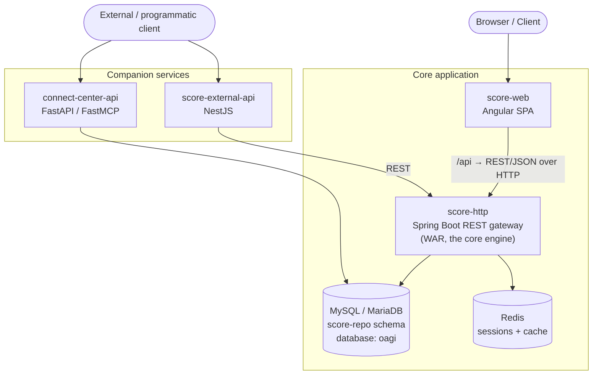

A one-page tour of how connectCenter is put together — enough to find the module and
package a change belongs in. For the technology stack per module, see
[Contributor Prerequisites](./prerequisites.md); for running the stack from source,
see [Development Setup](./development-setup.md).

## Topology

At its core, connectCenter is a single-page Angular application (`score-web`) talking to
a Spring Boot REST gateway (`score-http`), backed by a MySQL/MariaDB-compatible database
and Redis. Companion services sit alongside the core for external/programmatic access.



A request flows through the system like this:

1. The browser loads the Angular SPA served by `score-web`.
2. The SPA issues REST calls under the `/api` prefix — proxied to the backend dev port
   `9000` in development, or routed via `GATEWAY_HOST`/`GATEWAY_PORT` in the packaged
   frontend image.
3. `score-http` controllers handle the request. Most API packages split writes from
   reads (`*CommandController` vs. `*QueryController`).
4. Services read and write the relational model through jOOQ; sessions and cache are
   served from Redis; realtime interactions use a WebSocket/STOMP channel.
5. The response (typically JSON) returns to the SPA. Schema export operations produce
   downloadable artifacts (see [Schema generation](#schema-generation) below).

## Backend API packages

All backend API code lives under `org.oagi.score.gateway.http.api`. Each package maps to
a `score-web` feature module (under `score-web/src/app`) where one exists — this table
is the "where does my change go" map:

| API package (`…http.api.*`) | Purpose | Frontend module (`score-web/src/app`) |
|---|---|---|
| `account_management` | User account CRUD, pending registrations, and system accounts. | `account-management` |
| `agency_id_management` | Agency Identification lists and their values. | `agency-id-list-management` |
| `ai_management` | Query the available AI model(s) used by AI-assisted features. | (used by AI-assisted features) |
| `application_management` | Read/update application-wide configuration settings. | `settings-management` |
| `bie_management` | Business Information Entity (BIE) profiling: edit, generate, report, and BIE packages. | `bie-management` |
| `business_term_management` | Business terms and their assignment to components. | `business-term-management` |
| `cc_management` | Core Component management (ACC, ASCCP, BCCP, DT/BDT). | `cc-management` |
| `code_list_management` | Code lists, their values, and code-list uplift. | `code-list-management` |
| `comment_management` | Comments attached to components and BIEs. | (inline in component / BIE detail views) |
| `context_management` | Business context: context categories, context schemes, and business contexts. | `context-management` |
| `export` | Schema export engine (XML / JSON Schema generation, schema diffing). | (invoked by export / generate actions) |
| `external` | Lookups exposing BIE and component data to other internal callers. | — |
| `graph` | Serves component / relationship graph data for diagrams. | (diagram dialogs) |
| `info_management` | Dashboard "info" summaries (product info, BIE/CC counts). | `basis` (about / landing) |
| `integration_management` | GitHub-issue integration for tracking component changes. | (see [GitHub Integration](../04-user-guide/github-integration/index.md)) |
| `library_management` | CCS libraries (the top-level container for releases and content). | `library-management` |
| `log_management` | Revision / change logs and log comparison. | `log-management` |
| `mail` | Sends outbound email (e.g. notifications). | — |
| `message_management` | In-app messages / notifications. | `message-management` |
| `module_management` | Module sets and module-set releases. | `module-management` |
| `namespace_management` | XML namespace definitions. | `namespace-management` |
| `oas_management` | OpenAPI (OAS) document definition and generation. | `bie-management` (OpenAPI doc tooling) |
| `plantuml` | Renders PlantUML diagrams. | `common` (PlantUML diagram component) |
| `release_management` | Release lifecycle: create, assign content, and release diagrams. | `release-management` |
| `tag_management` | Tags applied to components / BIEs. | `tag-management` |
| `tenant_management` | Multi-tenant configuration. | (see [Multi-Tenant Management](../04-user-guide/multi-tenant-management/index.md)) |
| `xbt_management` | XML built-in / expression-built-in type definitions. | (referenced by DT tooling) |

A few `score-web` directories are shared infrastructure rather than feature modules:
`authentication` (login/auth), `basis` (app shell and "about"), `common` (shared
dialogs, trees, diagram and snackbar components), and `settings-management`.

## Schema generation

Schema generation is a backend responsibility, implemented in two `score-http` packages:

- **XML and JSON Schema export** — the `export` package. Exporters walk the assembled
  schema modules with a visitor pattern (`XMLExportSchemaModuleVisitor`,
  `JSONExportSchemaModuleVisitor`) over a model layer with pluggable naming strategies;
  it is invoked from higher-level services (e.g. `ReleaseQueryService`,
  `ModuleSetReleaseQueryService`) rather than a single dedicated controller.
- **OpenAPI document generation** — the `oas_management` package
  (`OpenAPIDocController` / `OpenAPIGenerateController` and their services, with
  expression builders under `generate_openapi_expression`).

## Database structure

The schema follows the
[CCTS (Core Component Technical Specification) v3.0](https://www.unece.org/fileadmin/DAM/cefact/codesfortrade/CCTS/CCTS-Version3.pdf)
data model, so most table and column names mirror CCTS concepts directly. The canonical
schema lives in `score-repo/scripts/score-schema.sql`; the in-repo engineering deep dive
is `docs/OverviewOfScoreDatabaseStructure/OverviewOfScoreDatabaseStructure.md`. Schema
changes between releases are applied by Flyway on backend startup — see
[Database Migration](../05-operations/database-migration.md).

Each Core Component type has its own table — `acc`, `ascc`, `asccp`, `bcc`, `bccp`, `dt`
(holding both CDTs and BDTs), and `dt_sc` — with name columns that compose the immutable
DEN (Dictionary Entry Name). Code lists and agency ID lists (`code_list`,
`agency_id_list`, and their `*_value` tables) are the value-domain libraries.

The data-type subsystem maps the 11 CCTS-allowed primitives onto concrete syntax types:
`cdt_pri` lists the primitives, `dt_awd_pri` / `dt_sc_awd_pri` hold the allowed
primitives per data type / supplementary component, and `xbt` (with its release-scoped
`xbt_manifest`) carries the syntax mappings — `builtIn_type` (note the mixed-case
spelling) plus `jbt_draft05_map`, `jbt_202012_map`, `openapi30_map`, and
`openapi31_map`. A BBIE carries its value-domain restriction through exactly one of
`xbt_manifest_id`, `code_list_manifest_id`, or `agency_id_list_manifest_id`.

### The manifest pattern

The single most important schema concept: a connectCenter database tracks **multiple
releases** of a library at once, so immutable content rows are layered under
release-specific **manifest** tables.

- A content table (`acc`, `asccp`, `dt`, `code_list`, …) stores one *revision* of a
  component.
- A matching `*_manifest` table (`acc_manifest`, `asccp_manifest`, …) points a single
  `release_id` at a specific revision.

"Which version of which component is in release X" is a property of the manifest row,
not the content row:

```sql
SELECT acc.* FROM acc
JOIN acc_manifest ON acc.acc_id = acc_manifest.acc_id
JOIN release ON acc_manifest.release_id = release.release_id
WHERE release.release_num = ?;
```

Manifests also point at *each other* (e.g. `acc_manifest.based_acc_manifest_id`), so
inheritance and associations resolve within a single release. BIE tables and module
assignments therefore link to **manifest** rows, never to raw content rows.

Association order within an ACC is stored as a doubly linked list in the `seq_key`
table (`prev_seq_key_id` / `next_seq_key_id`), so inserting or removing one association
does not renumber the rest. Legacy integer `seq_key` columns still exist on some tables
but are deprecated and no longer used for ordering.

### BIE tables

A BIE is a CC specialized for a business context. The BIE tables (`abie`,
`asbiep`/`asbie`, `bbiep`/`bbie`, `bbie_sc`) mirror the CC tables and hang off a single
root, `top_level_asbiep`. Every BIE row carries `owner_top_level_asbiep_id`, so an
entire profile loads with one predicate per table; a *reused* BIE is an `asbie` whose
target `asbiep` belongs to a different `owner_top_level_asbiep_id`. Packages of BIEs
are modeled by `bie_package` / `bie_package_top_level_asbiep`.

Supporting table groups follow the same shapes: business contexts (`ctx_category`,
`ctx_scheme`, `biz_ctx*`), business terms (`business_term` and `*_bizterm` links),
OpenAPI documents (the `oas_*` family rooted at `oas_doc`), modules (`module`,
`module_set`, `module_set_release`, and `module_*_manifest` assignment tables), and
accounts/tenancy (`app_user`, `app_oauth2_user`, `oauth2_app`, `tenant`).
